我们开始构建Android版本的Digging啦, 本章我们讲完成环境的搭建以及获取钱包的余额.

### 搭建工程
本篇采用koltin开发, IDE为Android. 我们打开Android Studio新建工程

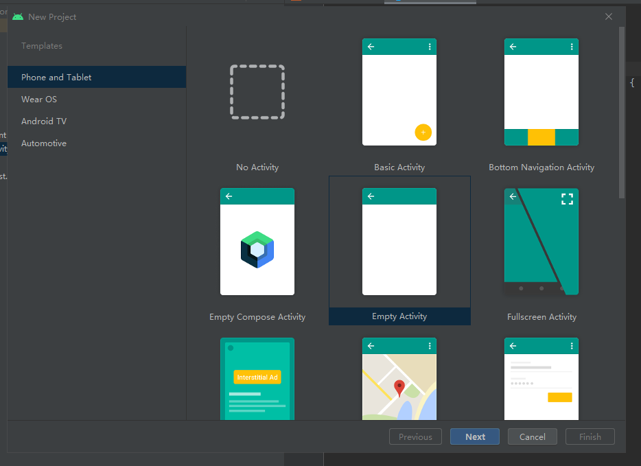 

这里选择的是Empty Activity

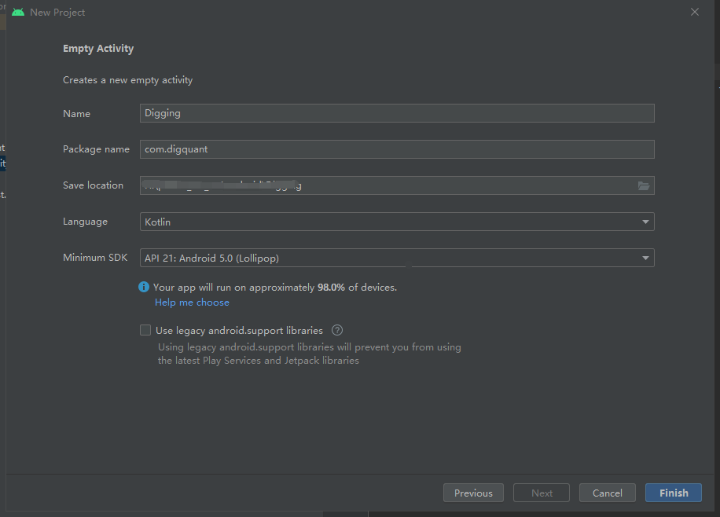 

开发语言为koltin,最小支持得到SDK为API 21

工程创建完成,目录如下:

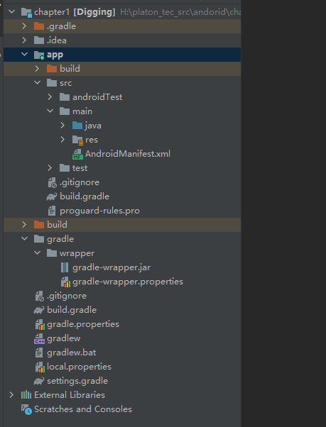 

接着我们引入PlatON的Android版本的SDK

打开app目录下的build.gradle文件, 内容如下:

```
plugins {
    id 'com.android.application'
    id 'kotlin-android'
}

android {
    compileSdk 31

    defaultConfig {
        applicationId "com.mifun"
        minSdkVersion 21
        targetSdkVersion 31
        versionCode 1
        versionName "1.0"
        testInstrumentationRunner "androidx.test.runner.AndroidJUnitRunner"
    }

    buildTypes {
        release {
            minifyEnabled false
            proguardFiles getDefaultProguardFile('proguard-android-optimize.txt'), 'proguard-rules.pro'
        }
    }

    buildFeatures {
        viewBinding true
    }

    dataBinding {
        //noinspection DataBindingWithoutKapt
        enabled = true
    }
    sourceSets {
        main {
            jniLibs.srcDirs = ['libs']
        }
    }
    android.applicationVariants.all {
        variant ->
            variant.outputs.all {
                //在这里修改apk文件名
                outputFileName = "digging.apk"
            }
    }

    compileOptions {
        sourceCompatibility JavaVersion.VERSION_1_8
        targetCompatibility JavaVersion.VERSION_1_8
    }

    splits {
        abi {
            enable true
            reset()
            universalApk true
        }
    }
    kotlinOptions {
        jvmTarget = '1.8'
    }

}

dependencies {

    implementation 'com.google.android.material:material:1.4.0'
    // 引入platON的jar包
    implementation 'com.platon.client:core:0.13.0.2-android'
    implementation 'com.platon.client:crypto:0.13.0.2-android'
}
```
接着打开最外层的settings.gradle文件,如下图:

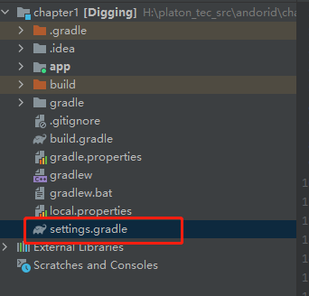 

增加platon的仓库地址,内容如下:
```
dependencyResolutionManagement {
    repositoriesMode.set(RepositoriesMode.FAIL_ON_PROJECT_REPOS)
    repositories {
        google()
        maven { url "https://jitpack.io" }
        maven { url "https://sdk.platon.network/nexus/content/groups/public/" }
        
        mavenCentral()
        jcenter() // Warning: this repository is going to shut down soon

    }
}
rootProject.name = "Digging"
include ':app'
```
紧接着在app目录下创建libs目录,将libscrypt.so文件拷贝到改目录下,如下图:

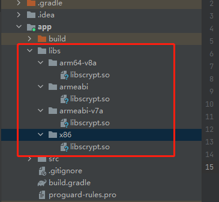 

这里设置支持arm64和x86读者如果不需要的话,可以自行删除不需要的平台.


最后我们在AndroidManifest.xml文件添加使用网络的权限, 代码如下:
```
<?xml version="1.0" encoding="utf-8"?>
<manifest xmlns:android="http://schemas.android.com/apk/res/android"
    package="com.digquant">

    <!-- 访问网络，网络定位需要上网-->
    <uses-permission android:name="android.permission.INTERNET" />

    <application
        android:allowBackup="true"
        android:icon="@mipmap/ic_launcher" 
        android:label="@string/app_name"
        android:usesCleartextTraffic="true"

        android:roundIcon="@mipmap/ic_launcher_round"
        android:supportsRtl="true"
        android:theme="@style/Theme.Digging">
        <activity
            android:name=".activity.MainActivity"
            android:screenOrientation="fullSensor"
            android:exported="true">
            <intent-filter>
                <action android:name="android.intent.action.MAIN" />

                <category android:name="android.intent.category.LAUNCHER" />
            </intent-filter>
        </activity>
    </application>

</manifest>
```


此致工程构建完毕.

### 编写代码
在com.digquant包下创建api包,然后添加PlatonApi文件,如下图:

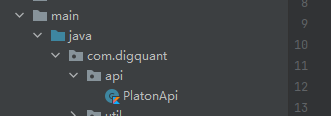 

PlatonApi顾名思义,所有和PlatON节点的交互接口都放在这里.其代码如下:
```
class PlatonApi {
    //
    companion object {
        // 测试节点地址
        const val url: String = "http://35.247.155.162:6789"
        //连接超时时间
        const val TRANSACTION_SEND_CONNECT_TIMEOUT: Long = 10000
        // 读取超时
        const val TRANSACTION_SEND_READ_TIMEOUT: Long = 50000
        // PlatonApi为单例
        val platonApi: PlatonApi = PlatonApi()
    }

    // 手续费
    private val GasPrice: BigInteger = BigInteger.valueOf(2000000000000L)
    // 手续费上线
    private val GasLimit: BigInteger = BigInteger.valueOf(99999L)
    // 手续费类
    var gasProvider = ContractGasProvider(GasPrice, GasLimit)
    // 和PlatON通讯的对象
    var mWeb3j: Web3j = Web3jFactory.build(
        HttpService(
            url, OkHttpClient().newBuilder()
                .connectTimeout(
                    TRANSACTION_SEND_CONNECT_TIMEOUT,
                    TimeUnit.MILLISECONDS
                )
                .readTimeout(
                    TRANSACTION_SEND_READ_TIMEOUT,
                    TimeUnit.MILLISECONDS
                )
                .build(), false
        )
    );
    /**
     * 获取余额
     */
    fun GetBalance(walletAddress: String): PlatonGetBalance {
        return mWeb3j.platonGetBalance(
            walletAddress,
            DefaultBlockParameterName.LATEST
        ).send()
    }
}
```
对于这个类,笔者通过伴生的方式实现为单例.
本工程函数的命名规则参考Go语言: public函数的首字母为大写, 其他为小写.这样易于区分函数类型.因为这里获取指定钱包余额函数为公有函数,因此为**GetBalance**
接着我们编写界面,打开res/layout下的activity_main.xml文件,如下图:

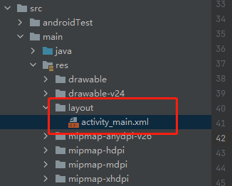 

代码如下:

```
<?xml version="1.0" encoding="utf-8"?>
<LinearLayout xmlns:android="http://schemas.android.com/apk/res/android"
    xmlns:app="http://schemas.android.com/apk/res-auto"
    xmlns:tools="http://schemas.android.com/tools"
    android:layout_width="match_parent"
    android:layout_height="match_parent"
    android:orientation="vertical"
    android:padding="10dp"
    tools:context=".MainActivity">
    <LinearLayout
        android:layout_width="match_parent"
        android:layout_height="wrap_content"
        android:orientation="horizontal">

        <TextView
            android:layout_width="wrap_content"
            android:layout_height="wrap_content"
            android:layout_marginRight="10dp"
            android:text="钱包地址:" />

        <EditText
            android:id="@+id/walletAddress"
            android:layout_width="match_parent"
            android:layout_height="wrap_content"
            android:hint="请输入要查询的钱包地址" />
    </LinearLayout>

    <LinearLayout
        android:layout_width="match_parent"
        android:layout_height="wrap_content"
        android:layout_marginTop="10dp">

        <TextView
            android:layout_width="wrap_content"
            android:layout_height="wrap_content"
            android:layout_marginRight="10dp"
            android:text="当前余额:" />

        <TextView
            android:id="@+id/balance"
            android:layout_width="match_parent"
            android:layout_height="wrap_content" />
    </LinearLayout>
    
    <Button
        android:id="@+id/btn"
        android:layout_width="wrap_content"
        android:layout_height="wrap_content"
        android:layout_marginTop="10dp"
        android:text="获取" />

</LinearLayout>
```
界面效果如下图:

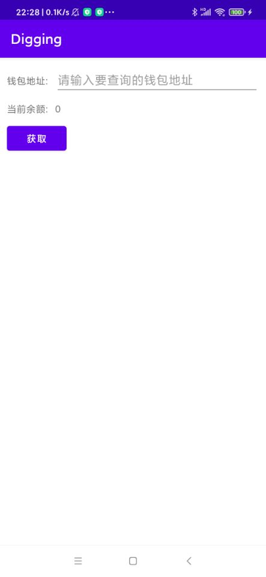 

然后在com.digquant.activity的MainActivity文件

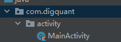 

其代码如下:
```
class MainActivity : AppCompatActivity() {

    /**
     * 使用binding
     */
    lateinit var binding: ActivityMainBinding

    /**
     * 创建handler
     */
    lateinit var handler: Handler

    override fun onCreate(savedInstanceState: Bundle?) {
        super.onCreate(savedInstanceState)
        // 构建布局
        val inflater = LayoutInflater.from(this)
        binding = ActivityMainBinding.inflate(inflater, null, false);
        setContentView(binding.root)
        
        handler = Handler();

        initEvent();

    }

    /**
     * 初始化时间
     */
    private fun initEvent() {

        binding.btn.setOnClickListener {
            val walletAddress = binding.walletAddress.text.toString()
            /**
             * 因此platonApi调用Http的方式都是同步的
             * 而在UI线程不能发起Http调用因此需要在子线程调用
             * 把调用任务放在线程池
             */
            ThreadPoolUtil.AddTask {
                /**
                 * 获取platonApi对象
                 */
                val platonApi = PlatonApi.platonApi
                val platonBalance = platonApi.GetBalance(walletAddress)

                /**
                 * 获取的balance单位为Von,要手动转为LAT
                 */
                val lat =
                    Convert.fromVon(BigDecimal(platonBalance.balance), Convert.Unit.LAT).toDouble();
                // 通过handler讲balance传回UI线程
                handler.post {
                    binding.balance.text = lat.toString()
                }
            }
        }
    }
}
```
这里需要注意的是, Platon的Api调用Http的方式都是同步的,因此不能在UI线程使用,需要放入到子线程中.为了避免每次调用都需要创建子线程,我们这里 构建一个线程池.
创建com.digquant.util包,添加ThreadPoolUtil文件, 代码如下:
```
package com.digquant.util

import java.util.concurrent.LinkedBlockingDeque
import java.util.concurrent.ThreadPoolExecutor
import java.util.concurrent.TimeUnit

class ThreadPoolUtil {
    companion object {
        private val executor = ThreadPoolExecutor(
            2,
            10,
            10 * 60,
            TimeUnit.SECONDS,
            LinkedBlockingDeque()
        )
        fun AddTask(runnable: Runnable?) {
            executor.execute(runnable)
        }
    }
}
```
最后我们在App输入地址:lat1zrq89dhle45g78mm4j8aq3dq5m2shpu56ggc6e可以查出该钱包的余额, 如下图:

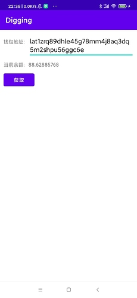 

浏览器查看到余额如下:

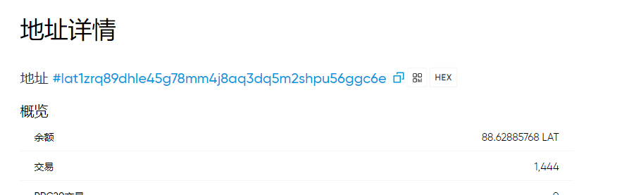 

可以看到我们获取到的余额和浏览器的一致.

好啦, 本章的内容就先到这里啦.

仓库地址: https://github.com/DQTechnology/Platon_DevGuideProject