上一章,我们完成了环境的搭建以及调用的SDK的获取了指定钱包的余额, 但是SDK提供的调用方式我们都必须放在子线程里面使用,显得麻烦.因此本章,我们通过JSONRPC封装接口,使用简单.

### 引入retrofit包
打开app/build.gradle文件,如下图

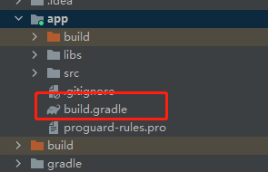 
添加以下依赖:
```
dependencies {
    implementation 'com.google.android.material:material:1.4.0'

    implementation 'com.platon.client:core:0.13.0.2-android'
    implementation 'com.platon.client:crypto:0.13.0.2-android'

    implementation 'com.squareup.retrofit2:retrofit:2.9.0'
    implementation 'com.squareup.retrofit2:converter-jackson:2.9.0'
}
```
### 修改PlatonApi文件如下:
本工程使用的是retrofit和koltin的协程实现http调用
```
interface IPlatonApi {
    @POST("/")
    suspend fun Call(@retrofit2.http.Body params: PlatonParams): PlatonResult
}
class PlatonApi {
    companion object {
        /**
         * 测试网地址
         */
        const val url: String = "http://35.247.155.162:6789"

        /**
         * 创建retrofit的httpClient对象
         */
        fun <T> Create(tClass: Class<T>): T {

            val okHttpClient = OkHttpClient.Builder().build()
            val retrofit: Retrofit = Retrofit.Builder().baseUrl(url)
                .addConverterFactory(JacksonConverterFactory.create())
                .client(okHttpClient)
                .build()
            return retrofit.create(tClass)
        }

        init {
            /**
             *  初始化钱包应用
             */
            WalletApplication.init(
                WalletApplication.MAINNET,
                AddressManager.ADDRESS_TYPE_BECH32,
                AddressBehavior.CHANNLE_PLATON
            )
        }

        /**
         * 创建httpClient实例
         */
        private fun getHttpApi(): IPlatonApi {
            return Create(IPlatonApi::class.java)
        }

        /**
         * 获取钱包余额
         */
        suspend fun GetBalance(walletAddress: String): Double {
            val params = ArrayList<Any>()
            with(params) {
                add(walletAddress)
                add("latest")
            }
            val platonResult = doCall("platon_getBalance", params)
            val lat = Numeric.decodeQuantity(platonResult.result)
            return Convert.fromVon(BigDecimal(lat), Convert.Unit.LAT).toDouble()
        }
}
```
这里需要注意的是,一定要在应用启动的时候初始化钱包应用, 也就是上面代码的init的代码块,以上代码我们就自己实现了获取余额的接口.调用方式如下:
```
    private fun initEvent() {
        binding.btn.setOnClickListener {
            lifecycleScope.launch {
                /**
                 * 获取钱包余额
                 */
                val lat = PlatonApi.GetBalance("lat1tgu6pts6nhmneu5zhqly3rc83r6y6ecfmde03e")
                val asdasd = 10;
            }
        }
    }
```
这里的钱包我们使用的是JavaScript篇第二章的钱包地址:
钱包的余额为:184.81058个LAT
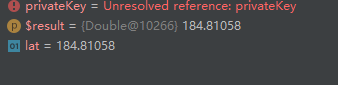 

浏览器中该钱包的余额为:

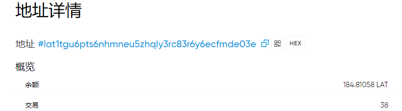 

可以看到我们编写的接口获取的余额和浏览器一致.大家可以看到通过我们自己封装的出来的接口,使用方式比第一章的要方便简介很多.

### 获取当前链的地址前缀–GetAddressHrp
在PlatonApi添加如下代码:
```
        /**
         * 获取HRP
         */
        suspend fun GetAddressHrp(): String? {
            val params = ArrayList<Any>()
            val platonResult = doCall("platon_getAddressHrp", params)
            return platonResult.result
        }
```
调用方式如下:
```
val hrp = PlatonApi.GetAddressHrp();
```
结果如下:

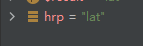 

### 获取当前gas的价格– GetGasPrice

在PlatonApi添加如下代码:
```
        /**
         * 获取当前gas价格
         */
        suspend fun GetGasPrice(): BigInteger {

            val params = ArrayList<Any>()
            val platonResult = doCall("platon_gasPrice", params)
            return Numeric.decodeQuantity(platonResult.result)
        }
```
因为调用方式基本一样,笔者就不一直写出来了, 我们直接看结果即可. gasPrice如下图:

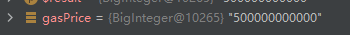 

### 获取指定块的信息– GetBlockByNumber
这里我们需要自定义一个类来接收块的信息, 通过官方文档,我们可以定义出块信息的类如下:

```
@JsonIgnoreProperties(ignoreUnknown = true)
class PlatonBlockInfo {
    /**
     *  块编号
     */
    var number: String = ""
        set(value) {
            field = Numeric.decodeQuantity(value).toString()
        }

    /**
     * 块哈希，处于 pending 状态的块为 null
     */
    var hash: String = ""

    /**
     * 父块哈希
     */
    var parentHash: String = ""

    /**
     * 生成的 proof-of-work 的哈希，处于 pending 状态的块为 null
     */
    var nonce: String = ""

    /**
     * 块中日志的 bloom filter，处于 pending 状态的块为 null
     */
    var logsBloom: String = ""

    /**
     * 块中的交易树根节点
     */
    var transactionsRoot: String = ""

    /**
     * 块中的最终状态树根节点
     */
    var stateRoot: String = ""

    /**
     *  接收奖励的矿工地址
     */
    var miner: String = ""

    /**
     * 块 “extra data” 字段
     */
    var extraData: String = ""

    /**
     * 字节为单位的块大小
     */
    var size: String = ""
        set(value) {
            field = Numeric.decodeQuantity(value).toString()
        }

    /**
     *  该块允许的最大 gas 值
     */
    var gasLimit: String = ""
        set(value) {
            field = Numeric.decodeQuantity(value).toString()
        }

    /**
     * 该块中所有交易使用的 gas 总量
     */
    var gasUsed: String = ""
        set(value) {
            field = Numeric.decodeQuantity(value).toString()
        }

    /**
     * 出块的 unix 时间戳
     */
    var timestamp: String = ""
        set(value) {
            field = Numeric.decodeQuantity(value).toString()
        }
    var transactions: List<Any> = ArrayList()
    
}
```
因为这个接口返回的字段比较多, 这个类并没有全部接受所有字段,因此需要在类加上注解@JsonIgnoreProperties来忽略多余的字段,如果不加的话会直接抛异常. 还需要注意的是: size, gasLimit,gasUsed,timestamp 返回的都是16进制的字段,为了方便阅读,我们需要手动转换为10进制的值.
接着我们在接口 IPlatonApi 添加接口 Call2 专门用来接受块信息的. 代码如下:

```
interface IPlatonApi {

    @POST("/")
    suspend fun Call(@retrofit2.http.Body params: PlatonParams): PlatonResult

    @POST("/")
    suspend fun Call2(@retrofit2.http.Body params: PlatonParams): PlatonBlockResult
}
```
接着我们在PlatonApi添加doCall2函数,用来调用Call2接口
```
...省略代码
        suspend fun doCall2(method: String, params: ArrayList<Any>): PlatonBlockResult {

            val platonParams = PlatonParams(
                method = method,
                params = params,
                id = 1
            )
            val httpApi = getHttpApi()
            return httpApi.Call2(platonParams)
        }
...省略代码
```
最后在PlatonApi类添加GetBlockByNumber的实现代码如下:
```
        /**
         * 获取指定块的信息
         */
        suspend fun GetBlockByNumber(blockNumber: Long): PlatonBlockInfo {
            val params = ArrayList<Any>()
            val blockNumberBN = BigInteger(blockNumber.toString())
            with(params) {
                add(Numeric.encodeQuantity(blockNumberBN))
                add(false)
            }
            return doCall2("platon_getBlockByNumber", params).result
        }
```
我们这里获取和JavaScript篇第二章一样的块, 块编号为: 6533257, 结果如下图:

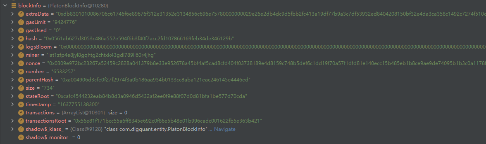 
和JavaScript篇第二章对比,可以看出结果是一样的. 


### 通过块编号获取块交易数量 -- GetBlockTransactionCountByNumber

在PlatonApi类添加GetBlockTransactionCountByNumber的实现代码如下:
```
        suspend fun GetBlockTransactionCountByNumber(blockNumber: Long): Long {
            val params = ArrayList<Any>()
            val blockNumberBN = BigInteger(blockNumber.toString())
            with(params) {
                add(Numeric.encodeQuantity(blockNumberBN))
            }
            val platonResult = doCall("platon_getBlockTransactionCountByNumber", params)
            return Numeric.decodeQuantity(platonResult.result).toLong()
        }
```
因为我们之前已经知道这个块是一个空块,因此可以看到交易数量为0
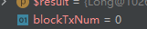 


### 通过块哈希值获取块的交易数量 -- GetBlockTransactionCountByHash

在PlatonApi类添加GetBlockTransactionCountByHash的实现代码如下:
```
        /**
         * 通过块的哈希值获取块的交易数量
         */
        suspend fun GetBlockTransactionCountByHash(blockHash: String): Long {
            val params = ArrayList<Any>()
            params.add(blockHash)
            val platonResult = doCall("platon_getBlockTransactionCountByHash", params)
            return Numeric.decodeQuantity(platonResult.result).toLong()
        }
```

通过GetBlockByNumber接口我们知道这个块的哈希值为0x0561ab627d3053c486a552e594f6b3f40f7acc2fd107866169feb34de346129b, 这个接口获取该块的交易数量也为0, 如下图
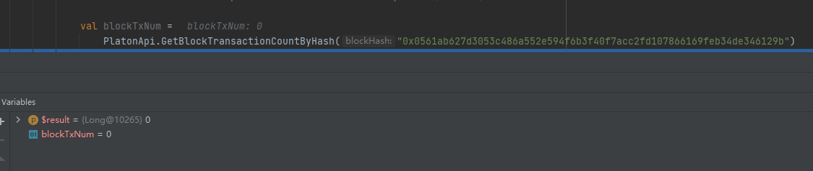 


### 获取钱包地址的发出的交易数量 – GetTransactionCount
在PlatonApi类添加GetTransactionCount的实现代码如下:
```
        /**
         * 获取交易数量
         */
        suspend fun GetTransactionCount(walletAddress: String): BigInteger {
            val params = ArrayList<Any>()

            with(params) {
                add(walletAddress)
                add("latest")
            }
            val platonResult = doCall("platon_getTransactionCount", params)

            return Numeric.decodeQuantity(platonResult.result)
        }
```
这里我们获取的钱包地址lat1tgu6pts6nhmneu5zhqly3rc83r6y6ecfmde03e的交易数量,结果如下图:

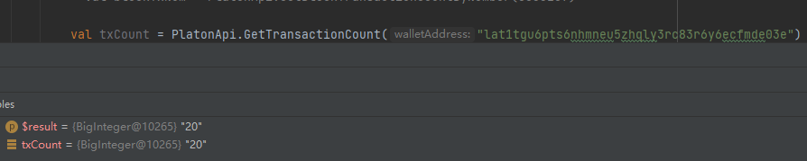

我们在浏览器看到, 有38比交易.

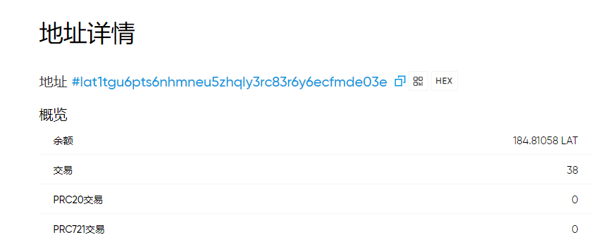 

 在JavaScript篇我们已经知道,接受的记录是不会计算在交易数量里面的,而这个账号有18比接受记录,因此38-18 = 20 的等于我们接口获取到的值.

### 完成第一笔转账
因为转换要通过交易哈希获取交易收据,而交易收据的信息如下:
```
@JsonIgnoreProperties(ignoreUnknown = true)
class PlatonReceiptInfo {
    /**
     * 区块的哈希值。 等待被打包时为null 。
     */
    var blockHash: String = ""

    /**
     * 20字节 - 交易的发送地址。
     */
    var from: String = ""

    /**
     * 32字节 - 创建此日志的事务的哈希值。当其挂起的日志时为null。
     */
    var transactionHash: String = ""

    /**
     *  区块中交易索引的位置，未打包时为null。
     */
    var transactionIndex: String = ""
        set(value) {
            field = Numeric.decodeQuantity(value).toString()
        }

    /**
     * 该交易所在的区块号。null，待处理。
     */
    var blockNumber: String = ""
        set(value) {
            field = Numeric.decodeQuantity(value).toString()
        }

    /**
     *  在区块中执行此交易时使用的天然气总量。

     */
    var cumulativeGasUsed: String = ""
        set(value) {
            field = Numeric.decodeQuantity(value).toString()
        }

    /**
     *
     */
    var contractAddress: String? = null

    /**
     * 成功状态 成功为1 失败为0
     */
    var status: String = ""
        set(value) {
            field = Numeric.decodeQuantity(value).toString()
        }

    /**
     *  仅此特定交易使用的天然气量。
     */
    var gasUsed: String = ""
        set(value) {
            field = Numeric.decodeQuantity(value).toString()
        }

    /**
     * 此事务生成的日志对象数组。
     */
    var logs: List<Any> = ArrayList();

}
```
在IPlatonApi 添加Call3用来获取交易收据的
```
interface IPlatonApi {

    @POST("/")
    suspend fun Call(@retrofit2.http.Body params: PlatonParams): PlatonResult

    @POST("/")
    suspend fun Call2(@retrofit2.http.Body params: PlatonParams): PlatonBlockResult


    @POST("/")
    suspend fun Call3(@retrofit2.http.Body params: PlatonParams): PlatonReceiptResult
}

```

在PlatonApi类添加doCall3获取交易收据的实现代码如下:
```
        suspend fun doCall3(method: String, params: ArrayList<Any>): PlatonReceiptResult {

            val platonParams = PlatonParams(
                method = method,
                params = params,
                id = 1
            )
            val httpApi = getHttpApi()
            return httpApi.Call3(platonParams)
        }
```
接着我们添加发送LAT的的接口SendLATTO代码:
```
        /**
         * 发送LAT到制定者账号, 返回交易哈希
         */
        suspend fun SendLATTO(
            privateKey: String,
            toAddress: String,
            lat: Long
        ): PlatonReceiptInfo? {

            /**
             * 转换秘钥
             */
            val iPrivateKey =
                Numeric.toBigInt(privateKey)

            val keyPair = ECKeyPair.create(iPrivateKey)

            /**
             * 将秘钥转换成sdk使用的凭证类
             */
            val credentials: Credentials = Credentials.create(keyPair)

            /**
             * 设置gaslimit
             */
            val gasLimit = BigInteger.valueOf(21000)

            /**
             * 获取当前的gasprice
             */
            val gasPrice = GetGasPrice()

            /**
             * 获取交易数量用作nonce字段
             */
            val nonce: BigInteger = GetTransactionCount(credentials.address)

            /**
             * 将lat转换为von
             */
            val value = Convert.toVon(BigDecimal(lat), Convert.Unit.LAT).toBigInteger();
            /**
             * 构建交易类
             */
            val rawTransaction = RawTransaction.createTransaction(
                nonce,
                gasPrice,
                gasLimit,
                toAddress,
                value,
                ""
            )

            /**
             * 使用秘钥对交易数据进行签名
             */
            val signedMessage =
                TransactionEncoder.signMessage(rawTransaction, 210309, credentials)

            /**
             * 将交易数据转换为16进制
             */
            val hexValue = Numeric.toHexString(signedMessage)

            val params = ArrayList<Any>()

            params.add(hexValue)
            /**
             * 发送给节点,返回为交易哈希
             */
            val platonResult = doCall("platon_sendRawTransaction", params)

            /**
             * 根据交易哈希获取交易收据
             */
            return GetTransactionReceipt(platonResult.result)
        }
```
通过交易哈希获取收据的接口,代码如下:
```
        /**
         * 获取交易收据数据
         */
        suspend fun GetTransactionReceipt(txHash: String): PlatonReceiptInfo? {
            val params = ArrayList<Any>()

            with(params) {
                add(txHash)
            }

            return doCall3("platon_getTransactionReceipt", params).result
        }
```
这里使用Javascript第二章的秘钥a4ac816da1ab40f805d026009247002f47c8c0a9af95b35ca9741c576466e1a8.对应的钱包地址为:lat1tgu6pts6nhmneu5zhqly3rc83r6y6ecfmde03e. 我们已经知道该钱包的余额为:184.81058个LAT.
现在我们转10个LAT到lat1zrq89dhle45g78mm4j8aq3dq5m2shpu56ggc6e, 获取收据如下图:

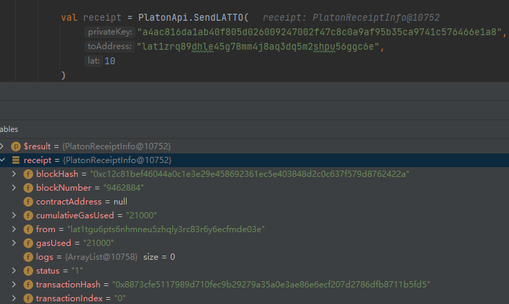 

从status可以看到转账已经成功. 我们在浏览器看到钱包的余额为:

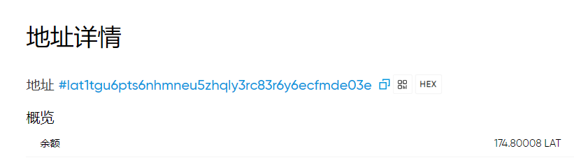 

可以看到我们已经成功转账出去.

好啦本章内容就到到这里啦, 下一章我们开始构建Digging的页面啦.  
在这里也祝大家元旦快乐.

仓库地址: [https://github.com/DQTechnology/Platon_DevGuideProject ](https://github.com/DQTechnology/Platon_DevGuideProject)