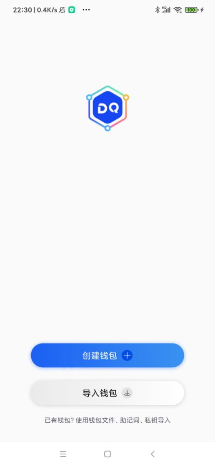
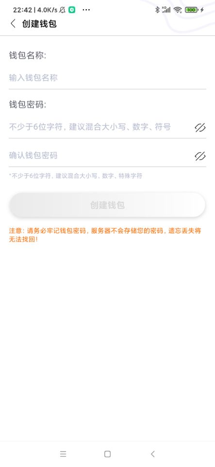
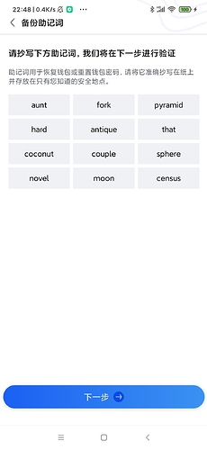

本章我们开始模仿ATON构建页面，为了方便Android版本的Digging的页面资源，基本使用ATON。因为Android的布局代码篇幅比较大，笔者就不一一贴出来了，大家下载源码看即可。
### 创建开屏页面 SplashActivity

在目录res/layout下创建activity_splash.xml文件，布局代码如下：
```
<?xml version="1.0" encoding="utf-8"?>
<androidx.constraintlayout.widget.ConstraintLayout xmlns:android="http://schemas.android.com/apk/res/android"
    xmlns:app="http://schemas.android.com/apk/res-auto"
    android:layout_width="match_parent"
    android:layout_height="match_parent"
    android:background="@color/color_ffffff"
    android:gravity="center_horizontal"
    android:orientation="vertical">

    <ImageView
        android:layout_width="wrap_content"
        android:layout_height="wrap_content"
        android:layout_centerInParent="true"
        android:layout_marginTop="220dp"
        android:src="@mipmap/splash_logo"
        app:layout_constraintLeft_toLeftOf="parent"
        app:layout_constraintRight_toRightOf="parent"
        app:layout_constraintTop_toTopOf="parent"
        android:contentDescription="TODO" />

    <TextView
        android:id="@+id/tv_logo"
        style="@style/Text.000.12"
        android:layout_marginBottom="16dp"
        android:text="@string/copyright_resume"
        app:layout_constraintBottom_toBottomOf="parent"
        app:layout_constraintLeft_toLeftOf="parent"
        app:layout_constraintRight_toRightOf="parent" />
</androidx.constraintlayout.widget.ConstraintLayout>
```
这里使用的是约束布局ConstraintLayout。接着在activity包创建SplashActivity类，代码如下:
```
class SplashActivity : AppCompatActivity() {

    private lateinit var bindding: ActivitySplashBinding

    override fun onCreate(savedInstanceState: Bundle?) {
        super.onCreate(savedInstanceState)
        requestWindowFeature(Window.FEATURE_NO_TITLE)

        val inflater = LayoutInflater.from(this)
        bindding = ActivitySplashBinding.inflate(inflater, null, false)

        setContentView(bindding.root)

        val handler = Handler(Looper.getMainLooper())
        /**
         * 设置2s后跳转到页面
         */
        handler.postDelayed({
            DXRouter.JumpAndFinish(this, OperateMenuActivity::class.java)
        }, 2000)
    }
}
```
这里的逻辑时，2s后跳转指定页面。这里用到了自定义的路由跳转DXRouter，该类的代码放在util包，代码如下：
```
object DXRouter {
    /**
     * @param activity
     * @param activityClass
     */
    fun JumpAndFinish(activity: Activity, activityClass: Class<out Activity?>?) {
        val intent = Intent(activity, activityClass)
        activity.startActivity(intent)
        activity.finish()
    }

    fun JumpTo(activity: Context, intent: Intent?) {
        activity.startActivity(intent)
    }

    fun JumpTo(activity: Context, activityClass: Class<out Activity?>?) {
        val intent = Intent(activity, activityClass)
        activity.startActivity(intent)
    }

    /**
     * @param activity
     * @param activityClass
     */
    fun JumpAndWaitResult(activity: Activity, activityClass: Class<out Activity?>?, reqNO: Int) {
        val intent = Intent(activity, activityClass)
        JumpAndWaitResult(activity, reqNO, intent)
    }

    /**
     * @param activity
     * @param reqNO
     * @param intent
     */
    fun JumpAndWaitResult(activity: Activity, reqNO: Int, intent: Intent?) {
        activity.startActivityForResult(intent, reqNO)
    }
}
```
从代码可以看到该类只是对Activity的封装。最后把AndroidManifest.xml文件中的启动Activity修改为：**SplashActivity** 修改后的代码如下：
```
    <application
        android:name="com.DiggingApplication"
        android:allowBackup="true"
        android:icon="@mipmap/ic_launcher"
        android:label="@string/app_name"
        android:roundIcon="@mipmap/ic_launcher_round"

        android:supportsRtl="true"
        android:theme="@style/Theme.Digging"

        android:usesCleartextTraffic="true"
        tools:targetApi="m">
        <activity
            android:name=".activity.SplashActivity"
            android:exported="true"
            android:launchMode="standard"
            android:screenOrientation="portrait"
            android:theme="@style/SplashTheme">
            <intent-filter>
                <action android:name="android.intent.action.MAIN" />
                <category android:name="android.intent.category.LAUNCHER" />
            </intent-filter>
        </activity>
    </application>
```
页面效果如下：

 


### 创建/导入钱包的引导页面 OperateMenuActivity


具体的布局代码，参看res/layout下的activity_operate_menu.xml 


本页面使用到了ATON的ShadowContainer类，笔者为了方便，直接把代码拷贝过来，放在com.platon.aton.widge包下， 接着在activity包下创建OperateMenuActivity类，其代码如下：

```
class OperateMenuActivity : AppCompatActivity() {

    private lateinit var bindding: ActivityOperateMenuBinding

    override fun onCreate(savedInstanceState: Bundle?) {
        super.onCreate(savedInstanceState)
        ViewUtil.SetWindow(window)
        ViewUtil.SetStatusBarColorToBlack(window)
        val inflater = LayoutInflater.from(this)
        bindding = ActivityOperateMenuBinding.inflate(inflater, null, false)
        setContentView(bindding.root)
        initEvent()
    }
    
    private fun initEvent() {
        /***
         * 创建钱包
         */
        bindding.scCreateWallet.setOnClickListener {
            DXRouter.JumpTo(this, CreateWalletActivity::class.java)
        }
        /**
         * 导入钱包
         */
        bindding.scImportWallet.setOnClickListener {
        }
    }
}
```
该页面的逻辑当前只是做跳转用，本页面暂时先实现创建钱包的跳转，页面效果如下图：

 

大家要注意，新增的Activity必须要在AndroidManifest.xml注册。

### 创建钱包页面  CreateWalletActivity

具体的布局代码，参看res/layout创建文件activity_create_wallet.xml 

创建 CreateWalletActivity类，其代码如下：

```package com.digquant.activity

import android.os.Bundle
import android.text.Editable
import android.text.TextUtils
import android.text.TextWatcher
import android.text.method.HideReturnsTransformationMethod
import android.text.method.PasswordTransformationMethod
import android.view.LayoutInflater
import android.view.View
import androidx.appcompat.app.AppCompatActivity
import com.digquant.R
import com.digquant.databinding.ActivityCreateWalletBinding
import com.digquant.service.WalletManager
import com.digquant.util.*

class CreateWalletActivity : AppCompatActivity() {

    private lateinit var bindding: ActivityCreateWalletBinding


    /**
     * 钱包名是否符合规范
     */
    private var isEnableName = true

    /**
     * 密码是是否符合要求
     */
    private var isEnablePassword = true

    /**
     * 是否显示面
     */
    private var mShowPassword = false

    /**
     * 是否显示重复密码
     */
    private var mShowRepeatPassword = false


    override fun onCreate(savedInstanceState: Bundle?) {
        super.onCreate(savedInstanceState)
        ViewUtil.SetWindow(window)
        /**
         * 设置状态栏的颜色为黑色
         */
        ViewUtil.SetStatusBarColorToBlack(window)
        val inflater = LayoutInflater.from(this)
        bindding = ActivityCreateWalletBinding.inflate(inflater, null, false)

        setContentView(bindding.root)

        initUI()
        initEvent()
    }

    /**
     * 初始化UI
     */
    private fun initUI() {
        enableCreate(false)
        showPassword()
        showRepeatPassword()
    }

    /**
     * 初始化事件
     */
    private fun initEvent() {


        /**
         * 返回Activity
         */
        bindding.backBtn.setOnClickListener {
            this.finish();
        }

        /**
         *  创建钱包
         */
        bindding.sbtnCreate.setOnClickListener {
            createWallet()
        }
        /**
         * 显示密码
         */
        bindding.ivPasswordEyes.setOnClickListener {
            showPassword()
        }
        /**
         * 显示重复密码
         */
        bindding.ivRepeatPasswordEyes.setOnClickListener {
            showRepeatPassword()
        }

        /**
         * 检测钱包名称
         */
        bindding.etName.addTextChangedListener(object : TextWatcher {
            override fun beforeTextChanged(s: CharSequence?, start: Int, count: Int, after: Int) {}
            override fun onTextChanged(s: CharSequence?, start: Int, before: Int, count: Int) {
                /**
                 * 判断钱包名是否符合规则，字符不能超过20个
                 */
                val name = bindding.etName.text.toString().trim()
                when {
                    TextUtils.isEmpty(name) -> {
                        showNameError(
                            ResourceUtil.GetString(R.string.validWalletNameEmptyTips),
                            true
                        )
                    }
                    name.length > 20 -> {
                        showNameError(ResourceUtil.GetString(R.string.validWalletNameTips), true)
                    }
                    else -> {
                        showNameError("", false)
                    }
                }
            }

            override fun afterTextChanged(s: Editable?) {}
        })
        /**
         * 检测密码规范
         */
        bindding.etPassword.addTextChangedListener(object : TextWatcher {
            override fun beforeTextChanged(s: CharSequence?, start: Int, count: Int, after: Int) {}

            override fun onTextChanged(s: CharSequence?, start: Int, before: Int, count: Int) {
                val password = bindding.etPassword.text.toString().trim()
                val repeatPassword = bindding.etRepeatPassword.text.toString().trim()
                when {
                    /**
                     * 判断密码是否为空
                     */
                    TextUtils.isEmpty(password) -> {
                        showPasswordError(
                            ResourceUtil.GetString(R.string.validPasswordEmptyTips),
                            true
                        )
                    }
                    /**
                     * 判断密码强度
                     */
                    password.length < 6 -> {
                        showPasswordError(
                            ResourceUtil.GetString(R.string.validPasswordEmptyTips),
                            true
                        )
                    }
                    /**
                     * 判断重复密码是否相等
                     */
                    repeatPassword != password -> {
                        showPasswordError(ResourceUtil.GetString(R.string.passwordTips), true)
                    }
                    else -> {
                        if (password == repeatPassword) {
                            showPasswordError("", false)
                        }
                    }
                }
            }

            override fun afterTextChanged(s: Editable?) {}
        })
        /**
         * 监听重复密码
         */
        bindding.etRepeatPassword.addTextChangedListener(object : TextWatcher {
            override fun beforeTextChanged(s: CharSequence?, start: Int, count: Int, after: Int) {
            }

            override fun onTextChanged(s: CharSequence?, start: Int, before: Int, count: Int) {
                val password = bindding.etPassword.text.toString().trim()
                val repeatPassword = bindding.etRepeatPassword.text.toString().trim()

                when {
                    /**
                     * 判断密码是否为空
                     */
                    TextUtils.isEmpty(repeatPassword) -> {
                        showPasswordError(
                            ResourceUtil.GetString(R.string.validRepeatPasswordEmptyTips),
                            true
                        )
                    }

                    /**
                     * 判断重复密码是否相等
                     */
                    repeatPassword != password -> {
                        showPasswordError(ResourceUtil.GetString(R.string.passwordTips), true)
                    }
                    else -> {
                        if (password == repeatPassword) {
                            showPasswordError("", false)
                        }
                    }
                }

            }

            override fun afterTextChanged(s: Editable?) {
                val password: String = bindding.etPassword.getText().toString().trim { it <= ' ' }
                checkPwdStrength(password)
            }
        })
    }

    /**
     * 创建钱包
     */
    private fun createWallet() {
        val name = bindding.etName.text.toString().trim()
        val password = bindding.etPassword.text.toString().trim()
        val repeatPassword = bindding.etRepeatPassword.text.toString().trim()

        /**
         * 检测名字长度
         */
        if (name.length > 20) {
            showNameError(ResourceUtil.GetString(R.string.validWalletNameTips), true)
            return
        }
        /**
         * 检测密码
         */
        if (TextUtils.isEmpty(password)) {
            showPasswordError(ResourceUtil.GetString(R.string.validPasswordEmptyTips), true)
            return
        }
        /**
         * 检测重复密码
         */
        if (TextUtils.isEmpty(repeatPassword)) {
            showPasswordError(ResourceUtil.GetString(R.string.validRepeatPasswordEmptyTips), true)
            return
        }

        if (password != repeatPassword) {
            showPasswordError(ResourceUtil.GetString(R.string.passwordTips), true)
            return
        }
        /**
         * 去钱包管理类创建Session
         */
        val isSucceed = WalletManager.BuildCreateWalletSession(name, password)

        if(!isSucceed) {
            ToastUtil.showLongToast(this, "创建钱包助记词失败")
        }

        DXRouter.JumpTo(this, BackupMnemonicPhraseActivity::class.java)
    }

    /**
     * 检测密码强度
     */
    private fun checkPwdStrength(password: String) {

        bindding.passwordStrength.visibility =
            if (TextUtils.isEmpty(password)) View.GONE else View.VISIBLE

        if (TextUtils.isEmpty(password)) {
            bindding.tvStrength.text = ResourceUtil.GetString(R.string.strength)

            bindding.vLine1.setBackgroundColor(ResourceUtil.GetColor(R.color.color_00000000))
            bindding.vLine2.setBackgroundColor(ResourceUtil.GetColor(R.color.color_00000000))
            bindding.vLine3.setBackgroundColor(ResourceUtil.GetColor(R.color.color_00000000))
            bindding.vLine4.setBackgroundColor(ResourceUtil.GetColor(R.color.color_00000000))
            return
        }

        when (CheckStrength.getPasswordLevelNew(password)) {
            CheckStrength.LEVEL.EASY -> {
                bindding.tvStrength.setTextColor(ResourceUtil.GetColor(R.color.color_f5302c))
                bindding.tvStrength.setText(R.string.weak)
                bindding.vLine1.setBackgroundColor(
                    ResourceUtil.GetColor(R.color.color_f5302c)
                )
                bindding.vLine2.setBackgroundColor(
                    ResourceUtil.GetColor(R.color.color_00000000)
                )
                bindding.vLine3.setBackgroundColor(
                    ResourceUtil.GetColor(R.color.color_00000000)
                )
                bindding.vLine4.setBackgroundColor(
                    ResourceUtil.GetColor(R.color.color_00000000)
                )
            }
            CheckStrength.LEVEL.MIDIUM -> {
                bindding.tvStrength.setTextColor(
                    ResourceUtil.GetColor(R.color.color_ff9000)
                )
                bindding.tvStrength.setText(R.string.so_so)
                bindding.vLine1.setBackgroundColor(
                    ResourceUtil.GetColor(R.color.color_ff9000)
                )
                bindding.vLine2.setBackgroundColor(
                    ResourceUtil.GetColor(R.color.color_ff9000)
                )
                bindding.vLine3.setBackgroundColor(
                    ResourceUtil.GetColor(R.color.color_00000000)
                )
                bindding.vLine4.setBackgroundColor(
                    ResourceUtil.GetColor(R.color.color_00000000)
                )
            }
            CheckStrength.LEVEL.STRONG -> {
                bindding.tvStrength.setTextColor(
                    ResourceUtil.GetColor(R.color.color_58b8ff)
                )
                bindding.tvStrength.setText(R.string.good)
                bindding.vLine1.setBackgroundColor(
                    ResourceUtil.GetColor(R.color.color_58b8ff)
                )
                bindding.vLine2.setBackgroundColor(
                    ResourceUtil.GetColor(R.color.color_58b8ff)
                )
                bindding.vLine3.setBackgroundColor(
                    ResourceUtil.GetColor(R.color.color_58b8ff)
                )
                bindding.vLine4.setBackgroundColor(
                    ResourceUtil.GetColor(R.color.color_00000000)
                )
            }
            CheckStrength.LEVEL.VERY_STRONG, CheckStrength.LEVEL.EXTREMELY_STRONG -> {
                bindding.tvStrength.setTextColor(
                    ResourceUtil.GetColor(R.color.color_19a20e)
                )
                bindding.tvStrength.setText(R.string.strong)
                bindding.vLine1.setBackgroundColor(
                    ResourceUtil.GetColor(R.color.color_19a20e)
                )
                bindding.vLine2.setBackgroundColor(
                    ResourceUtil.GetColor(R.color.color_19a20e)
                )
                bindding.vLine3.setBackgroundColor(
                    ResourceUtil.GetColor(R.color.color_19a20e)
                )
                bindding.vLine4.setBackgroundColor(
                    ResourceUtil.GetColor(R.color.color_19a20e)
                )
            }
            else -> {
            }
        }
    }

    /**
     * 显示密码
     */
    private fun showPassword() {
        if (mShowPassword) {
            // 显示密码
            bindding.etPassword.transformationMethod = HideReturnsTransformationMethod.getInstance()

            bindding.etPassword.setSelection(bindding.etPassword.text.toString().length)
            bindding.ivPasswordEyes.setImageResource(R.mipmap.icon_open_eyes)

        } else {
            // 隐藏密码
            bindding.etPassword.transformationMethod = PasswordTransformationMethod.getInstance()
            bindding.etPassword.setSelection(bindding.etPassword.text.toString().length)
            bindding.ivPasswordEyes.setImageResource(R.mipmap.icon_close_eyes)

        }
        mShowPassword = !mShowPassword;
    }

    /**
     * 显示重复密码
     */
    private fun showRepeatPassword() {
        if (mShowRepeatPassword) {
            // 显示密码
            bindding.etRepeatPassword.transformationMethod =
                HideReturnsTransformationMethod.getInstance()
            bindding.etRepeatPassword.setSelection(bindding.etRepeatPassword.text.toString().length)

            bindding.ivRepeatPasswordEyes.setImageResource(R.mipmap.icon_open_eyes)
            !mShowRepeatPassword
        } else {
            // 隐藏密码
            bindding.etRepeatPassword.transformationMethod =
                PasswordTransformationMethod.getInstance()
            bindding.etRepeatPassword.setSelection(bindding.etRepeatPassword.text.toString().length)
            bindding.ivRepeatPasswordEyes.setImageResource(R.mipmap.icon_close_eyes)
            !mShowRepeatPassword
        }
        mShowRepeatPassword = !mShowRepeatPassword;
    }

    /**
     * 显示名字的错误信息
     */
    private fun showNameError(text: String?, isVisible: Boolean) {
        bindding.tvNameError.visibility = if (isVisible) View.VISIBLE else View.GONE
        bindding.tvNameError.text = text
        this.isEnableName = isVisible
        enableCreate(!isEnablePassword && !isEnableName)
    }

    /**
     * 显示面错误的信息
     */
    fun showPasswordError(text: String, isVisible: Boolean) {
        bindding.tvPasswordError.visibility = if (isVisible) View.VISIBLE else View.GONE
        bindding.tvPasswordError.text = text
        bindding.tvPasswordDesc.visibility = if (isVisible) View.GONE else View.VISIBLE
        isEnablePassword = isVisible
        enableCreate(!isEnablePassword && !isEnableName)
    }

    /**
     *
     */
    private fun enableCreate(enabled: Boolean) {
        bindding.sbtnCreate.isEnabled = enabled
    }
}
```
该类的检测逻辑直接使用了ATON的，该类的主要逻辑：
1，检测钱包名长度是否在1~20个字符内
2，检测钱包的密码是否大于等于6
如何满足创建钱包的条件，则去WalletManager构建一个创建钱包的回话，把钱包名和密码暂存里面。
该类的我们稍后讲解，页面效果如下：

 

### 创建备份助记词的页面  BackupMnemonicPhraseActivity

具体的布局代码，参看res/layout下的activity_backup_mnemonic_phrase.xml

在activity包下创建BackupMnemonicPhraseActivity类，该类的代码如下：
```
class BackupMnemonicPhraseActivity : AppCompatActivity() {

    private lateinit var bindding: ActivityBackupMnemonicPhraseBinding


    override fun onCreate(savedInstanceState: Bundle?) {
        super.onCreate(savedInstanceState)
        ViewUtil.SetWindow(window)

        ViewUtil.SetStatusBarColorToBlack(window)
        val inflater = LayoutInflater.from(this)
        bindding = ActivityBackupMnemonicPhraseBinding.inflate(inflater, null, false)

        setContentView(bindding.root)

        initUI()

        initEvent()
    }


    private fun initUI() {

        val createWalletInfo = WalletManager.GetCreateWalletSession()

        val mnemonicWords = createWalletInfo?.mnemonicWords
        if (mnemonicWords != null) {
          // j将12个单词一次显示在页面
            bindding.tvMnemonic1.text = mnemonicWords[0]
            bindding.tvMnemonic2.text = mnemonicWords[1]
            bindding.tvMnemonic3.text = mnemonicWords[2]
            bindding.tvMnemonic4.text = mnemonicWords[3]
            bindding.tvMnemonic5.text = mnemonicWords[4]
            bindding.tvMnemonic6.text = mnemonicWords[5]
            bindding.tvMnemonic7.text = mnemonicWords[6]
            bindding.tvMnemonic8.text = mnemonicWords[7]
            bindding.tvMnemonic9.text = mnemonicWords[8]
            bindding.tvMnemonic10.text = mnemonicWords[9]
            bindding.tvMnemonic11.text = mnemonicWords[10]
            bindding.tvMnemonic12.text = mnemonicWords[11]
        }
    }

    private fun initEvent() {
        bindding.backBtn.setOnClickListener {
            this.finish()
        }
    }
}
```
该类的主要逻辑：从WalletManager类中获取当前创建钱包回话的助记词，并显示在页面上，页面效果如下图:
 

### WalletManager解析
该类为一个纯静态类，用于管理所有的钱包，当前有三个接口，生成创建钱包的回话BuildCreateWalletSession，获取钱包回话内容GetCreateWalletSession，删除当前创建钱包的会话ClearCreateWalletSession。
生成助记词需要在build.gradle中引入bitcoinj-core包。生成助记词的逻辑放在了JZWalletUtil和JZMnemonicUtil这两个类。

好啦,本章内容先到这里啦, 下一章我们开始学习如何生成秘钥.

仓库地址: https://github.com/DQTechnology/Platon_DevGuideProject