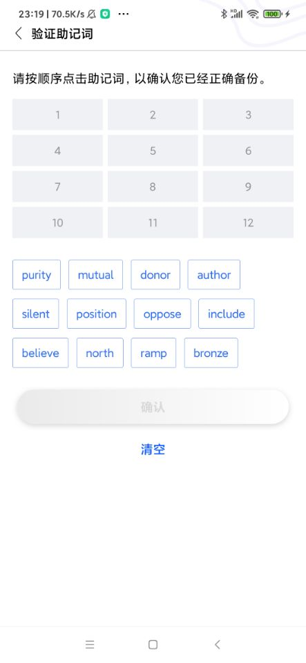
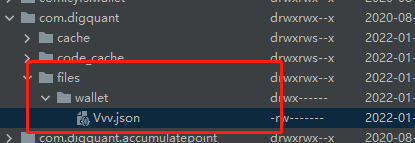

本章我们实现通过助记词生成秘钥,并且保存成文件的功能

### 创建确认助记词的页面
具体的布局代码,参看文件res/layout/activity_verify_mnemonic_phrase.xml文件
页面效果如下图:

 

接着在Activity目录下增加VerifyMnemonicPhraseActivity类, 代码解析如下:
```
    /**
     * 存储单词信息
     */
    data class WordInfo(
        var checked: Boolean,
        var mnemonic: String, // 助记词
        val waitSelectIndex: Int, // 在待选单词列表的索引
        var showWordIndex: Int // 选中单词的索引
    )
```
创建WordInfo类用来存储当前单词以下信息:
1, 选中状态
2, 单词本身
3, 单词在待选列表的索引
4, 单词在选中列表的索引

在initUI中获取WalletManager已经创建好的助记词, 然后打算助记词的顺序,显示待大选列表中, 代码如下:
```
        /**
         * 获取创建钱包的信息
         */
        val createWalletInfo = WalletManager.GetCreateWalletSession()

        /**
         * 获取助记词,如果助记词没有则1s关闭页面
         */
        val mnemonicWords = createWalletInfo?.mnemonicWords

        if (mnemonicWords == null) {
            ToastUtil.showLongToast(this, "助记词为空")
            this.finish()
            lifecycleScope.launch {
                /**
                 * 1s后关闭页面
                 */
                delay(1000)
                this@VerifyMnemonicPhraseActivity.finish()
            }
            return
        }
        /**
         * 保存正确顺序的助记词
         */
        originMnemonicWordList = mnemonicWords
        /**
         * 打乱助记词的顺序
         */
        val shuffledMnemonicWords = mnemonicWords.shuffled()
        /**
         * 显示待选助记词
         */
        showMnemonicWords(shuffledMnemonicWords)
```
showMnemonicWords方法的代码如下:
```
    /**
     * 打算的助记词显示的待选单词列表
     */
    private fun showMnemonicWords(shuffledMnemonicWords: List<String>) {
        bindding.flAll.removeAllViews()
        shuffledMnemonicWords.forEachIndexed { index, s ->
            /**
             * 构建助记词信息对象
             * 因为单词没有被选中,因此序选中索引都设置为-1
             */
            val dataEntity = WordInfo(false, s, index, -1)
            /**
             * 构建好的单词信息全部存到待选表
             */
            waitSelectWordInfoMap[index] = dataEntity

            bindding.flAll.addView(createAllItemView(dataEntity))
        }
    }
```
该方法构建每个单词的信息WordInfo对象.然后在createAllItemView方法,床架对应的待选代码UI元素TextView, 该方法代码如下:
```
    /**
     * 创建待续单词的UI元素
     */
    private fun createAllItemView(
        dataEntity: WordInfo
    ): TextView? {
        val textView = TextView(this)
        textView.text = dataEntity.mnemonic
        textView.gravity = Gravity.CENTER
        textView.isAllCaps = false

        waitSelectTVMnemonicList.add(textView)

        textView.setTextSize(TypedValue.COMPLEX_UNIT_SP, 14f)

        textView.setBackgroundResource(R.drawable.bg_shape_verify_mnemonic_n)
        textView.setTextColor(ResourceUtil.GetColor(R.color.color_316def))

        val paddingLeftAndRight: Int = DensityUtil.DP2PX(this, 12f)
        val paddingTopAndBottom = 0
        ViewCompat.setPaddingRelative(
            textView,
            paddingLeftAndRight,
            paddingTopAndBottom,
            paddingLeftAndRight,
            paddingTopAndBottom
        )
        val layoutParams = FlexboxLayout.LayoutParams(
            ViewGroup.LayoutParams.WRAP_CONTENT,
            DensityUtil.DP2PX(this, 38F)
        )
        val marginRight: Int = DensityUtil.DP2PX(this, 10F)
        val marginTop: Int = DensityUtil.DP2PX(this, 12F)
        layoutParams.setMargins(0, marginTop, marginRight, 0)
        textView.layoutParams = layoutParams
        return textView
    }
```
在这里把待选单词Textview和选中单词Textview放在数组链表,这样通过索引就可以直接获取对应元素,代码如下:
```
    /**
     *
     */
    private fun initUI() {
   ...省略代码
        /**
         * 把显示选中助记词的ui对象存储成列表, 这样可以通过索引直接获取对应的UI对象
         */
        showTVMnemonicList.add(bindding.tvMnemonic1)
        showTVMnemonicList.add(bindding.tvMnemonic2)
        showTVMnemonicList.add(bindding.tvMnemonic3)
        showTVMnemonicList.add(bindding.tvMnemonic4)
        showTVMnemonicList.add(bindding.tvMnemonic5)
        showTVMnemonicList.add(bindding.tvMnemonic6)
        showTVMnemonicList.add(bindding.tvMnemonic7)
        showTVMnemonicList.add(bindding.tvMnemonic8)
        showTVMnemonicList.add(bindding.tvMnemonic9)
        showTVMnemonicList.add(bindding.tvMnemonic10)
        showTVMnemonicList.add(bindding.tvMnemonic11)
        showTVMnemonicList.add(bindding.tvMnemonic12)
    }
```
初始化选中单词事件在initEvent中, 代码如下:
```
    /**
     *
     */
    private fun initEvent() {
        /**
         *初始化显示选择的助记词事件
         */
        showTVMnemonicList.forEachIndexed { index, textView ->

            textView.setOnClickListener {
                selectWord(index, false)
            }
        }
        /**
         * 初始化等待选择的助记词事件
         */
        waitSelectTVMnemonicList.forEachIndexed { index, textView ->
            textView.setOnClickListener {
                selectWord(index, true)
            }
        }
        /**
         * 生成秘钥
         */
        bindding.sbtnSubmit.setOnClickListener {
            genPrivateKey()
        }
        /**
         * 清空所有选中的单词
         */
        bindding.btnEmpty.setOnClickListener {

            /**
             * 选中的单词都设置为空
             */
            showTVMnemonicList.forEachIndexed { index, textView ->

                textView.text = "";

                val dataEntity: WordInfo? = selectWordInfoMap[index]
                if (dataEntity != null) {
                    dataEntity.checked = false
                }
            }
            /**
             * 重新显示设置的单词
             */
            waitSelectTVMnemonicList.forEachIndexed { index, textView ->
                textView.setBackgroundResource(R.drawable.bg_shape_verify_mnemonic_n)
                textView.setTextColor(ResourceUtil.GetColor(R.color.color_316def))
            }
            curEmptyIndex = 0
            selectWordInfoMap.clear()
            bindding.sbtnSubmit.isEnabled = false
        }
    }
```
这里我们对应选中单词的方法selectWord代码如下:
```
    /**
     * 处理单词的点击事件
     */
    private fun selectWord(index: Int, isWaitSelect: Boolean) {
        /**
         * 通过isWaitSelect判断,index获取单词信息对象是从待选对象获取,还是已选对象获取
         */
        val wordInfo: WordInfo? = if (isWaitSelect) {
            waitSelectWordInfoMap[index]
        } else {
            selectWordInfoMap[index]
        }

        if (wordInfo == null) {
            return
        }

        if (isWaitSelect) {
            /**
             * 如果点击的是待选单词列表,那每次都取反
             */
            wordInfo.checked = !wordInfo.checked
        } else {
            if (wordInfo.showWordIndex == -1) {
                return
            }
            /**
             * 如果点击的是已选单词列表,则每次则认为是取消选中
             */
            wordInfo.checked = false
        }
        /**
         * 获取待选单词的UI
         */
        val waitSelectMnemonicTV = waitSelectTVMnemonicList[wordInfo.waitSelectIndex]

        if (!wordInfo.checked) {
            // 取消选中词
            waitSelectMnemonicTV.setBackgroundResource(R.drawable.bg_shape_verify_mnemonic_n)
            waitSelectMnemonicTV.setTextColor(ResourceUtil.GetColor(R.color.color_316def))
            selectWordInfoMap.remove(wordInfo.showWordIndex)
            val showMnemonicTV = showTVMnemonicList[wordInfo.showWordIndex]
            showMnemonicTV.text = ""

            /**
             * 如果取消的位置索引比当前的空位置的索引小,则更新
             */
            if (wordInfo.showWordIndex < curEmptyIndex) {
                curEmptyIndex = wordInfo.showWordIndex
            }

            wordInfo.showWordIndex = -1
            bindding.sbtnSubmit.isEnabled = false
        } else {
            // 选中单词
            waitSelectMnemonicTV.setBackgroundResource(R.drawable.bg_shape_verify_mnemonic_h)
            waitSelectMnemonicTV.setTextColor(ResourceUtil.GetColor(R.color.color_b6bbd0))


            wordInfo.showWordIndex = curEmptyIndex

            selectWordInfoMap[wordInfo.showWordIndex] = wordInfo

            /**
             * 寻找下一个为空的位置
             */
            findNextEmptyIndex()

            val showMnemonicTV = showTVMnemonicList[wordInfo.showWordIndex]

            showMnemonicTV.text = wordInfo.mnemonic

            // 选完单词后,创建按钮设置为可用
            if (selectWordInfoMap.size == originMnemonicWordList.size) {
                bindding.sbtnSubmit.isEnabled = true
            }
        }
    }
```
这里使用了变量curEmptyIndex用来指示下一个选中单词的位置. 单词选完了,生成秘钥,方法为:genPrivateKey, 代码如下:
```
    /**
     * 生成密码
     */
    private fun genPrivateKey() {
        originMnemonicWordList.forEachIndexed { index, s ->

            val dataEntity = selectWordInfoMap[index];
            if (dataEntity == null) {
                ToastUtil.showLongToast(this, "助记词顺序不正确, 请重新选择")
                return@forEachIndexed
            }

            if (s != dataEntity.mnemonic) {
                ToastUtil.showLongToast(this, "助记词顺序不正确, 请重新选择")
                return@forEachIndexed
            }
            if (!WalletManager.GenerateWallet()) {

                ToastUtil.showLongToast(this, "生成钱包失败")
                return@forEachIndexed
            }
            ToastUtil.showLongToast(this, "生成钱包成功!")

        }
    }
```
该方法会判断选中单词的顺序是否正确,如果正确则调用WalletManager类的GenerateWallet方法生成钱包, 该方法如下:
```
    /**
     * 生成钱包
     */
    fun GenerateWallet(): Boolean {
        //
        val createWalletInfo = GetCreateWalletSession() ?: return false
        // 1,把助记词组合成空格隔开的字符串
        val mnemonic = createWalletInfo.mnemonicWords.joinToString(" ")
        // 2.生成种子
        val seed = JZMnemonicUtil.generateSeed(mnemonic, null)
        // 3. 生成根Keystore root private key 树顶点的master key ；bip32
        val rootPrivateKey = HDKeyDerivation.createMasterPrivateKey(seed)
        // 4. 由根Keystore生成 第一个HD 钱包
        val dh = DeterministicHierarchy(rootPrivateKey)
        // 5. 定义父路径 H则是加强
        val parentPath = HDUtils.parsePath(PATH)
        // 6. 由父路径,派生出第一个子Keystore "new ChildNumber(0)" 表示第一个（PATH）
        val child: DeterministicKey = dh.deriveChild(parentPath, true, true, ChildNumber(0))
        val ecKeyPair = ECKeyPair.create(child.privKeyBytes)
        // 7. 删除当前创建钱包的信息
        clearCreateWalletSession()
        // 8. 存储钱包
        return storePrivateKey(createWalletInfo, ecKeyPair)
    }
```
这里hd的钱包生成路径和ATON是一致的, val PATH = "M/44H/486H/0H/0"(大家有没有发现这里使用的PATH和浏览器版本是不一样的,那么同样的助记词在浏览器版本和Anroid生成的秘钥是否不一样呢?如果不一样如何解决呢?)生成秘钥之后,需要把秘钥持久化,这里直接存成文件, WalletManager的storePrivateKey方法代码如下:
```
    /**
     * 存储私钥
     */
    private fun storePrivateKey(
        createWalletInfo: CreateWalletSessionInfo,
        ecKeyPair: ECKeyPair
    ): Boolean {
        return try {
       
            val context = DiggingApplication.context
            // 生成钱包文件
            val walletFile =
                Wallet.create(createWalletInfo.password, ecKeyPair, N_STANDARD, P_STANDARD)

            val objectMapper = ObjectMapper()
            // 将钱包文件序列化为json字符串
            val keyFileContent = objectMapper.writeValueAsString(walletFile)

            // 写入文件
            FileUtil.WriteStringToFile(context.filesDir,"$WalletStorePath/${createWalletInfo.walletName}.json", keyFileContent)
            true
        } catch (e: Exception) {
            false
        }
    }
```
最后要在App路径下找到存储好的钱包文件,如下图:

 

文件内容如下:

```

可点击key和value值进行编辑
{
    "address":{
        "mainnet":"lat1mpxc2j5z0ttqna8xtcahskehcerc03gy7z25aw",
        "testnet":"lax1mpxc2j5z0ttqna8xtcahskehcerc03gy38cmnp"
    },
    "id":"7aa0516c-f9cb-495d-96f9-28cfc088d997",
    "version":3,
    "crypto":{
        "cipher":"aes-128-ctr",
        "cipherparams":{
            "iv":"d058c496292dd2100051876274732597"
        },
        "ciphertext":"e8ec7a89b59cc10363108d190c7daab4206a001a27bdcbdb9f71828afe9e88bd",
        "kdf":"scrypt",
        "kdfparams":{
            "dklen":32,
            "n":16384,
            "p":1,
            "r":8,
            "salt":"a114c2af5fd1e583fb0bdc7ed687efca823e34b300784ea92a0b292c2871e93e"
        },
        "mac":"f00da8599adad9d33617eb54e958eb780535019a482df50797df3773377b02c6"
    }
}
```

好啦本章内容就到这里啦, 下一章我们完成导入秘钥的功能.

仓库地址: https://github.com/DQTechnology/Platon_DevGuideProject

Andorid篇往期连接
[跟Dex学PlatON应用开发–Android篇(一)](https://forum.latticex.foundation/t/topic/5948)
[跟Dex学PlatON应用开发–Android篇(二)](https://forum.latticex.foundation/t/topic/5952)
[跟Dex学PlatON应用开发–Android篇(三)](https://forum.latticex.foundation/t/topic/5958)