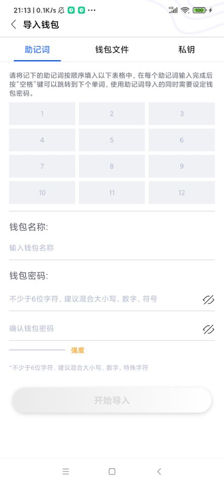
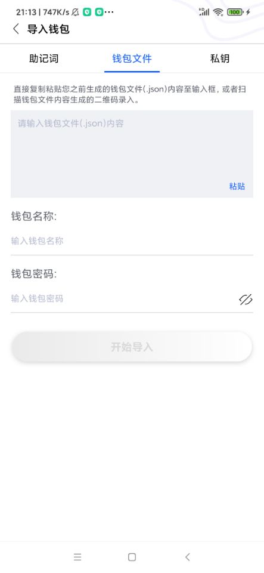
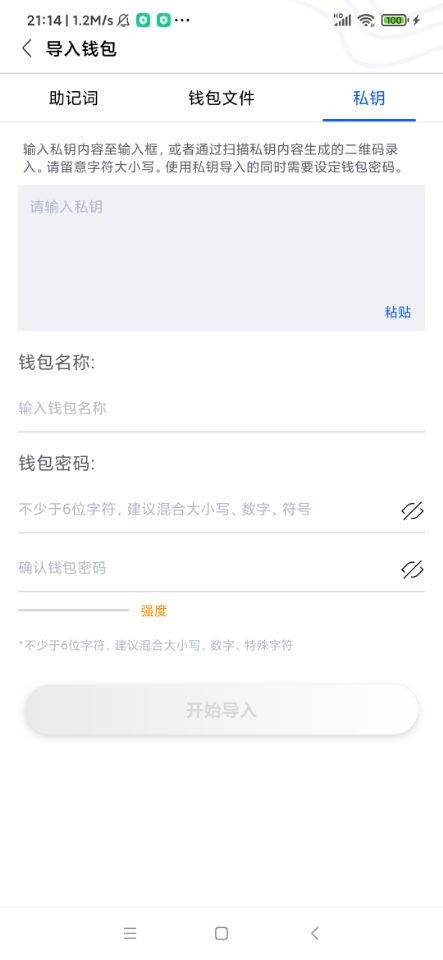
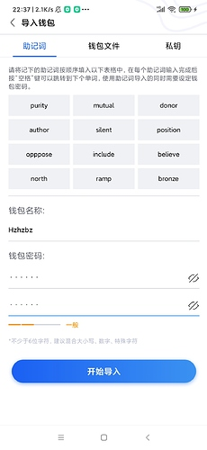
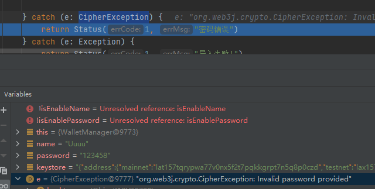

本章我们完成助记词/秘钥/钱包文件的导入功能

### 创建导入的主页面

具体的布局代码,参看res/layout/activity_import_wallet.xml文件,
本页面使用到ATON的SmartTabLayout, 之前ATON工程中该类支持的ViewPager, 笔者将其修改支持ViewPager2, 具体代码参看, com.platon.aton.widge.table包下的SmartTabLayout类.

然后在activity包中创建ImportActivity类,该类继承了BaseActivity类. 同时其他Activity也都修改集成该类
BaseActivity类的代码如下:
```koltin
abstract class BaseActivity: AppCompatActivity() {
    override fun onCreate(savedInstanceState: Bundle?) {
        super.onCreate(savedInstanceState)
        /**
         * 把标题栏颜色设置未黑色
         */
        ViewUtil.SetWindow(window)
        ViewUtil.SetStatusBarColorToBlack(window)
        /**
         * 设置UI对象
         */
        setContentView(inflateUI( LayoutInflater.from(this)))
        initUI()
        initEvent()
    }
    /**
     * 创建UI对象
     */
    protected abstract fun inflateUI(inflater: LayoutInflater): View
    /**
     * 初始化UI
     */
    protected abstract fun initUI()
    /**
     * 初始化时间
     */
    protected abstract fun initEvent()
}
```
该类为一个抽象类, 在onCreate中把状态栏的文字颜色设置为黑色,然后提供以下三个抽象方法:
1, inflateUI 实例化UI对象
2, initUI 初始化UI对象
3, initEvent 初始化事件

ImportActivity类的代码如下:
```
class ImportActivity : BaseActivity() {
    private lateinit var binding: ActivityImportWalletBinding

    /**
     * 创建页面对象
     */
    override fun inflateUI(inflater: LayoutInflater): View {
        binding = ActivityImportWalletBinding.inflate(inflater, null, false)
        return binding.root
    }

    /**
     *
     */
    override fun initUI() {
        // 初始化tabBar
        val indicatorThickness = DensityUtil.DP2PX(this, 2.0f)
        binding.stbBar.setIndicatorThickness(indicatorThickness)
        binding.stbBar.setIndicatorCornerRadius((indicatorThickness / 2.0f))
        // 设置tabBar的TabView创建函数
        binding.stbBar.setCustomTabView { container, title -> getTableView(container, title) }
        /**
         * 这里支持三种导入方式: 助记词, 钱包文件, 私钥
         */
        val titleList = ArrayList<String>(3)
        with(titleList) {
            add(ResourceUtil.GetString(R.string.mnemonicPhrase))
            add(ResourceUtil.GetString(R.string.keystore))
            add(ResourceUtil.GetString(R.string.privateKey))
        }
        // 创建页面的Adapter
        binding.vpContent.adapter = ImportPageAdapter()
        binding.stbBar.setViewPager(binding.vpContent, titleList)
    }

    override fun initEvent() {}
    /**
     * 创建tabView
     */
    private fun getTableView(container: ViewGroup, title: String): View? {
        val inflater = LayoutInflater.from(this)
        val tabBinding = LayoutAppTabItem1Binding.inflate(inflater, container, false)
        tabBinding.ivIcon.visibility = View.GONE
        tabBinding.tvTitle.text = title
        tabBinding.tvTitle.setTextColor(
            ContextCompat.getColorStateList(
                this,
                R.color.color_app_tab_text2
            )
        )
        return tabBinding.root
    }
}
```
Digging支持助记词, 钱包文件, 私钥三种方式导入钱包.
这三种导入方式对应的页面分别参看:res/layout/page_import_mnemonic_phrase.xml, page_import_keystore.xml和page_import_private_key.xml.
因为ViewPager2是基于RecyclerView实现的,因此要创建Adapter和ViewHolder.
创建com.digquant.adapter包,然后创建ImportPageAdapter类, 代码如下:
```
class ImportPageAdapter : RecyclerView.Adapter<BaseViewHolder>() {
    override fun onCreateViewHolder(parent: ViewGroup, viewType: Int): BaseViewHolder {
        // 对应的创建出三个页面对象
        val inflater = LayoutInflater.from(parent.context)
        if (viewType == 0) {
            val binding = PageImportMnemonicPhraseBinding.inflate(inflater, parent, false)
            return ImportMnemonicPage(binding.root)
        } else if (viewType == 1) {
            val binding = PageImportKeystoreBinding.inflate(inflater, parent, false)
            return ImportKeystorePage(binding.root)
        } else if (viewType == 2) {
            val binding = PageImportPrivateKeyBinding.inflate(inflater, parent, false)
            return ImportPrivateKeyPage(binding.root)
        }
        throw RuntimeException("无法识别页面类型")
    }
    override fun onBindViewHolder(holder: BaseViewHolder, position: Int) {
        // 因为页面都是静态的,因此不需要动态渲染
    }
    /**
     * 返回position作为页面类型
     */
    override fun getItemViewType(position: Int): Int {
        return position
    }
    override fun getItemCount(): Int {
        // 三个页面
        return 3
    }
}
```
页面效果如下图:

 

   

 

### 导入助记词的逻辑
在com.digquant.page的ImportMnemonicPage类,该类得到逻辑和创建钱包逻辑基本一致, 由于代码篇幅比较大,笔者就不贴代码了.该类的主要逻辑如下:
1,  钱包名的长度1~20个字符
2, 钱包的密码必读大于等于6个字符
然后再com/digquant/service/WalletManager.kt增加导入助记词的方法: ImportMnemonicWords, 代码如下:
```
    /**
     * 导入助记词
     */
    fun ImportMnemonicWords(name: String, password: String, mnemonicWords: List<String>): Boolean {
        // 1,把助记词组合成空格隔开的字符串
        val mnemonic = mnemonicWords.joinToString(" ")
        // 2.生成种子
        val seed = JZMnemonicUtil.generateSeed(mnemonic, null)
        // 3. 生成根Keystore root private key 树顶点的master key ；bip32
        val rootPrivateKey = HDKeyDerivation.createMasterPrivateKey(seed)
        // 4. 由根Keystore生成 第一个HD 钱包
        val dh = DeterministicHierarchy(rootPrivateKey)
        // 5. 定义父路径 H则是加强
        val parentPath = HDUtils.parsePath(PATH)
        // 6. 由父路径,派生出第一个子Keystore "new ChildNumber(0)" 表示第一个（PATH）
        val child: DeterministicKey = dh.deriveChild(parentPath, true, true, ChildNumber(0))
        val ecKeyPair = ECKeyPair.create(child.privKeyBytes)
        // 7. 删除当前创建钱包的信息
        clearCreateWalletSession()
        // 8. 存储钱包
        return storePrivateKey(name, password, ecKeyPair)
    }
```
同时把GenerateWallet的方法, 修改成调用该方法,这样可以复用代码.

页面效果图如下:

 

钱包文件内容如下:
```
{
    "address":{
        "mainnet":"lat157tqrypwa77v0nx5f2t7pqkkgrpt7n5q8p0czd",
        "testnet":"lax157tqrypwa77v0nx5f2t7pqkkgrpt7n5qgyahvz"
    },
    "id":"c1b27553-b9ba-4a40-9347-d22ab365b19e",
    "version":3,
    "crypto":{
        "cipher":"aes-128-ctr",
        "cipherparams":{
            "iv":"1bad59628b8b3bd336be6880fd222b7c"
        },
        "ciphertext":"bb31c7dd97322821f478d8496006edd55f161ba85daa8cce9bb55f16af1c1f64",
        "kdf":"scrypt",
        "kdfparams":{
            "dklen":32,
            "n":16384,
            "p":1,
            "r":8,
            "salt":"ee8e6b8d43f19ee0dfc36c799eff20af8eb480a40a963bf85d32364174df7b09"
        },
        "mac":"0536d5acaecd64e566bd90b92660d0883abea7c9b74474d708d8ccd0bd3a2f0e"
    }
}
```

### 导入钱包文件的逻辑
具体的代码在com.digquant.page.ImportKeystorePage类, 导入钱包文件需要判断密码是否可以解锁钱包文件, 因此WalletManager类的导入钱包文件方法ImportKeyStore的代码如下:
```
    /**
     * 导入钱包文件
     */
    fun ImportKeyStore(
        name: String,
        password: String,
        keystore: String
    ): Status {

        try {
            val context = DiggingApplication.context

            val objectMapper = ObjectMapper()
            val walletFile: WalletFile = objectMapper.readValue(
                keystore,
                WalletFile::class.java
            )
            // 使用密码解锁钱包文件, 如果密码不正确会抛出CipherException异常
            Credentials.create(Wallet.decrypt(password, walletFile))

            FileUtil.WriteStringToFile(
                context.filesDir,
                "$WalletStorePath/${name}.json",
                keystore
            )
            return Status(0, "")

        } catch (e: CipherException) {
            return Status(1, "密码错误")
        } catch (e: Exception) {
            return Status(1, "导入失败!")
        }
    }
```
使用Credentials.create尝试使用输入的密码解锁钱包文件, 如果输入的密码不正确,会抛出CipherException异常,如下图:

 

如果输入的密码正确,则成功导入.

### 导入秘钥的逻辑
具体的代码在com.digquant.page.ImportPrivateKeyPage类,该类的主要逻辑如下:
1,  钱包名的长度1~20个字符
2, 钱包的密码必读大于等于6个字符
3, 判断秘钥是否为空
然后在WalletManager类添加导入秘钥的方法ImportPrivateKey, 代码如下:
```

    /**
     * 导入密码
     */
    fun ImportPrivateKey(
        name: String,
        password: String,
        privateKey: String
    ): Boolean {

        val ecKeyPair =
            ECKeyPair.create(Numeric.toBigIntNoPrefix(Numeric.cleanHexPrefix(privateKey)))
        return storePrivateKey(name, password, ecKeyPair)
    }
```
这里记得调用Numeric.cleanHexPrefix方法来取出0x开头的秘钥,因为有一些钱包导出的秘钥是以0x开始的.


好啦本章内容就到这里啦, 下一章我们开始构建主页面啦


仓库地址: https://github.com/DQTechnology/Platon_DevGuideProject

Andorid篇往期连接

[跟Dex学PlatON应用开发–Android篇(一)](https://forum.latticex.foundation/t/topic/5948)

[跟Dex学PlatON应用开发–Android篇(二)](https://forum.latticex.foundation/t/topic/5952)

[跟Dex学PlatON应用开发–Android篇(三)](https://forum.latticex.foundation/t/topic/5958)

[跟Dex学PlatON应用开发–Android篇(四)](https://forum.latticex.foundation/t/topic/5967)