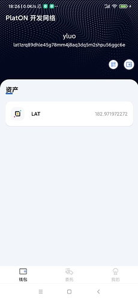
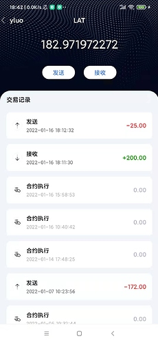
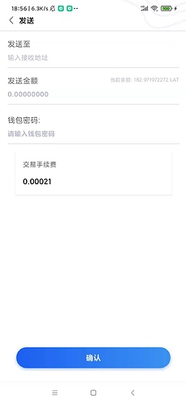
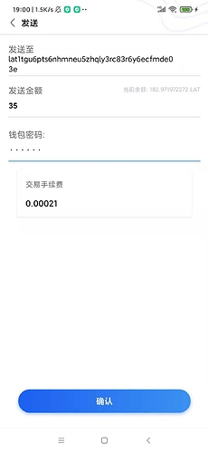
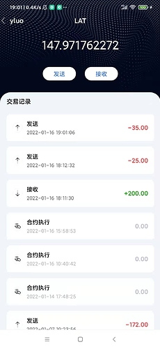

本章我们完成查看交易列表以及转账的功能

### 增加WalletManager方法
因为增加的方法比较多, 笔者调重要的方法讲解,其他的需要方法,大家去看源码即可.

1, 加载所有钱包列表 -- LoadAllWallet
代码如下:
```
    fun LoadAllWallet() {
        val context = DiggingApplication.context
        try {
            val file = File(context.filesDir, WalletStorePath)
            if (!file.isDirectory) {
                return
            }
            file.listFiles()?.forEach {
                walletSet.add(it.name.split(".")[0])
            }
        } catch (e: Exception) {

        }
    }
```
因为我们创建/导入钱包的钱包文件都是以{钱包名}.json的命名文件存放在walletFiles目录下的,因此我们需要获取walletFiles目录下文件列表,然后提取出钱包名

2, 获取当前选中的钱包名 -- GetCurrentWalletName
代码如下:
```
    /**
     * 获取当前钱包名字
     */
    fun GetCurrentWalletName(): String {
        if (!TextUtils.isEmpty(walletName)) {
            return walletName
        }
        val context = DiggingApplication.context
        // 
        val sp = context.getSharedPreferences("walletInfo", Context.MODE_PRIVATE)
        var curWalletName = sp.getString("curWallet", "")

        // 如果当前选中的钱包为空， 则获取第一个钱包名做为显示钱包
        if (TextUtils.isEmpty(curWalletName)) {
            if (walletSet.size != 0) {
                curWalletName = walletSet.iterator().next()
                SwitchWallet(curWalletName)
            }
        }
        walletName = curWalletName!!
        return walletName
    }
```
如果没有选中的钱包, 则获取钱包列表得到第一个钱包作为显示的钱包.

3, 切换钱包 -- SwitchWallet
```
    /**
     * 切换钱包
     */
    fun SwitchWallet(walletName: String) {
        val context = DiggingApplication.context
        val sp = context.getSharedPreferences("walletInfo", Context.MODE_PRIVATE)
        val editor = sp.edit()
        editor.putString("curWallet", walletName)
        editor.commit()
        WalletManager.walletName = walletName
    }
```
这里使用SharedPreferences得到方式存储当前显示的钱包名
同时WalletManager类还增加钱包名是否存在的判断函数,用来判断创建或者导入钱包是,钱包是否重名.


改造完成后, 在SplashActivity类的initUI中调用 WalletManager.LoadAllWallet函数,然后通过判断当前是否 有钱包,如果没有钱包的话则跳转到OperateMenuActivity页面, 创建或者导入钱包. 如果当前已经有钱包那么跳转到MainActivity页面,显示钱包信息.具体代码如下:
```
    override fun initUI() {
        // 加载所有的钱包
        WalletManager.LoadAllWallet()
        val handler = Handler(Looper.getMainLooper())
        /**
         * 设置2s后跳转到页面
         */
        handler.postDelayed({

            if (WalletManager.IsExistWallet()) {
                DXRouter.JumpAndFinish(this, MainActivity::class.java)
            } else {
                DXRouter.JumpAndFinish(this, OperateMenuActivity::class.java)
            }
        }, 2000)
    }
```

### 构建主页面
具体的布局代码,参看res/layout/activity_main.xml文件. 这里使用ViewPager2做页面的跳转, 其中主页面的Adapter为adapter/MainPageAdapter,具体的代码为:
```
class MainPageAdapter : RecyclerView.Adapter<BaseViewHolder>() {
    override fun onCreateViewHolder(parent: ViewGroup, viewType: Int): BaseViewHolder {

        val inflater = LayoutInflater.from(parent.context)

        return AssetPage(PageAssetsBinding.inflate(inflater, parent, false).root)
    }

    override fun onBindViewHolder(holder: BaseViewHolder, position: Int) {

    }

    override fun getItemViewType(position: Int): Int {
        return position
    }

    override fun getItemCount(): Int {
        return 1
    }
}
```
因为本章只实现了钱包页,因此getItemCount返回的数量为1.
然后我们创建钱包页,具体的布局代码参看res/layout/page_assets.xml
接着我们编写获取钱包的逻辑,在page目录下创建res/layout/page_assets.xml的逻辑类AssetPage,主要代码如下:
```
    private fun initUI() {
        //设置顶部的状态栏高度
        ViewUtil.SetStatusBarMargin(binding.nodeBar)
        //
        // 设置tab选项
        var indicatorThickness = DensityUtil.DP2PX(itemView.context, 2.0f)
        binding.stbBar.setIndicatorThickness(indicatorThickness + 4)
        indicatorThickness += 4
        binding.stbBar.setIndicatorCornerRadius(indicatorThickness / 2.0f)
        val titleList = ArrayList<String>(3)
        // 添加资产选项
        titleList.add(ResourceUtil.GetString(R.string.wallet_tab_assets))

        binding.stbBar.setCustomTabView { container, title -> getTableView(container, title) }

        binding.vpContent.adapter = AssetPageAdapter()

        binding.stbBar.setViewPager(binding.vpContent, titleList)
        // 获取当前钱包名字
        val walletName = WalletManager.GetCurrentWalletName()
        // 获取当前钱包地址
        val walletAddress = WalletManager.GetWalletAddress(walletName)
        // 显示在页面上
        binding.walletName.text = walletName
        binding.walletAddress.text = walletAddress
    }
```
这里使用了ATON的CustomTabLayout控件来显示资产的页面,因为显示资产的页面使用的ViewPager2显示,因此我们需要编写对应的Adapter, 在adapter包创建AssetPageAdapter, 代码如下:
```
class AssetPageAdapter : RecyclerView.Adapter<BaseViewHolder>() {
    override fun onCreateViewHolder(parent: ViewGroup, viewType: Int): BaseViewHolder {
        val inflater = LayoutInflater.from(parent.context)
        val binding = PageCommonRecyclerviewBinding.inflate(inflater, parent, false)
        return AssetRecyclerPage(binding.root)
    }

    override fun onBindViewHolder(holder: BaseViewHolder, position: Int) {
        holder.OnRender(position)
    }

    override fun getItemCount(): Int {
        return 1
    }
}
```
因为我们这里只有资产这个页面,因此getItemCount的数量返回1, 因为资产页面也是使用RecyclerView显示的,对应的Adapter为adapter包下的AssetRecyclerAdAdapter类,因为资产这里只显示当前钱包的LAT数量,因此只有一条记录,其中获取LAT数量代码放在, AssetRecyclerPage的loadAsset, 其代码如下:
```
    private suspend fun loadAsset() {
        // 获取当前钱包地址
val walletAddress = WalletManager.GetCurWalletAddress()
      // 获取钱包余额
        val lat = PlatonApi.GetBalance(walletAddress)
        val assetItemData = AssetItemData(R.mipmap.icon_platon_item_default, "LAT", lat)
        val itemList = ArrayList<AssetItemData>()
        itemList.add(assetItemData)
        adapter.UpdateData(itemList)
    }
```
注意因为AssetRecyclerPage不是Activity类因此不能使用lifecycleScope,只能使用GlobalScope, 调用loadAsset函数的方式如下:
```
       GlobalScope.launch(Dispatchers.Main) {
            loadAsset()
        }
```
这里一定要指明Dispatchers.Main否则, GlobalScope.launch默认使用子线程执行,操作UI时会崩溃.
最后获取到钱包余额的效果如下图:

 

### 构建显示交易列表的页面
具体的布局代码,参看res/layout/activity_assets_chain.xml文件, 页面效果如下图:

 

接着我们再activity包下创建AssetChainActivity类. 这里显示余额的数量就不赘述了, 我们讲解获取交易记录的方式.从ATON中我们知道, 测试网的地址为: https://aton-dev.platon.network. 同时开源的版本的ATON中,知道获取交易列表的地址为:/app/v0760/transaction/list, 以及该接口的调用参数如下:
```
data class TransactionListTO(
    var walletAddrs: List<String>? = null,// 数据列表
    var beginSequence: Int = 1, // 页数
    var listSize: Int = 20, // 每一页显示的数量
    var direction: String = "new" //向前取最新的
)
```
以及该接口返回的数据类型为Transaction, 对应的字段描述如下:
```
@JsonIgnoreProperties(ignoreUnknown = true)
data class Transaction(
    /**
     * 交易hash
     */
    val hash: String? = null,

    /**
     * 当前交易所在快高
     */
    val blockNumber: String? = null,

    /**
     * 当前交易的链id
     */
    val chainId: String? = null,

    /**
     * 交易实际花费值(手续费)，单位：wei
     * “21168000000000”
     */
    val actualTxCost: String? = null,

    /**
     * 交易发送方
     */
    val from: String? = null,

    /**
     * 交易接收方
     */
    val to: String? = null,

    /**
     * 交易序列号
     */
    val sequence: Long = 0,

    /**
     * 交易状态2 pending 1 成功 0 失败
     */
    val txReceiptStatus: Int = 0,

    /**
     * 0: 转账
     * 1: 合约发布(合约创建)
     * 2: 合约调用(合约执行)
     * 3: 其他收入
     * 4: 其他支出
     * 5: MPC交易
     * 1000: 发起质押(创建验证人)
     * 1001: 修改质押信息(编辑验证人)
     * 1002: 增持质押(增加自有质押)
     * 1003: 撤销质押(退出验证人)
     * 1004: 发起委托(委托)
     * 1005: 减持/撤销委托(赎回委托)
     * 2000: 提交文本提案(创建提案)
     * 2001: 提交升级提案(创建提案)
     * 2002: 提交参数提案(创建提案)
     * 2003: 给提案投票(提案投票)
     * 2004: 版本声明
     * 3000: 举报多签(举报验证人)
     * 4000: 创建锁仓计划(创建锁仓)
     */
    val txType: String? = null,

    /**
     * 交易金额
     */
    val value: String? = null,

    /**
     * 发送者钱包名称
     */
    val senderWalletName: String? = null,

    /**
     * {json}交易详细信息
     */
    val txInfo: String? = null,

    /**
     * 提交时间（单位：毫秒）
     */
    val timestamp: Long = 0,

    /**
     * to类型
     * contract —— 合约
     * address —— 地址
     */
    val toType: String? = null,

    /**
     * Sent发送/Receive接收
     */
    val direction: String? = null,

    /**
     * 节点名称/委托给/验证人
     * //txType = 1004,1005,1000,1001,1002,1003,3000,2000,2001,2002,2003,2004,nodeName不为空
     * 详细描述：txType =  2000,2001,2002,2003(验证人)
     * 详细描述：txType =  1004,1005(委托给，同时也是节点名称)
     */
    val nodeName: String? = null,

    /**
     * txType =  1004,1005,1000,1001,1002,1003,3000,2004,nodeId不为空
     */
    val nodeId: String? = null,

    /**
     * txType =  4000,lockAddress不为空
     */
    val lockAddress: String? = null,

    /**
     * 举报类型
     */
    val reportType: String? = null,

    /**
     * 版本
     */
    val version: String? = null,

    /**
     * 提案id(截取最后一个破折号)
     */
    val url: String? = null,

    /**
     * PIP编号   eip-100(EIP-由前端拼接)
     */
    val piDID: String? = null,

    /**
     * 提案类型
     */
    val proposalType: String? = null,

    /**
     * 提案id
     */
    val proposalId: String? = null,

    /**
     * 投票
     */
    val vote: String? = null,


    //=======================下面是新加的三个字段=================================
    //=======================下面是新加的三个字段=================================
    /**
     * //赎回状态， 1： 退回中   2：退回成功     赎回失败查看交易txReceiptStatus
     */
    val redeemStatus: String? = null,

    /**
     * 钱包头像
     */
    val walletIcon: String? = null,

    /**
     * 钱包名称
     */
    val walletName: String? = null,

    /**
     * "unDelegation":"10000",       //赎回金额 txType = 1005(赎回数量)
     */
    val unDelegation: String? = null,

    /**
     * 质押金额 txType = 1003(退回数量)
     */
    val stakingValue: String? = null,

    /**
     * 领取数量 单位von   1LAT(ETH)=1000000000000000000von(wei)
     */
    val totalReward: String? = null,

    /**
     * 交易备注
     */
    val remark: String? = null,
)
```
该类已经对每个字段有具体的描述了,笔者就不再说明了.接着我们再api包下创建AtonApi类,代码如下:
```
interface IAtonApi {
    @POST("/app/v0760/transaction/list")
    suspend fun GetTransactionList(@retrofit2.http.Body param: TransactionListTO): ApiResponse<List<Transaction>>
}
object AtonApi {
    private var url: String = "https://aton-dev.platon.network"

    fun <T> Create(tClass: Class<T>): T {
        val okHttpClient = OkHttpClient.Builder().build()
        val retrofit: Retrofit = Retrofit.Builder().baseUrl(AtonApi.url)
            .addConverterFactory(JacksonConverterFactory.create())
            .client(okHttpClient)
            .build()
        return retrofit.create(tClass)
    }
    private val atonApi = Create(IAtonApi::class.java)
    /**
     * 获取交易列表
     */
    suspend fun GetTransactionList(param: TransactionListTO): ApiResponse<List<Transaction>> {
        return atonApi.GetTransactionList(param)
    }
}
```
这样我们就可以获取到钱包地址的交易列表啦.交易列表对应的显示逻辑在adapter/TransactionListAdapter中, 显示交易内容的逻辑函数在TransactionListAdapter.TransactionViewHolder类的OnRender方法中, 代码如下:
```
            override fun OnRender(position: Int) {

                val transaction = adapter.GetData(position)

                val transactionStatus =
                    TransactionStatus.getTransactionStatusByIndex(transaction.txReceiptStatus)
                // 是否是发送者
                val isSender: Boolean = transaction.from == WalletManager.GetCurWalletAddress()

                // 获取交易类型
                val transactionType =
                    TransactionType.getTxTypeByValue(NumberParserUtils.parseInt(transaction.txType))

                // 判断当前是不是发送
                val isSend =
                    isSender && transactionType !== TransactionType.UNDELEGATE
                            && transactionType !== TransactionType.EXIT_VALIDATOR
                            && transactionType !== TransactionType.CLAIM_REWARDS
                // 判断交易额是否为0
                val isValueZero: Boolean = !BigDecimalUtil.isBiggerThanZero(transaction.value)

                // 如果交易额为0,交易失败或者交易超时,则交易额显示为灰色
                val isTransactionGray =
                   isValueZero || transactionStatus === TransactionStatus.FAILED || transactionStatus === TransactionStatus.TIMEOUT


                if (isTransactionGray) {
                    binding.transactionAmount.text = AmountUtil.formatAmountText(transaction.value)
                    binding.transactionAmount.setTextColor(ResourceUtil.GetColor(R.color.color_b6bbd0))
                } else if (isSend) {
                    //发送LAT,数量显示为红色
                    binding.transactionAmount.text =
                        "-${AmountUtil.formatAmountText(transaction.value)}"
                    binding.transactionAmount.setTextColor(ResourceUtil.GetColor(R.color.color_ff3b3b))
                } else {
                    // 接收LAT数量显示为绿色
                    binding.transactionAmount.text =
                        "+${AmountUtil.formatAmountText(transaction.value)}"

                    binding.transactionAmount.setTextColor(ResourceUtil.GetColor(R.color.color_19a20e))
                }
                if (isTransactionGray) {
                    binding.transactionTime.setTextColor(ResourceUtil.GetColor(R.color.color_61646e_50))
                } else {
                    binding.transactionTime.setTextColor(ResourceUtil.GetColor(R.color.color_61646e))
                }

                binding.transactionStatus.setTextColor(ResourceUtil.GetColor(R.color.color_000000))
                binding.transactionStatus.text = getTxTDesc(transaction, isSend)
                binding.transactionTime.text = DateUtil.format(
                    transaction.timestamp,
                    DateUtil.DATETIME_FORMAT_PATTERN_WITH_SECOND
                )

                binding.transactionStatus.visibility =
                    if (transactionStatus === TransactionStatus.PENDING) View.GONE else View.VISIBLE
                // 如果是转账的,则显示箭头
                if (transactionType == TransactionType.TRANSFER) {
                    binding.transactionStatusIV.setImageResource(if (isSender) R.mipmap.icon_send_transation else R.mipmap.icon_receive_transaction)
                } else {
                    binding.transactionStatusIV.setImageResource(if (isSend) R.mipmap.icon_delegate else R.mipmap.icon_undelegate)
                }
            }
```
这里对应的交易类型判断TransactionType,以及交易状态TransactionStatus放放在entity包下.


### 构建显示交易列表的页面
具体的布局代码,参看res/layout/activity_send_transaction.xml文件, 页面效果如下图:

 

接着在activity包下创建SendTransactionActivity类,主要代码如下:
```
    /**
     * 获取当前钱包余额
     */
    private suspend fun getBalance() {
        val walletAddress = WalletManager.GetCurWalletAddress()
        val amount = PlatonApi.GetBalance(walletAddress)
        this.balance = amount
        binding.walletBalance.text = "当前余额: ${amount.toString()} LAT"
    }

    /**
     * 获取手续费
     */
    private suspend fun getGasFee() {
        val gasfee = PlatonApi.GetGasPrice().multiply(BigInteger("21000"))
        binding.feeAmount.text = AmountUtil.formatAmountText(gasfee.toString())
    }

    override fun initEvent() {
        binding.sendBtn.setOnClickListener {
            // 1, 通过密码获取钱包秘钥
            val password = binding.password.text.toString()
            if (TextUtils.isEmpty(password)) {
                ToastUtil.showLongToast(this, "密码不能为空")
                return@setOnClickListener
            }

            val privateKey =
                WalletManager.GetWalletPrivateKey(WalletManager.GetCurrentWalletName(), password)
            if (TextUtils.isEmpty(privateKey)) {
                ToastUtil.showLongToast(this, "密码错误")
                return@setOnClickListener
            }

            val toAddress = binding.walletAddress.text.toString()
            if (TextUtils.isEmpty(toAddress)) {
                ToastUtil.showLongToast(this, "接收地址不能为空")
                return@setOnClickListener
            }
            val lat = binding.walletAmount.text.toString()
            lifecycleScope.launch {
                // 发送lat
                val receiptInfo = PlatonApi.SendLATTO(privateKey, toAddress, lat.toLong())

                ToastUtil.showLongToast(this@SendTransactionActivity, "发送成功")

                delay(1000)
                this@SendTransactionActivity.finish()
            }
        }
    }
```
该类主要逻辑有
1, 显示钱包余额
2, 显示当前手续费
3, 通过密码获取秘钥, 然后调用PlatonApi.SendLATTO发送LAT

这里我们演示发送35个LAT到钱包lat1tgu6pts6nhmneu5zhqly3rc83r6y6ecfmde03e中,

 

然后再交易列表看到该条记录, 页面如下:

 


好啦本章内容就先到这里啦, 下一章我们实现委托功能.

本章新增的代码比较多,如果大家有问题,欢迎提问.


仓库地址: https://github.com/DQTechnology/Platon_DevGuideProject

Andorid篇往期连接

[跟Dex学PlatON应用开发–Android篇(一)](https://forum.latticex.foundation/t/topic/5948)

[跟Dex学PlatON应用开发–Android篇(二)](https://forum.latticex.foundation/t/topic/5952)

[跟Dex学PlatON应用开发–Android篇(三)](https://forum.latticex.foundation/t/topic/5958)

[跟Dex学PlatON应用开发–Android篇(四)](https://forum.latticex.foundation/t/topic/5967)

[跟Dex学PlatON应用开发–Android篇(五)](https://forum.latticex.foundation/t/topic/5979)