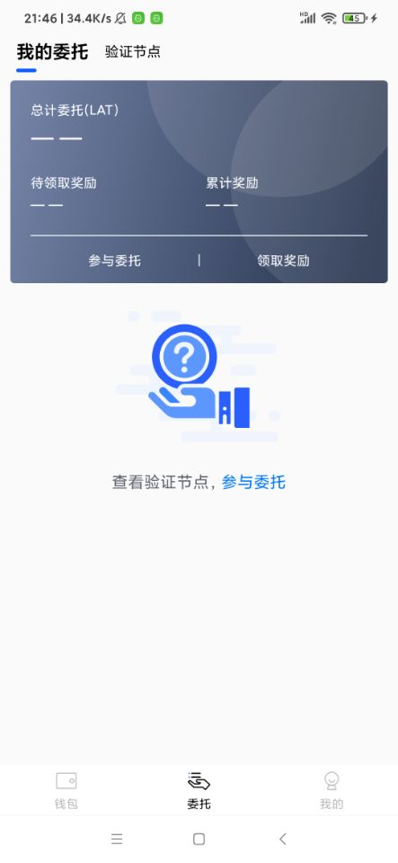
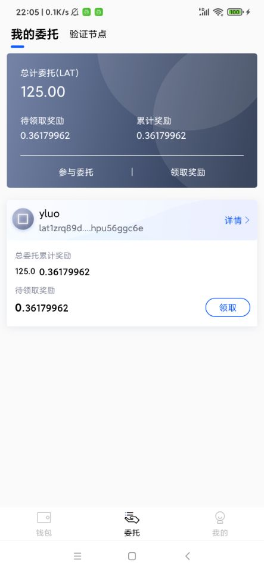
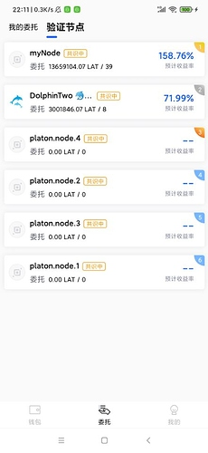
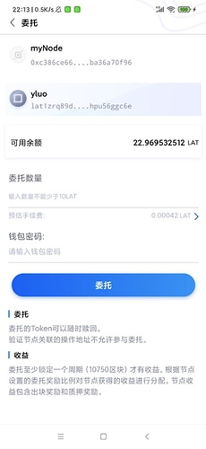
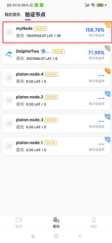
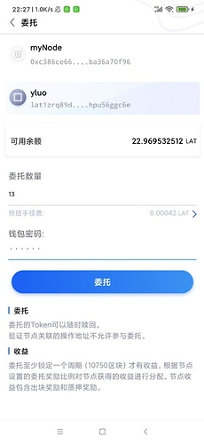
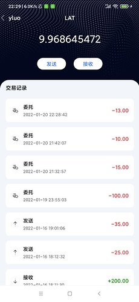

委托的功能我们分成两章来讲解, 本章我们实现获取验证节点列表以及委托的功能, 也将学会如何自己写代码去调用智能合约.

### 创建委托的页面

委托页面是作为activity_main的一个主页面出现的, 由因为委托页面又分为我的委托和验证节点两个子页面.
我们先构建委托页面,具体的布局代码, 参看res/layout/page_delegate.xml文件.

然后在 page包下创建DelegatePage类, 代码如下:
```
class DelegatePage(itemView: View) : BaseViewHolder(itemView) {
    private val binding: PageDelegateBinding = PageDelegateBinding.bind(itemView)
    init {
        initUI()
    }
    private fun initUI() {
        //设置顶部的状态栏高度
        ViewUtil.SetStatusBarMargin(binding.stbBar)

        // 设置tab选项
        var indicatorThickness = DensityUtil.DP2PX(itemView.context, 2.0f)
        binding.stbBar.setIndicatorThickness(indicatorThickness + 4)
        indicatorThickness += 4
        binding.stbBar.setIndicatorCornerRadius(indicatorThickness / 2.0f)
        val titleList = ArrayList<String>(2)
        // 添加资产选项
        titleList.add(ResourceUtil.GetString(R.string.tab_my_delegate))
        // 添加资产选项
        titleList.add(ResourceUtil.GetString(R.string.tab_validators))
        binding.stbBar.setCustomTabView { container, title -> getTableView(container, title) }
        binding.vpContent.adapter = DelegatePageAdapter()
        binding.stbBar.setViewPager(binding.vpContent, titleList)
    }
    private fun getTableView(container: ViewGroup, title: String): View? {
        val inflater = LayoutInflater.from(container.context)
        val tabBinding = LayoutAppTabItem3Binding.inflate(inflater, container, false)
        tabBinding.tvTitle.text = title

        return tabBinding.root
    }
}
```
然后在adapter/MainPageAdapter类,添加该页面的创建代码:
```
    override fun onCreateViewHolder(parent: ViewGroup, viewType: Int): BaseViewHolder {
        val inflater = LayoutInflater.from(parent.context)

        return when (viewType) {
            0 -> {
                // 钱包页面
                AssetPage(PageAssetsBinding.inflate(inflater, parent, false).root)
            }
            1 -> {
                // 委托页面
                DelegatePage(PageDelegateBinding.inflate(inflater, parent, false).root)
            }
            else -> {
                throw RuntimeException("无法识别页面类型")
            }
        }
    }
```
接着我们创建 **我的委托**页面, 布局代码参看 res/layout/page_my_delegate.xml, 这里笔者使用RecyclerView控件来显示内容, 页面效果如下图:

 

其中总委托的item布局参看 res/layout/item_total_delegated.xml文件, 空提示item的布局代码参看res/layout/item_empty_delegate_tip.xml,  钱包委托详情的item参看res/layout/item_my_delegate_list.xml文件.

接着我们编写获取委托情况代码, 在JavaScript篇中,我们是直接从PlatON节点获取委托信息的,这种方式获取的信息有限, 这次我们调用ATON的接口获取. 

在page包创建为的委托页的逻辑类 MyDelegatePage, 讲解从ATON后台获取钱包委托信息的代码,其他基本都是Andorid的基本开发功能,就不展开讲解了, 获取委托信息代码如下:
```
    private suspend fun loadData() {

        val walletAddrs = ArrayList<String>()
        /**
         * 获取所有的钱包地址
         */
        walletAddrs.addAll(WalletManager.GetAllWalletAddress())
        val myDelegateTO = MyDelegateTO(walletAddrs)
        // 获取钱包信息
        val delegateInfoRsp = AtonApi.GetMyDelegateList(myDelegateTO)
        // 获取委托节点详情
        adapter.UpdateData(delegateInfoRsp.data)

        binding.refresher.finishRefresh(true)
    }
```

**AtonApi.GetMyDelegateList**通过查看来源版本的ATON源码可以知道, 获取钱包委托信息的接口地址为: /app/v0760/node/listDelegateGroupByAddr, 而测试网ATON的后台地址为:  https://aton-dev.platon.network
然后我们得知调用该接口的参数为:
```
data class MyDelegateTO(
    val walletAddrs: List<String>
)
```
从结构体知道, 这个参数参数的是钱包地址数组, 返回是各个钱包的的委托详情,是一个数组, 字段描述如下:
```
@JsonIgnoreProperties(ignoreUnknown = true)
class DelegateInfo {
    /**
     * 钱包名称
     */
    var walletName: String? = null
    /**
     * 钱包地址
     */
    var walletAddress: String? = null
    /**
     * 钱包头像
     */
    var walletIcon: String? = null
    /**
     * 累计的奖励  单位von   1LAT(ETH)=1000000000000000000von(wei)
     */
    var cumulativeReward: String? = null
    /**
     * 待领取的奖励，单位von
     */
    var withdrawReward: String? = null
    /**
     * 总委托  单位von   1LAT(ETH)=1000000000000000000von(wei)
     */

    var delegated: String? = null

    /**
     * 是否正在pending
     */
    var isPending: Boolean = false

    /**
     * 是否是观察者钱包
     */

    var isObservedWallet: Boolean = false

    fun setIsObservedWallet(isObservedWallet: Boolean) {
        this.isObservedWallet = isObservedWallet
    }

    fun setIsPending(isPending: Boolean) {
        this.isPending = isPending
    }
}
```
这里需要注意的是对于**is**开头字段, 我们需要手写set和get方法,否则会报错.
计算总的委托数量, 需要把各个钱包的委托信息相加, 具体的UI显示代码在adapter包的MyDelegateAdapter类中, 计算总委托LAT, 总待领取奖励,累计奖励的代码如下
```
   fun UpdateData(delegateList: List<DelegateInfo>?) {
        totalDelegateLAT = BigInteger("0")
        canWithdrawReward = BigInteger("0")
        cumulativeReward = BigInteger("0")

        delegateList?.forEach {
            if (it.delegated != null) {
                totalDelegateLAT = totalDelegateLAT.add(it.delegated!!.toBigInteger())
            }
            if (it.withdrawReward != null) {
                canWithdrawReward = canWithdrawReward.add(it.withdrawReward!!.toBigInteger())
            }
            if (it.cumulativeReward != null) {
                cumulativeReward = cumulativeReward.add(it.cumulativeReward!!.toBigInteger())
            }
        }
        this.delegateNodeList.clear()
        if (delegateList != null) {
            this.delegateNodeList.addAll(delegateList)
        }
        notifyDataSetChanged()
    }
```
页面效果如下图:

 

接着我们编写验证节点页面,

布局代码参看res/layout/page_validator.xml, 对应的item布局代码参看res/layout/item_validator_list.xml

验证节点的逻辑代码文件为, page包下的ValidatorPage, 这里我们讲解获取验证节点列表的接口,从ATON中找到该接口的地址为: /app/v0760/node/nodelist, 这个接口并没有参数, 一次性可以获取到所有的接口, 如果需要和当前最新版本的ATON一样,区分活跃,候选节点那么需要自己根据各个节点状态来区分, 该接口返回的结构图如下:
```
@JsonIgnoreProperties(ignoreUnknown = true)
class VerifyNode {
    /**
     * 节点ID
     */
    var nodeId: String? = null

    /**
     * 质押排名
     */

    var ranking: Int = 0

    /**
     * 节点名称
     */
    var name: String? = null
    /**
     * 节点头像
     */
    var url: String? = null

    /**
     * 预计年化率
     */

    var delegatedRatePA: String? = null

    /**
     * 竞选状态
     * Active —— 活跃中
     * Candidate —— 候选中
     * Locked —— 锁定中
     */
    var nodeStatus: String? = null
    /**
     * 是否为链初始化时内置的候选人
     */
    var isInit: Boolean = false

    /**
     * 是否共识中
     */
    var isConsensus: Boolean = false
    /**
     * 总押金
     */
    var delegateSum: String? = null

    /**
     * 委托者数
     */
    var delegate: String? = null

    fun setIsConsensus(isConsensus: Boolean) {
        this.isConsensus = isConsensus
    }

    fun setIsInit(isInit: Boolean) {
        this.isInit = isInit
    }
}
```
页面效果如下图:

 


### 创建发送委托页面

发送委托的页面布局代码, 参看res/layout/activity_delegate.xml, 页面效果如下图:

 

该页面的是一个activity,对应的逻辑类为activity包下的DelegateActivity类. 也页面是通过点击验证节点进去的,
如下图:
 

这里我们讲解发送委托的接口, 这里笔者本着学习的目的, 没有使用SDK自动的委托接口, 而是直接通过jsonrpc封装了一个, 这样后面就算遇到官方不提供的SDK的语言, 我们都可以自己编写对应接口.

要调用委托接口, 我们需要完成一下步骤:
1, 找到委托函数的信息: 包含函数名, 参数列表
2, 把调用函数的参数序列化
3, 找到委托的智能合约地址

通过官网我们知道委托的函数名为: 1004, 对应的参数依次为:
1, 委托类型该参数 0 代表自由金额, 1代表锁仓金额, 类型为BigInt
2, 委托节点ID, 该类型为字符串
3, 委托金额, 类型为Bigint

知道函数调用信息后, 我们就是序列化. PlatON节点序列化参数的方式为:rlp, 参考SDK的序列方式,可以得出该函数的序列方式代码为:
```
    /**
     * 委托lat
     */
    suspend fun Delegate(privateKey: String, nodeId: String, lat: String): PlatonReceiptInfo? {
        // solidity的序列化方式为RlpType, 从官网得知
        // 委托的函数名为 1004
        // 参数依次为委托类型, 委托节点Id, 委托lat的数量, 因此我们需要一次序列化参数
        val result = ArrayList<RlpType>()
        // 委托的函数名为1004
        with(result) {
            // 构造函数名
            add(RlpString.create(RlpEncoder.encode(RlpString.create(1004))))
            // 0: 自由金额； 1: 锁仓  默认自由金额即可
            add(RlpString.create(RlpEncoder.encode(RlpString.create(0L))))
            // 设置nodeId
            add(
                RlpString.create(
                    RlpEncoder.encode(
                        RlpString.create(
                            Numeric.hexStringToByteArray(
                                nodeId
                            )
                        )
                    )
                )
            )
            // 委托金额
            val von = Convert.toVon(lat, Convert.Unit.LAT).toBigInteger()
            add(RlpString.create(RlpEncoder.encode(RlpString.create(von))))
        }

        val data = Hex.toHexString(RlpEncoder.encode(RlpList(result)))
        // 委托的智能合约地址为: lat1zqqqqqqqqqqqqqqqqqqqqqqqqqqqqqqzsjx8h7
        return sendRawTransaction(
            privateKey, "lat1zqqqqqqqqqqqqqqqqqqqqqqqqqqqqqqzsjx8h7", 0,
            49920, data
        )
    }
```
序列化信息完成后,就是把参数发送给智能合约了, 从官网的文档我们知道, 委托的智能合约地址为: lat1zqqqqqqqqqqqqqqqqqqqqqqqqqqqqqqzsjx8h7, 而调用智能合约的方式和发送LAT的方式是一样的,区别的是data是否为空, 因此我们把, SendLATTO发送参数的逻辑抽取成sendRawTransaction单独函数,代码如下:
```
    private suspend fun sendRawTransaction(
        privateKey: String,
        toAddress: String,
        lat: Long,
        gas: Long,
        data: String
    ): PlatonReceiptInfo? {
        /**
         * 转换秘钥
         */
        val iPrivateKey =
            Numeric.toBigInt(privateKey)

        val keyPair = ECKeyPair.create(iPrivateKey)

        /**
         * 将秘钥转换成sdk使用的凭证类
         */
        val credentials: Credentials = Credentials.create(keyPair)

        /**
         * 设置gaslimit
         */
        val gasLimit = BigInteger.valueOf(gas)

        /**
         * 获取当前的gasprice
         */
        val gasPrice = GetGasPrice()

        /**
         * 获取交易数量用作nonce字段
         */
        val nonce: BigInteger = GetTransactionCount(credentials.address)

        /**
         * 将lat转换为von
         */
        val value = Convert.toVon(BigDecimal(lat), Convert.Unit.LAT).toBigInteger();
        /**
         * 构建交易类
         */
        val rawTransaction = RawTransaction.createTransaction(
            nonce,
            gasPrice,
            gasLimit,
            toAddress,
            value,
            data
        )

        /**
         * 使用秘钥对交易数据进行签名
         */
        val signedMessage =
            TransactionEncoder.signMessage(rawTransaction, 210309, credentials)

        /**
         * 将交易数据转换为16进制
         */
        val hexValue = Numeric.toHexString(signedMessage)

        val params = ArrayList<Any>()

        params.add(hexValue)
        /**
         * 发送给节点,返回为交易哈希
         */
        val platonResult = doCall("platon_sendRawTransaction", params)

        /**
         * 根据交易哈希获取交易收据
         */
        return GetTransactionReceipt(platonResult.result)
    }
```
因为发送LAT和执行委托的操作的gasLimit不一样,因此把该变量抽取成参数.

笔者这里演示委托13个LAT(**这里感谢在测试网部署质押节点同学**), 界面如下:

 


然后我们在交易记录中看到对应的委托记录,如下图:

 


好啦,本章就先到这里啦, 下一章我们实现领取委托奖励,赎回委托的功能.

最近几章的内容, 代码量比较大, 因此耽搁了一些时间. 


仓库地址: https://github.com/DQTechnology/Platon_DevGuideProject

Andorid篇往期连接

[跟Dex学PlatON应用开发–Android篇(一)](https://forum.latticex.foundation/t/topic/5948)

[跟Dex学PlatON应用开发–Android篇(二)](https://forum.latticex.foundation/t/topic/5952)

[跟Dex学PlatON应用开发–Android篇(三)](https://forum.latticex.foundation/t/topic/5958)

[跟Dex学PlatON应用开发–Android篇(四)](https://forum.latticex.foundation/t/topic/5967)

[跟Dex学PlatON应用开发–Android篇(五)](https://forum.latticex.foundation/t/topic/5979)