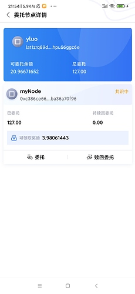

本章我们实现赎回委托, 领取委托奖励的功能. 也将学会如何解析智能合约的返回结果.

### 创建委托详情页面

布局代码参看res/layout/activity_delegate_detail.xml文件, 页面效果如下图:

 

然后再activity包下创建对应的逻辑类 **DelegateDetailActivity**

这个页面需要获取到钱包所有委托节点的信息. 在[javascript篇第九章](https://forum.latticex.foundation/t/topic/5915)我们是直接在区块链节点获取的, 而本章获取委托节点列表通过ATON提供的API获取. 该接口的接口地址为: **/app/v0760/node/delegateDetails**.(该接口的实现方式参看AtonApi类的GetDelegateDetailList方法)
而该接口返回的信息如下:
```
class DelegateNodeDetail {
    /**
     * 可委托LAT
     */
    var availableDelegationBalance: String? = null

    /**
     * 总委托LAT数量
     */
    var delegated: String? = null

    /**
     * 委托的节点列表
     */
    @JSONField(name = "item")
    var item: List<DelegateItemInfo>? = null
}

class DelegateItemInfo {
    /**
     * 投票节点Id（节点地址 ）
     */
     var nodeId: String? = null

    /**
     * 节点名称
     */
    var nodeName: String? = null

    /**
     * 机构官网（链接）
     */
    var website: String? = null

    /**
     * 节点头像
     */
    var url: String? = null

    /**
     * 竞选状态:
     * Active —— 活跃中
     * Candidate —— 候选中
     * Exiting —— 退出中
     * Exited —— 已退出
     * Locked —— 锁定中
     */
    var nodeStatus: String? = null

    /**
     * 已解除委托
     */
    var released: String? = null

    var walletAddress: String? = null

    /**
     * 是否为链初始化时内置的候选人
     * 0.7.3 新增字段
     */
    var isInit = false

    /**
     * 已委托  单位von
     */
    var delegated: String? = null

    /**
     * 0.7.5新增字段
     */
    var isConsensus = false

    /**
     * 待领取的奖励
     */
    var withdrawReward: String? = null

    fun getIsInit(): Boolean {
        return isInit
    }

    fun setIsInit(init: Boolean) {
        isInit = init
    }
    fun getIsConsensus(): Boolean {
        return isConsensus
    }

    fun setIsConsensus(consensus: Boolean) {
        isConsensus = consensus
    }
}
```
需要注意的是DelegateItemInfo结构体中的**isConsensus**和**isInit**两个字段都是以**is**开头的,因此需要重写这个两个字段的set和get方法. 获取节点列表后,显示即可.

### 实现赎回委托功能

布局代码参看res/layout/activity_withdraw_delegate.xml文件, 页面效果如下图:

 

然后在activity包下创建对应的逻辑类:**WithdrawDelegateActivity** 
赎回委托的接口信息:
1,  接口名为: 1005
2, 参数依次为: 委托的块高: stakingBlockNum, 委托的节点ID: nodeId,  赎回的lat数量

因此我们还需要获取stakingBlockNum.

我们可以通过委托智能合约的 **getRelatedListByDelAddr**接口获取.该接口的信息如下:
1,  接口名为: 1103
2, 参数为钱包地址
返回信息为:
```
class DelegationIdInfo {
    var addr: String? = null //  验证人节点的地址

    var nodeId: String? = null //  验证人的节点Id

    var stakingBlockNum: BigInteger? = null // 发起委托时的区块高度
}
```
调用该接口的代码如下:
```
    /**
     * 获取指定钱包的委托的节点的信息
     */
    suspend fun GetRelatedListByDelAddr(address: String): List<DelegationIdInfo> {
        // 获取钱包委托列表函数名为 1103
        // 参数为钱包地址
        val result = ArrayList<RlpType>()
        with(result) {
            // 构造函数名
            add(RlpString.create(RlpEncoder.encode(RlpString.create(1103))))
            // 钱包地址
            add(RlpString.create(RlpEncoder.encode(RlpString.create(Bech32.addressDecode(address)))))
        }
        //
        val data = Hex.toHexString(RlpEncoder.encode(RlpList(result)))
        // 添加 0x
        val preHexData = Numeric.prependHexPrefix(data)
        val params = ArrayList<Any>()
        //param的格式为
        // {
        //  from: "" 调用钱包地址
        //  to: ""  委托智能合约地址
        //  data: ""  调用的参数
        // }
        // 这里用一个map做参数传递
        val callData = HashMap<String, String>()
        callData["from"] = address
        // 委托智能合约的地址
        callData["to"] = "lat1zqqqqqqqqqqqqqqqqqqqqqqqqqqqqqqzsjx8h7"
        callData["data"] = preHexData
        params.add(callData)

        params.add("latest")
        val platonResult = doCall("platon_call", params)
        // 返回结果是以0x开头的16进制字符串, 需要把0x去掉
        val callResult = Numeric.cleanHexPrefix(platonResult.result)
        // 解析返回结果, 返回的是16进制格式需要, 解码成普通字符串
        val jsonMap = JSONUtil.jsonToMap(String(Hex.decode(callResult)))

        // 如果没有委托信息,则返回空列表
        val ret = jsonMap["Ret"] ?: return ArrayList()

        val jsonStr = JSONUtil.toJSONString(ret)
        //
        return JSONUtil.parseArray(jsonStr, DelegationIdInfo::class.java)
    }
```
调用该接口的序列化方式和之前发起委托时一样的, 因为这里调用的是platon_call方式, 因此不需要用私钥签名. 另外要注意的是, 因此从节点获取到的结果是以0x开头的, 处理结果时需要去掉.

这个接口返回的是该钱包地址所有委托节点的信息, 如果需要赎回指定的节点,需要通过nodeId去获取对应的stakingBlockNum遍历, 代码如下:
```
    /**
     * 获取在指定节点的委托信息
     */
    private suspend fun getDelegationIdInfo(): BigInteger {
        val walletAddress = WalletManager.GetWalletAddress(walletName)

        val delegateNodeList = PlatonApi.GetRelatedListByDelAddr(walletAddress)
        delegateNodeList.forEach {

            // 从区块链中获取的nodeId是不带0x, 需要手动加上
            if (Numeric.prependHexPrefix(it.nodeId) == nodeId) {
                return it.stakingBlockNum!!
            }
        }
        return BigInteger.ZERO
    }
```
这里需要注意的是,因为我们显示在界面上的节点ID是以0x开头的,而这个接口返回的节点Id不是以0x开头得到,因此比对节点ID时需要加上0x.
获取到stakingBlockNum后, 就可以赎回委托了,其代码如下:
```
    /**
     * 赎回委托的LAT
     */
    suspend fun UnDelegate(privateKey: String,  stakingBlockNum: BigInteger, nodeId: String, lat: String): PlatonReceiptInfo? {
        // 赎回委托的函数名为 1005
        // 参数依次为委托时的块高, 委托的节点ID, 赎回委托lat的数量
        val result = ArrayList<RlpType>()
        // 委托的函数名为1005
        with(result) {
            // 构造函数名
            add(RlpString.create(RlpEncoder.encode(RlpString.create(1005))))
            // 委托时的块高
            add(RlpString.create(RlpEncoder.encode(RlpString.create(stakingBlockNum))))
            // 委托的节点id
            add(
                RlpString.create(
                    RlpEncoder.encode(
                        RlpString.create(
                            Numeric.hexStringToByteArray(
                                nodeId
                            )
                        )
                    )
                )
            )
            //赎回委托金额
            val von = Convert.toVon(lat, Convert.Unit.LAT).toBigInteger()
            add(RlpString.create(RlpEncoder.encode(RlpString.create(von))))
        }

        val data = Hex.toHexString(RlpEncoder.encode(RlpList(result)))
        // 委托的智能合约地址为: lat1zqqqqqqqqqqqqqqqqqqqqqqqqqqqqqqzsjx8h7
        return sendRawTransaction(
            privateKey, "lat1zqqqqqqqqqqqqqqqqqqqqqqqqqqqqqqzsjx8h7", 0,
            49920, data
        )
    }
```
这里的gaslimit为49920.

下面我们演示赎回12.5个LAT, 如下图:

 

然后从交易列表看到赎回委托的记录:

 


### 实现领取委托奖励功能

领取委托奖励的页面是以弹出对话框的方式出现的, 其布局代码参看res/layout/dialog_claim_rewards.xml,

效果如下图:

 

然后再dialog包下创建对应的逻辑类: **ClaimRewardsDialog**

这里我们对领取奖励接口进行讲解:
1, 合约地址为 lat1zqqqqqqqqqqqqqqqqqqqqqqqqqqqqqqxlcypcy
2, 接口名为 5000
3, 没有参数
4, 每次最多只能领取20个节点的奖励, 如果超过20个需要多次领取

调用该接口的代码如下:
```
    /**
     * 领取委托奖励
     */
    suspend fun WithdrawDelegateReward(privateKey: String): PlatonReceiptInfo? {

        // 领取委托的奖励函数名为 5000
        // 没有参数,因此只需要序列化调用 函数名即可
        val result = ArrayList<RlpType>()
        //
        result.add(RlpString.create(RlpEncoder.encode(RlpString.create(5000))))

        val data = Hex.toHexString(RlpEncoder.encode(RlpList(result)))

        return sendRawTransaction(
            privateKey,
            "lat1zqqqqqqqqqqqqqqqqqqqqqqqqqqqqqqxlcypcy",
            0,
            38640,
            data
        )
    }
```
领取奖励后, 委托页面如下:

 

可以看到当前已经没有可以领取的奖励了, 同时交易列表增加了领取奖励的记录, 如下图:

 


好啦, 本章的内容就先到这里啦. 

通过第七章和本章, 我们学会了发起委托,赎回委托以及领取委托的奖励功能, 同时我们也学会了如何调用智能合约和解析返回结果的方法.


仓库地址: https://github.com/DQTechnology/Platon_DevGuideProject

Andorid篇往期连接

[跟Dex学PlatON应用开发–Android篇(一)](https://forum.latticex.foundation/t/topic/5948)

[跟Dex学PlatON应用开发–Android篇(二)](https://forum.latticex.foundation/t/topic/5952)

[跟Dex学PlatON应用开发–Android篇(三)](https://forum.latticex.foundation/t/topic/5958)

[跟Dex学PlatON应用开发–Android篇(四)](https://forum.latticex.foundation/t/topic/5967)

[跟Dex学PlatON应用开发–Android篇(五)](https://forum.latticex.foundation/t/topic/5979)

[跟Dex学PlatON应用开发–Android篇(六)](https://forum.latticex.foundation/t/topic/5985)

[跟Dex学PlatON应用开发–Android篇(七)](https://forum.latticex.foundation/t/topic/6003)