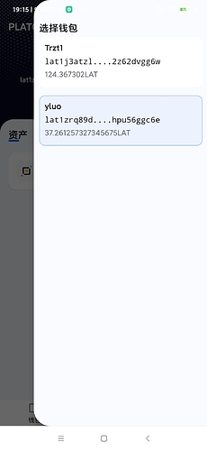

本章我们实现切换钱包以及切换网络的功能, 同时本章也是Android篇的最后一章啦.

###  主页面增加跳转添加钱包弹出框

弹出框的布局参看res/layout/dialog_assets_more.xml

然后在util包下增加弹出框的工具类 PopupWindowUtil, 代码如下:
```
public class PopupWindowUtil {
    public static PopupWindow Show(View contentView, View anchorView) {

        return Show(contentView, anchorView, 0, 0);
    }

    /**
     * @param contentView 弹出框的内容
     * @param anchorView  停靠对象
     * @param xOffset     停靠X偏移
     * @param yOffset     停靠Y偏移
     * @return
     */
    public static PopupWindow Show(View contentView, View anchorView, int xOffset, int yOffset) {
        // 创建popwindow实例
        final PopupWindow popupWindow = new PopupWindow(
                contentView,
                ConstraintLayout.LayoutParams.WRAP_CONTENT,
                ConstraintLayout.LayoutParams.WRAP_CONTENT,
                true);
        // 设置阴影
        popupWindow.setElevation(3);

        popupWindow.setTouchable(true);
        // 计算出指定view的位置
        int[] windowPos = calculatePopWindowPos(contentView, anchorView);

        popupWindow.setElevation(3);

        windowPos[0] -= xOffset;
        windowPos[1] += yOffset;
        //  设置弹出框的位置
        popupWindow.showAtLocation(anchorView, Gravity.TOP | Gravity.START, windowPos[0], windowPos[1]);
        return popupWindow;
    }

    private static int[] calculatePopWindowPos(final View contentView, final View anchorView) {
        final int[] windowPos = new int[2];
        final int[] anchorLoc = new int[2];
        // 获取锚点View在屏幕上的左上角坐标位置
        anchorView.getLocationOnScreen(anchorLoc);
        final int anchorHeight = anchorView.getHeight();
        // 获取屏幕的高宽
        final int screenHeight = ViewUtil.INSTANCE.GetScreenHeight();
        final int screenWidth = ViewUtil.INSTANCE.GetScreenWidth();
        contentView.measure(View.MeasureSpec.UNSPECIFIED, View.MeasureSpec.UNSPECIFIED);
        // 计算contentView的高宽
        final int windowHeight = contentView.getMeasuredHeight();
        final int windowWidth = contentView.getMeasuredWidth();
        // 判断需要向上弹出还是向下弹出显示
        final boolean isNeedShowUp = (screenHeight - anchorLoc[1] - anchorHeight < windowHeight);
        if (isNeedShowUp) {
            windowPos[0] = screenWidth - windowWidth;
            windowPos[1] = anchorLoc[1] - windowHeight;
        } else {
            windowPos[0] = screenWidth - windowWidth;
            windowPos[1] = anchorLoc[1] + anchorHeight;
        }
        return windowPos;
    }
}
```

接着在 page/AssetPage的initEvent方法中添加弹出代码:
```
private fun initEvent() {
... 省略代码
        // 显示弹出框
        binding.assetsAdd.setOnClickListener {
            popWindow = PopupWindowUtil.Show(assetMoreDialog.root, binding.assetsAdd)
        }
        
        // 跳转到创建钱包页面
        assetMoreDialog.createWallet.setOnClickListener {
            DXRouter.JumpTo(itemView.context, CreateWalletActivity::class.java)

            popWindow.dismiss()
        }

        // 跳转到导入钱包页面
        assetMoreDialog.importWallet.setOnClickListener {
            DXRouter.JumpTo(itemView.context, ImportActivity::class.java)

            popWindow.dismiss()
        }
... 省略代码
}
```
最后效果如下:

 

这样我们就可以导入多个钱包啦

### 编写切换钱包功能

把res/layout/activity_main.xml的最外层的布局修改为DrawerLayout, 把选择钱包的菜单显示在右边的侧滑菜单.

接着编写选择钱包的菜单的item, 具体布局代码参看res/layout/item_sidebar_wallet_list.xml. 这里显示钱包列表使用的是RecyclerView控件,对应的Adapter为 adapter包下的RightSideWalletListAdapter类. 然后点击主页面的钱包名称, 显示侧滑菜单.如下图:

 

因为这里的侧滑菜单是在MainActivity中的并不和主页面显示在同一个页面, 需要页面间传递事件.,笔者使用了EventBus实现. 弹出的效果如下图:

 

###  创建节点选择页面

布局参看res/layout/activity_node_settings.xml, 对应的Activity为NodeSettingsActivity, 接着在service包下的NodeManager添加节点管理的代码:
```
object NodeManager {


    private val nodeList = ArrayList<NodeInfo>()

    private lateinit var curNodeInfo: NodeInfo

    private var curNodeIndex: Int = 0


    fun GetNodeStatusDescRes( nodeStatus: String?, isConsensus: Boolean?): Int {
        return when (nodeStatus) {
            NodeStatus.ACTIVE -> if (isConsensus != null && isConsensus)  {
                R.string.validators_verifying
            } else {
                R.string.validators_active
            }
            NodeStatus.CANDIDATE -> R.string.validators_candidate
            NodeStatus.LOCKED -> R.string.validators_locked
            NodeStatus.EXITING -> R.string.validators_state_exiting
            NodeStatus.EXITED -> R.string.validators_state_exited
            else -> R.string.unknown
        }
    }

    fun LoadNodeConfig() {
        nodeList.add(
            NodeInfo(
                nodeName = "PLATON 开发网络",
                hrp = "LAT",
                nodeUrl = "http://35.247.155.162:6789",
                chainId = 210309,
                atonUrl = "https://aton-dev.platon.network",
                themeColor = "#04081f",
                isSelected = false
            )
        )

        nodeList.add(
            NodeInfo(
                nodeName = "PLATON 主网络",
                hrp = "LAT",
                nodeUrl = "https://samurai.platon.network",
                chainId = 100,
                atonUrl = "https://aton.platon.network",
                themeColor = "#0912D4",
                isSelected = false
            )
        )
        // 设置

        val context = DiggingApplication.context

        val sp = context.getSharedPreferences("nodeInfo", Context.MODE_PRIVATE)
        curNodeIndex = sp.getInt("nodeIndex", 0)

        curNodeInfo = nodeList[curNodeIndex]
    }


    fun GetNodeInfoByIndex(position: Int): NodeInfo {
        return nodeList[position]
    }

    fun GetNodeNum(): Int {
        return nodeList.size
    }

    fun GetCurNodeIndex(): Int {
        return curNodeIndex
    }

    fun GetCurNodeInfo(): NodeInfo {
        return curNodeInfo
    }

    fun SwitchNode(index: Int) {
        curNodeInfo = nodeList[index]
        curNodeIndex = index
        ThreadPoolUtil.AddTask {
            val context = DiggingApplication.context
            val sp = context.getSharedPreferences("nodeInfo", Context.MODE_PRIVATE)
            val editor = sp.edit()
            editor.putInt("nodeIndex", index)
            editor.commit()
        }
    }
}
```

这里笔者添加了测试网和主网的节点信息, 主网的节点地址直接使用了samurai的地址.

页面效果如下图:

 

一下是钱包: lat1zrq89dhle45g78mm4j8aq3dq5m2shpu56ggc6e分别在测试网和主网的截图:

**测试网主页面**

 

**测试网交易记录**

 


**主网主页面**

 

**主网交易记录**

 

**主网验证节点列表**

 


好啦, Andorid篇到这里就结束啦, 剩余的界面不涉及PlatON的知识点,大家只要掌握Android的知识即可构建, 因此笔者就不再做讲解啦.

我们回顾本篇的主要讲解内容:
1, 通过json-rpc和节点通讯
2, 手动的调用智能合约以及解析返回实现委托/赎回委托/领取委托奖励功能
3, 调用ATON的Api接口获取交易记录以及验证节点列表


下一篇我们就开始讲解Fluter应用. 因为本系列的文章定位为构建PlatON的应用教学, 不会对应用本身的基础做过多的的讲解, 因此同样需要大家提前掌握Flutter的基本用法.


仓库地址: https://github.com/DQTechnology/Platon_DevGuideProject

Andorid篇往期连接

[跟Dex学PlatON应用开发–Android篇(一)](https://forum.latticex.foundation/t/topic/5948)

[跟Dex学PlatON应用开发–Android篇(二)](https://forum.latticex.foundation/t/topic/5952)

[跟Dex学PlatON应用开发–Android篇(三)](https://forum.latticex.foundation/t/topic/5958)

[跟Dex学PlatON应用开发–Android篇(四)](https://forum.latticex.foundation/t/topic/5967)

[跟Dex学PlatON应用开发–Android篇(五)](https://forum.latticex.foundation/t/topic/5979)

[跟Dex学PlatON应用开发–Android篇(六)](https://forum.latticex.foundation/t/topic/5985)

[跟Dex学PlatON应用开发–Android篇(七)](https://forum.latticex.foundation/t/topic/6003)

[跟Dex学PlatON应用开发–Android篇(八)](https://forum.latticex.foundation/t/topic/6010)