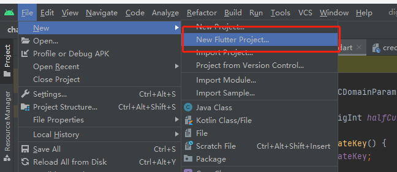

我们开始构建Flutter版本的Digging啦, 本章我们将完成环境的搭建以及获取钱包余额.

由于官方并没有提供Flutter的SDK, 根据Android篇通过json-rpc封装接口的基础, 在flutter中我们需要完成rlp的序列化/发序列化, 以及使用ECDSA完成签名即可实现.

### 搭建工程

flutter的环境搭建大家可以参看 [flutter中文网](https://flutterchina.club/setup-windows/) 

下面我们创建工程, 因为Flutter的跨平台的, 本章笔者在windows上创建工程, 后面再切换到mac.

打开Android Studio, 然后打开File->New->New Flutter Project, 如下图
 

选择Flutter的SDK, 笔者使用的是2.8.1版本, 如下图
 

接着在配置面板, 把IOS和Android都选上

 

工程创建完成后目录如下图:

 

在本章的代码里面, 笔者把和PlatON节点的代码放在sdk包下, 如下图:

 

改sdk由笔者参考java版本的sdk编写的, 因此报名和类名基本是和java版本的一致的.


### 使用SDK创建秘钥
 
main.dart的_MyHomePageState代码如下:
```
class _MyHomePageState extends State<MyHomePage> {
  String _address = "";

  void _generateWallet() async {
    // 创建钱包
    ECKeyPair ecKeyPair = WalletUtil.generatePlatONBip39Wallet();

    Credentials credentials =  Credentials.createByECKeyPair(ecKeyPair);

    setState(() {
      _address = credentials.address;
      print(_address);
    });
  }

  @override
  Widget build(BuildContext context) {
    return Scaffold(
      appBar: AppBar(
        title: Text(widget.title),
      ),
      body: Center(
        child: Column(
          mainAxisAlignment: MainAxisAlignment.center,
          children: <Widget>[
            Text(_address), // 显示钱包地址
            ElevatedButton(
              child: const Text("按钮"),
              onPressed: () {
                _generateWallet();
              },
            ),
          ],
        ),
      ),
    );
  }
}
```
在_generateWallet函数中我们通过WalletUtil.generatePlatONBip39Wallet,即可生成钱包, 效果如下图:

 

从图中看到我们生成的钱包地址为: lat19ydcsmfnxlqw4640u93r3chn2pk0c8shsn3lhg

我们在测试网给该地址领取LAT, 接着我们编写获取钱包余额的代码, 代码如下:
```
... 省略代码
  void _getBalance() async {
    // 创建钱包
    BigInt balance =
        await _web3.getBalance(_address);

    setState(() {
      _lat = AmountUtil.convertVonToLat(balance);
    });
  }
... 省略代码
```
在这之前我们需要在main函数中, 初始化网络参数, 代码如下:
```
void main() {
  // 使用测试网
  NetworkParameters.init(BigInt.from(210309), "lat");
  //
  runApp(const MyApp());
}
```
在_MyHomePageState类中初始化Web3实例, 代码如下:
```
... 省略代码
  // 创建web3对象
  final Web3 _web3 = Web3.build("http://35.247.155.162:6789");
... 省略代码
```

 

可以看到我们获取到钱包的余额.

好啦, 本章内容就到这里啦.

在Flutter篇中还是注重应用的实现, SDK的源码笔者不会着重去讲, SDK的功能也会随着本篇的应用逐渐完善.


仓库地址: [https://github.com/DQTechnology/Platon_DevGuideProject ](https://github.com/DQTechnology/Platon_DevGuideProject)