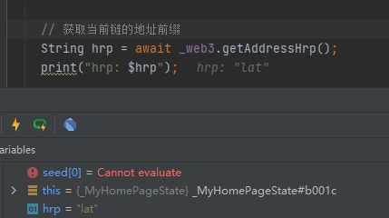
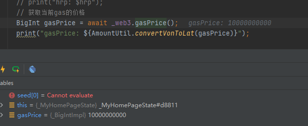
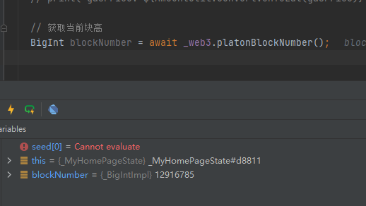
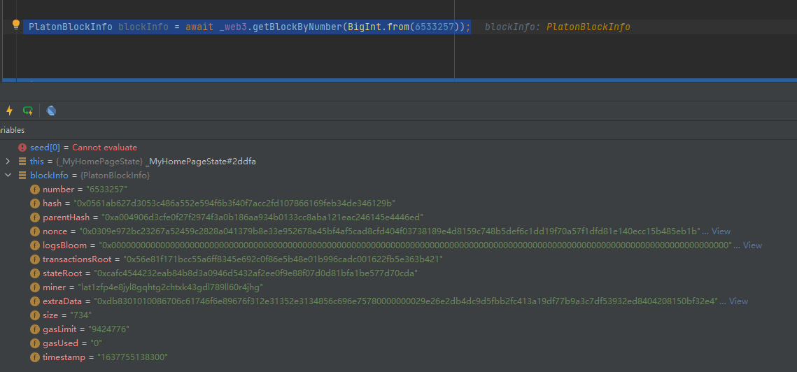
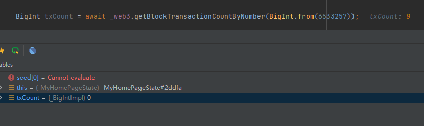
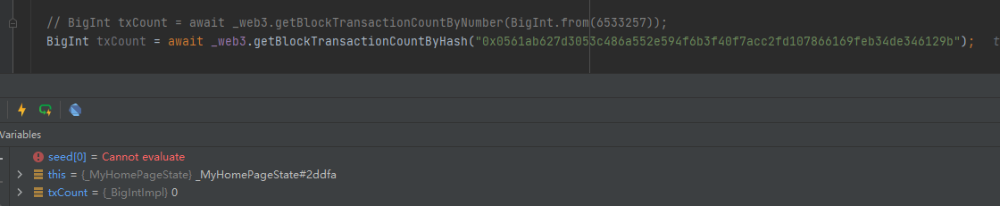
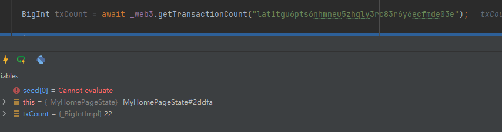
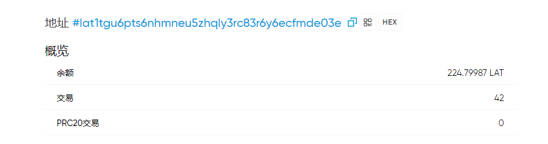
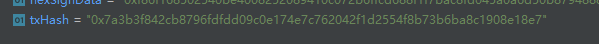
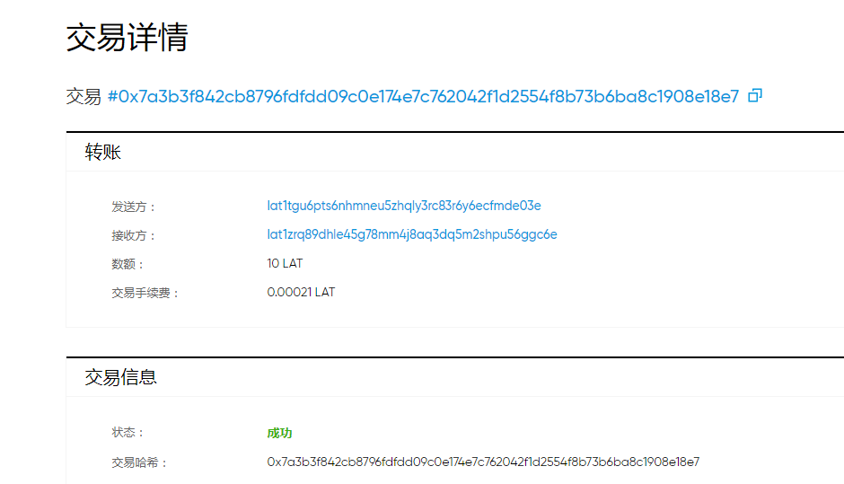

上一章我们完成了环境的搭建,以及生成秘钥和获取钱包月的余额. 本章我们讲解常用的Api接口,以及实现转账.


### 获取当前链的地址前缀–getAddressHrp

代码如下:
```
    // 获取当前链的地址前缀
    String hrp = await _web3.getAddressHrp();
    print("hrp: $hrp");
```
结果如下图:

 


### 获取当前gas的价格– gasPrice
代码如下:
```
    // 获取当前gas的价格
    BigInt gasPrice = await _web3.gasPrice();
    print("gasPrice: ${AmountUtil.convertVonToLat(gasPrice)}");
```
结果如下图:

  

### 获取当前块高–  platonBlockNumber

代码如下:
```
 // 获取当前块高
    BigInt blockNumber = await _web3.platonBlockNumber();
```
结果如下图:

 


### 获取指定块的信息– getBlockByNumber

笔者这里查看和Andorid篇第二章[连接](https://forum.latticex.foundation/t/topic/5952),一样的块高: 6533257
代码如下:
```
  PlatonBlockInfo blockInfo = await _web3.getBlockByNumber(BigInt.from(6533257));

```
结果如下图:

 

可以看到结果和Android篇的一致.


### 通过块编号获取块交易数量 – getBlockTransactionCountByNumber

代码如下:
```
 BigInt txCount = await _web3.getBlockTransactionCountByNumber(BigInt.from(6533257));

```
我们知道该块为空块,因此交易数量为0,
结果如下图:

 


### 通过块哈希值获取块的交易数量 – getBlockTransactionCountByHash

代码如下:
```
  BigInt txCount = await _web3.getBlockTransactionCountByHash("0x0561ab627d3053c486a552e594f6b3f40f7acc2fd107866169feb34de346129b");

```
我们已经知道块6533257,的交易哈希为: 0x0561ab627d3053c486a552e594f6b3f40f7acc2fd107866169feb34de346129b
结果如下图:

 


### 获取钱包地址的发出的交易数量 – getBlockTransactionCountByHash

代码如下:
```
  BigInt txCount = await _web3.getTransactionCount("lat1tgu6pts6nhmneu5zhqly3rc83r6y6ecfmde03e");
```
笔者这里获取地址为:lat1tgu6pts6nhmneu5zhqly3rc83r6y6ecfmde03e的交易数量.
结果如下图:

 

交易数量为22, 在区块链的结构如下图:

 

我们已经知道接收转账是不会增加交易次数得到,而这个账号有20笔接受记录,因此42-20 = 22.等于我们接口获取到的值.

### 完成第一笔转账

笔者使用秘钥为:a4ac816da1ab40f805d026009247002f47c8c0a9af95b35ca9741c576466e1a8.对应的钱包地址为:lat1tgu6pts6nhmneu5zhqly3rc83r6y6ecfmde03e. 我们已经知道该钱包的余额为:224.79987个LAT.
现在我们转10个LAT到lat1zrq89dhle45g78mm4j8aq3dq5m2shpu56ggc6e.

代码如下:
```
    //  加载秘钥
    Credentials credentials = Credentials.createPrivate(
        "a4ac816da1ab40f805d026009247002f47c8c0a9af95b35ca9741c576466e1a8");

    // 获取钱包的交易次数作为nonce
    BigInt nonce = await _web3.getTransactionCount(credentials.address);
    // 获取当前gasPrice
    BigInt gasPrice = await _web3.gasPrice();
    // 构建交易对象
    RawTransaction rawTransaction = RawTransaction(
        nonce,
        gasPrice,
        BigInt.from(21000),
        "lat1zrq89dhle45g78mm4j8aq3dq5m2shpu56ggc6e",
        BigInt.parse("10000000000000000000"),
        "");
    // 签名
    Uint8List signData = TransactionEncoder.signMessageWithChainId(
        rawTransaction, credentials, BigInt.from(210309));
    // 转换为16进制字符串
   String hexSignData = Numeric.bytesToHex(signData, withPrefix: true);

  // 发送交易数据
   String txHash = await _web3.sendRawTransaction(hexSignData);
```

返回的交易哈希如下图:

 

值为: 0x7a3b3f842cb8796fdfdd09c0e174e7c762042f1d2554f8b73b6ba8c1908e18e7

从区块链浏览器可以看到交易详情如下图:

 

好啦, 本章就到这里啦. 

下一章, 我们开始构建主页面啦.


仓库地址: https://github.com/DQTechnology/Platon_DevGuideProject

Flutter篇往期链接:

[跟Dex学PlatON应用开发–Flutter篇(一)](https://forum.latticex.foundation/t/topic/6020)