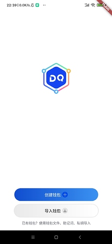
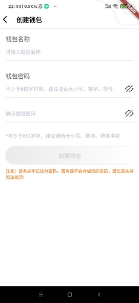
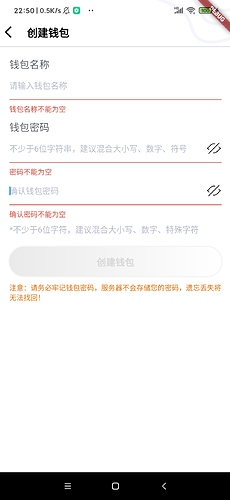
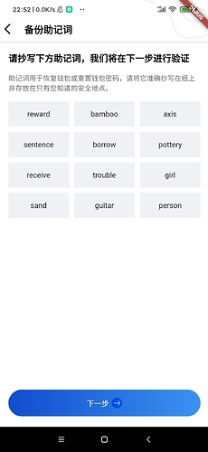
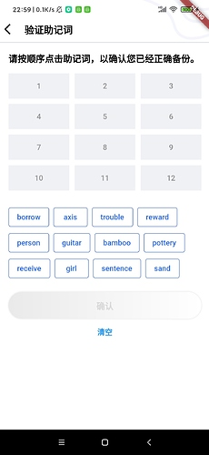
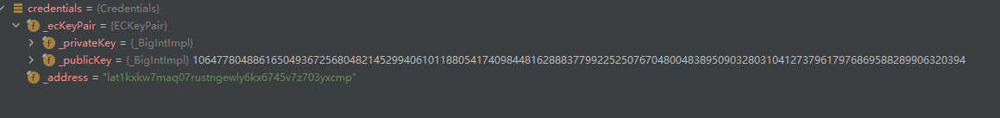

本章我们模仿ATON实现通过助记词生成钱包的个功能。

### 创建/导入钱包的引导页面  OperateMenuStatelessWidget

在app/page包下创建operate_menu_stateless_widget.dart文件，代码如下图：
```
class OperateMenuStatelessWidget extends StatelessWidget {
  const OperateMenuStatelessWidget({Key? key}) : super(key: key);

  @override
  Widget build(BuildContext context) {
    // 获取屏幕的宽高
    final size = MediaQuery.of(context).size;
    double width = size.width;
    double height = size.height;
    return Container(
        decoration: const BoxDecoration(color: Colors.white),
        child: Stack(children: [
          // 显示logo
          Positioned(
              top: ((height - 110) / 2) - 128,
              left: (width - 110) / 2,
              child: const Image(
                  width: 110,
                  height: 110,
                  image: AssetImage("images/splash_logo.png"))),
          Positioned(
              bottom: 6,
              width: width,
              child: Center(
                  child: Column(children: [
                SizedBox(
                  width: width - 100,
                  height: 44,
                  child: ShadowButton(
                      shadowColor: const Color(0xffbbbbbb),
                      onPressed: () {
                        // 跳转页面
                        Navigator.push(context, PageRouteBuilder(pageBuilder:
                            (BuildContext content, Animation<double> animation,
                                Animation<double> secondaryAnimation) {
                          // 跳转动画
                          return SlideTransition(
                              position: Tween<Offset>(
                                      begin: const Offset(1, 0),
                                      end: const Offset(.0, .0))
                                  .animate(CurvedAnimation(
                                      parent: animation, curve: Curves.easeIn)),
                              child: const CreateWalletStatefulWidget());
                        }));
                      },
                      borderRadius: BorderRadius.circular(44),
                      child: Row(
                          mainAxisAlignment: MainAxisAlignment.center,
                          children: [
                            const Text("创建钱包"),
                            Container(
                                margin: const EdgeInsets.only(left: 5),
                                child: const Image(
                                    width: 20,
                                    height: 20,
                                    image: AssetImage(
                                        "images/icon_create_wallet.png"))),
                          ]),
                      gradient: const LinearGradient(
                          colors: [Color(0xff104dcf), Color(0xff3b92f1)])),
                ),
                Container(
                  margin: const EdgeInsets.only(top: 12),
                  child: SizedBox(
                    width: width - 100,
                    height: 44,
                    child: ShadowButton(
                        shadowColor: const Color(0xffbbbbbb),
                        onPressed: () {},
                        borderRadius: BorderRadius.circular(44),
                        child: Row(
                            mainAxisAlignment: MainAxisAlignment.center,
                            children: [
                              const Text(
                                "导入钱包",
                                style: TextStyle(color: Color(0xff000000)),
                              ),
                              Container(
                                  margin: const EdgeInsets.only(left: 5),
                                  child: const Image(
                                      width: 20,
                                      height: 20,
                                      image: AssetImage(
                                          "images/icon_import_wallet.png"))),
                            ]),
                        gradient: const LinearGradient(
                            colors: [Color(0xffeaeaea), Color(0xffffffff)])),
                  ),
                ),
                Container(
                  margin: const EdgeInsets.only(top: 12, bottom: 12),
                  child: const Text(
                    "已有钱包？使用钱包文件、助记词、私钥导入",
                    style: TextStyle(
                        decoration: TextDecoration.none,
                        fontSize: 12,
                        color: Color(0xff61646e),
                        fontWeight: FontWeight.normal),
                  ),
                )
              ])))
        ]));
  }
}
```
页面效果如下图:

 

其中在创建钱包按钮跳转到创建钱包的页面,跳转动画使用了SlideTransition,让页面的跳转从右侧划出.

### 创建钱包页面 CreateWalletStatefulWidget

在app/page包下创建create_wallet_stateful_widget.dart文件，代码如下：
```
class CreateWalletStatefulWidget extends StatefulWidget {
  const CreateWalletStatefulWidget({Key? key}) : super(key: key);

  @override
  State<StatefulWidget> createState() {
    return CreateWalletState();
  }
}

class CreateWalletState extends State<CreateWalletStatefulWidget> {
  bool _isEnabled = false;

  final ValueNotifier<TextEditingValue> _nameController =
      ValueNotifier<TextEditingValue>(TextEditingValue.empty);

  final ValueNotifier<TextEditingValue> _passwordController =
      ValueNotifier<TextEditingValue>(TextEditingValue.empty);

  final ValueNotifier<TextEditingValue> _repeatPasswordController =
      ValueNotifier<TextEditingValue>(TextEditingValue.empty);

  bool _isEnableName = false;
  bool _isEnablePassword = false;

  @override
  void initState() {
    super.initState();
  }

  /// 验证钱包名称
  String? _validateWalletName(TextEditingValue value) {
    String name = value.text.trim();

    if (name.isEmpty) {
      _isEnableName = false;
      setState(() {
        _enableCreate();
      });
      return "钱包名称不能为空";
    }

    if (name.length > 20) {
      _isEnableName = false;
      setState(() {
        _enableCreate();
      });
      return "请输入1-20位字符";
    }

    setState(() {
      _isEnableName = true;
      _enableCreate();
    });

    return null;
  }

  /// 验证密码
  String? _validatePassword(TextEditingValue value) {
    String password = value.text.trim();

    if (password.isEmpty) {
      setState(() {
        _isEnablePassword = false;
        _enableCreate();
      });
      return "密码不能为空";
    }
    if (password.length < 6) {
      setState(() {
        _isEnablePassword = false;
        _enableCreate();
      });

      return "密码至少6个字符";
    }

    String repeatPassword = _repeatPasswordController.value.text.trim();

    if (repeatPassword != password) {
      setState(() {
        _isEnablePassword = false;
        _enableCreate();
      });
      return "两次密码不一致";
    }
    setState(() {
      _isEnablePassword = true;
      _enableCreate();
    });

    return null;
  }

  /// 验证重复密码
  String? _validateRepeatPassword(TextEditingValue value) {
    if (_repeatPasswordController.value.text.isEmpty) {
      _isEnablePassword = false;
      setState(() {
        _enableCreate();
      });
      return "确认密码不能为空";
    }
    if (_repeatPasswordController.value.text !=
        _passwordController.value.text) {
      _isEnablePassword = false;
      setState(() {
        _enableCreate();
      });
      return "两次密码不一致";
    }

    setState(() {
      _isEnablePassword = true;
      _enableCreate();
    });

    return null;
  }

  void _enableCreate() {
    _isEnabled = _isEnableName && _isEnablePassword;
  }

  void _onCreateWallet() {
    if (!_isEnabled) {
      return;
    }

    String name = _nameController.value.text.trim();
    String password = _passwordController.value.text.trim();

    WalletManager.buildCreateWalletSession(name, password);

    // 跳转页面
    Navigator.push(context, PageRouteBuilder(pageBuilder: (BuildContext content,
        Animation<double> animation, Animation<double> secondaryAnimation) {
      // 跳转动画
      return SlideTransition(
          position: Tween<Offset>(
                  begin: const Offset(1, 0), end: const Offset(.0, .0))
              .animate(
                  CurvedAnimation(parent: animation, curve: Curves.easeIn)),
          child: const BackupMnemonicPhraseStatefulWidget());
    }));
  }

  @override
  Widget build(BuildContext context) {
    return Scaffold(
        body: GestureDetector(
      //实现点击其他地方收起软键盘
      behavior: HitTestBehavior.translucent,
      onTap: () {
        FocusScope.of(context).requestFocus(FocusNode());
      },
      child: Container(
        decoration: const BoxDecoration(color: Colors.white),
        child: Flex(
            crossAxisAlignment: CrossAxisAlignment.start,
            direction: Axis.vertical,
            children: [
              PageHeader(title: "创建钱包"),
              Expanded(
                  flex: 1,
                  child: Container(
                      padding: const EdgeInsets.only(
                          top: 16, left: 16, right: 16, bottom: 20),
                      decoration: const BoxDecoration(),
                      child: SizedBox(
                        width: double.infinity,
                        child: Column(
                          crossAxisAlignment: CrossAxisAlignment.start,
                          children: [
                            ItemTitle(title: "钱包名称"),
                            CustomTextFiled(
                              controller: _nameController,
                              hintText: "请输入钱包名称",
                              validator: _validateWalletName,
                            ),
                            const SizedBox(height: 10),
                            ItemTitle(title: "钱包密码"),
                            CustomTextFiled(
                              forceHideErrorTip: _isEnablePassword,
                              controller: _passwordController,
                              hintText: "不少于6位字符串，建议混合大小写、数字、符号",
                              showPasswordBtn: true,
                              validator: _validatePassword,
                            ),
                            CustomTextFiled(
                              forceHideErrorTip: _isEnablePassword,
                              controller: _repeatPasswordController,
                              hintText: "确认钱包密码",
                              showPasswordBtn: true,
                              validator: _validateRepeatPassword,
                            ),
                            const SizedBox(height: 8),
                            const Text(
                              "*不少于6位字符，建议混合大小写、数字、特殊字符",
                              style: TextStyle(
                                  fontSize: 14, color: Color(0xffB8BDD2)),
                            ),
                            Container(
                                margin: const EdgeInsets.only(top: 20),
                                child: SizedBox(
                                  width: double.infinity,
                                  height: 50,
                                  child: ShadowButton(
                                      isEnable: _isEnabled,
                                      shadowColor: const Color(0xffdddddd),
                                      borderRadius: BorderRadius.circular(44),
                                      onPressed: _onCreateWallet,
                                      child: Text(
                                        "创建钱包",
                                        style: TextStyle(
                                            fontSize: 16,
                                            fontWeight: FontWeight.bold,
                                            color: _isEnabled
                                                ? const Color(0xfff6f6f6)
                                                : const Color(0xffd8d8d8)),
                                      )),
                                )),
                            const SizedBox(height: 10),
                            const Text(
                              "注意：请务必牢记钱包密码，服务器不会存储您的密码，遗忘丢失将无法找回！",
                              style: TextStyle(
                                  color: Color(0xffff6b00), fontSize: 12),
                            )
                          ],
                        ),
                      ))),
            ]),
      ),
    ));
  }
}
```
该页面的检测逻辑直接使用了ATON的，该类的主要逻辑：
1，检测钱包名长度是否在1~20个字符内
2，检测钱包的密码是否大于等于6
如何满足创建钱包的条件，则去WalletManager构建一个创建钱包的回话，把钱包名和密码暂存里面。
该类的我们稍后讲解，页面效果如下：

 

启动页面的导航控件,抽成一个独立的widget: PageHeader, 放在app/custom_widget包下.
代码如下:
```
class PageHeader extends StatelessWidget {
  String title;

  PageHeader({Key? key, required this.title}) : super(key: key);

  @override
  Widget build(BuildContext context) {
    return Container(
      height: 80,
      width: double.infinity,
      decoration: const BoxDecoration(
          image: DecorationImage(
        fit: BoxFit.fitHeight,
        image: AssetImage("images/bg_status_bar.png"),
      )),
      child: AppBar(
        systemOverlayStyle: StatusBarUtil.getDarkOverlayStyle(),
        leadingWidth: 30,
        shadowColor: const Color(0xffbbbbbb),
        elevation: 0,
        leading: IconButton(
          color: Colors.black,
          onPressed: () {
            Navigator.pop(context);
          },
          icon: const Icon(Icons.arrow_back_ios),
        ),
        title:  Text(title,
            style: const TextStyle(
                color: Colors.black,
                fontSize: 18,
                fontWeight: FontWeight.bold)),
        backgroundColor: Colors.transparent,
      ),
    );
  }
}
```
使用的使用只需要传入页面名字即可,使用如下代码:
```
   PageHeader(title: "创建钱包")
```
为方便使用,笔者对输入框进行了封装, 代码参看在app/custom_widge/custom_text_field.dart. 具备的功能有: 显示和隐藏密码, 支持校验器以及输入出错时的错误提示, 效果如下图:

 


### 创建备份助记词的页面 BackupMnemonicPhraseStatefulWidget

在app/page包下创建back_mnemonic_stateful_widget.dart文件，代码如下：
```
class BackupMnemonicPhraseStatefulWidget extends StatefulWidget {
  const BackupMnemonicPhraseStatefulWidget({Key? key}) : super(key: key);

  @override
  State<StatefulWidget> createState() {
    return _BackupMnemonicPhraseStatefulWidgetState();
  }
}

class _BackupMnemonicPhraseStatefulWidgetState
    extends State<BackupMnemonicPhraseStatefulWidget> {
  String _getWord(int index) {
    CreateWalletSessionInfo? sessionInfo =
        WalletManager.getCreateWalletSession();
    if (sessionInfo == null) {
      return "";
    }
    return sessionInfo.mnemonicWords[index];
  }

  @override
  Widget build(BuildContext context) {
    return Scaffold(
        body: Container(
      decoration: const BoxDecoration(color: Colors.white),
      child: Flex(
        crossAxisAlignment: CrossAxisAlignment.start,
        direction: Axis.vertical,
        children: [
          PageHeader(title: "备份助记词"),
          Expanded(
              flex: 1,
              child: Container(
                padding: const EdgeInsets.only(
                    top: 16, left: 16, right: 16, bottom: 20),
                child: SizedBox(
                  width: double.infinity,
                  child: Column(
                    crossAxisAlignment: CrossAxisAlignment.start,
                    children: [
                      const Text(
                        "请抄写下方助记词，我们将在下一步进行验证",
                        style: TextStyle(
                          fontSize: 17,
                          fontWeight: FontWeight.bold,
                          color: Colors.black,
                        ),
                      ),
                      const SizedBox(height: 16),
                      const Text(
                        "助记词用于恢复钱包或重置钱包密码，请将它准确抄写在纸上并存放在只有您知道的安全地点。",
                        style: TextStyle(
                          fontSize: 13,
                          color: Color(0xff61646e),
                        ),
                      ),
                      const SizedBox(height: 16),
                      SizedBox(
                          width: double.infinity,
                          height: 257,
                          child: GridView.count(
                              padding: EdgeInsets.zero,
                              crossAxisCount: 3,
                              mainAxisSpacing: 10.0,
                              crossAxisSpacing: 10.0,
                              childAspectRatio: 2.4,
                              children: List.generate(
                                12,
                                (index) => Container(
                                    decoration: const BoxDecoration(
                                        color: Color(0xfff0f1f5)),
                                    child: Center(
                                      child: Text(
                                        _getWord(index),
                                        style: const TextStyle(fontSize: 14),
                                      ),
                                    )),
                              )))
                    ],
                  ),
                ),
              )),
          Container(
            margin: const EdgeInsets.only(left: 16, right: 16, bottom: 20),
            child: SizedBox(
              width: double.infinity,
              height: 50,
              child: ShadowButton(
                  shadowColor: const Color(0xffbbbbbb),
                  onPressed: () {
                    // 跳转页面
                    Navigator.push(context, PageRouteBuilder(pageBuilder:
                        (BuildContext content, Animation<double> animation,
                            Animation<double> secondaryAnimation) {
                      // 跳转动画
                      return SlideTransition(
                          position: Tween<Offset>(
                                  begin: const Offset(1, 0),
                                  end: const Offset(.0, .0))
                              .animate(CurvedAnimation(
                                  parent: animation, curve: Curves.easeIn)),
                          child: VerifyMnemonicPhraseStatefulWidget());
                    }));
                  },
                  borderRadius: BorderRadius.circular(44),
                  child: Row(
                      mainAxisAlignment: MainAxisAlignment.center,
                      children: [
                        const Text("下一步"),
                        Container(
                            margin: const EdgeInsets.only(left: 5),
                            child: const Image(
                                width: 20,
                                height: 20,
                                image:
                                    AssetImage("images/icon_next_enable.png"))),
                      ]),
                  gradient: const LinearGradient(
                      colors: [Color(0xff104dcf), Color(0xff3b92f1)])),
            ),
          )
        ],
      ),
    ));
  }
}
```
该类的主要逻辑：从WalletManager类中获取当前创建钱包回话的助记词，并显示在页面上，页面效果如下图:

 


### 创建确认助记词的页面 VerifyMnemonicPhraseStatefulWidget

在app/page包下创建verify_mnemonic_stateful_widget.dart文件，代码如下：
```
class VerifyMnemonicPhraseStatefulWidget extends StatefulWidget {
  const VerifyMnemonicPhraseStatefulWidget({Key? key}) : super(key: key);

  @override
  State<StatefulWidget> createState() {
    return _VerifyMnemonicPhraseStatefulWidgetState();
  }
}

class WordInfo {
  bool checked;
  String mnemonic; // 助记词
  int waitSelectIndex; // 在待选单词列表的索引
  int showWordIndex;

  WordInfo(this.checked, this.mnemonic, this.waitSelectIndex,
      this.showWordIndex); // 选中单词的索引

}

class _VerifyMnemonicPhraseStatefulWidgetState
    extends State<VerifyMnemonicPhraseStatefulWidget> {
  final Color _hintColor = const Color(0xff959598);

  /// 正确顺序的助记词
  late List<String> _originMnemonicWordList;
  late List<String> _shuffledMnemonicWords;

  /// 待选单词的索引映射
  final Map<int, WordInfo> _waitSelectWordInfoMap = {};

  /// 选中单词索引映射
  final Map<int, WordInfo> _selectWordInfoMap = {};

  int _curEmptyIndex = 0;

  bool _isEnabled = false;

  @override
  void initState() {
    CreateWalletSessionInfo sessionInfo =
        WalletManager.getCreateWalletSession()!;

    _originMnemonicWordList = List.from(sessionInfo.mnemonicWords);

    _shuffledMnemonicWords = List.from(sessionInfo.mnemonicWords);

    _shuffledMnemonicWords.shuffle();

    for (int i = 0; i < _shuffledMnemonicWords.length; ++i) {
      _waitSelectWordInfoMap[i] =
          WordInfo(false, _shuffledMnemonicWords[i], i, -1);
    }

    super.initState();
  }

  String _getWord(int index) {
    WordInfo? wordInfo = _selectWordInfoMap[index];
    if (wordInfo == null) {
      return (index + 1).toString();
    }
    return wordInfo.mnemonic;
  }

  Color _getColor(int index) {
    WordInfo? wordInfo = _selectWordInfoMap[index];
    if (wordInfo != null) {
      return Colors.black;
    }
    return _hintColor;
  }

  VoidCallback? _getSelectWordPress(int index) {
    WordInfo? wordInfo = _selectWordInfoMap[index];

    if (wordInfo != null) {
      return () {
        _onSelectWord(index, false);
      };
    }
    return null;
  }

  String _getWaitSelectWord(int index) {
    return _shuffledMnemonicWords[index];
  }

  void _onSelectWord(int index, bool isWaitSelect) {
    late WordInfo? wordInfo;

    if (isWaitSelect) {
      wordInfo = _waitSelectWordInfoMap[index];
    } else {
      wordInfo = _selectWordInfoMap[index];
    }

    if (wordInfo == null) {
      return;
    }
    if (isWaitSelect) {
      /// 如果点击的是待选单词列表,那每次都取反
      wordInfo.checked = !wordInfo.checked;
    } else {
      if (wordInfo.showWordIndex == -1) {
        return;
      }

      /// 如果点击的是已选单词列表,则每次则认为是取消选中
      wordInfo.checked = false;
    }

    if (!wordInfo.checked) {
      _selectWordInfoMap.remove(wordInfo.showWordIndex);

      /// 如果取消的位置索引比当前的空位置的索引小,则更新
      if (wordInfo.showWordIndex < _curEmptyIndex) {
        _curEmptyIndex = wordInfo.showWordIndex;
      }
      wordInfo.showWordIndex = -1;
    } else {
      wordInfo.showWordIndex = _curEmptyIndex;
      _selectWordInfoMap[wordInfo.showWordIndex] = wordInfo;

      /// 寻找下一个为空的位置
      _findNextEmptyIndex();

      if (_selectWordInfoMap.length == _originMnemonicWordList.length) {
        // 可以创建了
        _isEnabled = true;
      }
    }

    setState(() {});
  }

  void _findNextEmptyIndex() {
    do {
      ///  如果为空则说明当前位置并没有选中单词
      if (_selectWordInfoMap[++_curEmptyIndex] == null) {
        return;
      }
    } while (_curEmptyIndex < _waitSelectWordInfoMap.length);
  }

  VoidCallback? _getUnSelectWordPress(int index) {
    WordInfo wordInfo = _waitSelectWordInfoMap[index]!;

    if (!wordInfo.checked) {
      return () {
        _onSelectWord(index, true);
      };
    }
    return null;
  }

  Color _getUnSelectWordBorderColor(int index) {
    WordInfo wordInfo = _waitSelectWordInfoMap[index]!;
    if (!wordInfo.checked) {
      return const Color(0xff6485CC);
    }
    return const Color(0xffDDE0E7);
  }

  Color _getUnSelectWordBackgroundColor(int index) {
    WordInfo wordInfo = _waitSelectWordInfoMap[index]!;
    if (!wordInfo.checked) {
      return Colors.white;
    }
    return const Color(0xffDCDFE6);
  }

  /// 清空选择的单词
  void _resetSelectWorld() {
    _waitSelectWordInfoMap.forEach((key, value) {
      value.checked = false;
    });
    _curEmptyIndex = 0;
    _selectWordInfoMap.clear();

    setState(() {
      _isEnabled = false;
    });
  }

  void _genPrivateKey() {
    bool bPass = true;
    for (int i = 0; i < _originMnemonicWordList.length; ++i) {
      String originWord = _originMnemonicWordList[i];
      WordInfo? selectWordInfo = _selectWordInfoMap[i];
      if (selectWordInfo == null) {
        bPass = false;
        Fluttertoast.showToast(msg: "助记词顺序不正确, 请重新选择");
        break;
      }
      if (originWord != selectWordInfo.mnemonic) {
        bPass = false;
        Fluttertoast.showToast(msg: "助记词顺序不正确, 请重新选择");
        break;
      }
    }

    if (!bPass) {
      return;
    }

    bool bSucceed = WalletManager.generateWallet();
    if (!bSucceed) {
      Fluttertoast.showToast(msg: "生成钱包失败!");
    } else {
      Fluttertoast.showToast(msg: "生成钱包成功!");
      // 生成成功删除session
      WalletManager.clearCreateWalletSession();
    }
  }

  @override
  Widget build(BuildContext context) {
    return Scaffold(
      body: Container(
        decoration: const BoxDecoration(color: Colors.white),
        child: Flex(
            crossAxisAlignment: CrossAxisAlignment.start,
            direction: Axis.vertical,
            children: [
              PageHeader(title: "验证助记词"),
              Expanded(
                flex: 1,
                child: Container(
                  padding: const EdgeInsets.only(
                      top: 16, left: 16, right: 16, bottom: 20),
                  child: SizedBox(
                    width: double.infinity,
                    child: Column(
                      crossAxisAlignment: CrossAxisAlignment.start,
                      children: [
                        const Text(
                          "请按顺序点击助记词，以确认您已经正确备份。",
                          style: TextStyle(
                            fontSize: 17,
                            fontWeight: FontWeight.bold,
                            color: Colors.black,
                          ),
                        ),
                        const SizedBox(height: 16),
                        SizedBox(
                            width: double.infinity,
                            height: 245,
                            child: GridView.count(
                                padding: EdgeInsets.zero,
                                crossAxisCount: 3,
                                mainAxisSpacing: 10.0,
                                crossAxisSpacing: 10.0,
                                childAspectRatio: 2.4,
                                children: List.generate(
                                  12,
                                  (index) => Container(
                                      decoration: const BoxDecoration(
                                          color: Color(0xfff0f1f5)),
                                      child: Center(
                                          child: TextButton(
                                              onPressed:
                                                  _getSelectWordPress(index),
                                              child: Text(_getWord(index),
                                                  style: TextStyle(
                                                      fontSize: 14,
                                                      color:
                                                          _getColor(index)))))),
                                ))),
                        Wrap(
                            spacing: 8,
                            runSpacing: 0,
                            alignment: WrapAlignment.start,
                            children: List.generate(
                              12,
                              (index) => OutlinedButton(
                                  style: OutlinedButton.styleFrom(
                                      primary: const Color(0xff316DEF),
                                      backgroundColor:
                                          _getUnSelectWordBackgroundColor(
                                              index),
                                      side: BorderSide(
                                          color: _getUnSelectWordBorderColor(
                                              index))),
                                  onPressed: _getUnSelectWordPress(index),
                                  child: Text(
                                    _getWaitSelectWord(index),
                                  )),
                            )),
                        Container(
                            margin: const EdgeInsets.only(top: 20),
                            child: SizedBox(
                              width: double.infinity,
                              height: 44,
                              child: ShadowButton(
                                  isEnable: _isEnabled,
                                  shadowColor: const Color(0xffdddddd),
                                  borderRadius: BorderRadius.circular(44),
                                  onPressed: _genPrivateKey,
                                  child: Text(
                                    "确认",
                                    style: TextStyle(
                                        fontSize: 16,
                                        fontWeight: FontWeight.bold,
                                        color: _isEnabled
                                            ? const Color(0xfff6f6f6)
                                            : const Color(0xffd8d8d8)),
                                  )),
                            )),
                        Center(
                          child: TextButton(
                              onPressed: _resetSelectWorld,
                              child: const Text(
                                "清空",
                                style: TextStyle(fontWeight: FontWeight.bold),
                              )),
                        )
                      ],
                    ),
                  ),
                ),
              )
            ]),
      ),
    );
  }
}
```
页面效果如下图:

 

使用WordInfo类来存储单词以下信息:
1, 选中状态
2, 单词本身
3, 单词在待选列表的索引
4, 单词在选中列表的索引

在_VerifyMnemonicPhraseStatefulWidgetState类中的initState函数中获取WalletManager已经创建好的助记词, 然后打乱助记词的顺序,显示选列表中.

生成秘钥的效果如下图:

 

好啦,本章内容先到这里啦, 下一章我们开始学习生成/保存walletFile, 秘钥/walletFile/助记词的导入功能.


仓库地址: https://github.com/DQTechnology/Platon_DevGuideProject

Flutter篇往期链接:

[跟Dex学PlatON应用开发–Flutter篇(一)](https://forum.latticex.foundation/t/topic/6020)

[跟Dex学PlatON应用开发–Flutter篇(二)](https://forum.latticex.foundation/t/topic/6025)