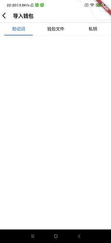
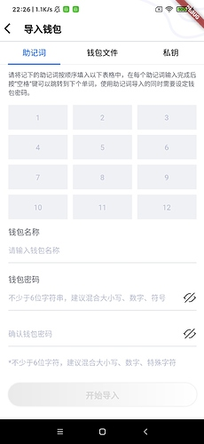
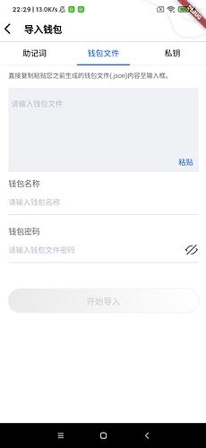
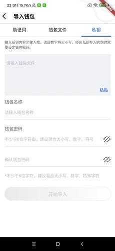

本章我们完成助记词/秘钥/钱包文件的导入并存储成文件的功能

### 创建导入的主页面  ImportStatefulWidget

代码放在app/page包下的import_stateful_widget.dart文件中.
页面切换,因为TabBarView在滑动页面时, TabBar接受页面变动的回调会有滞后.因此笔者使用PageView实现.代码如下:
```
  @override
  void initState() {
    super.initState();
    _tabController = TabController(length: _tabs.length, vsync: this);
    _tabController.addListener(() {
      // 点击tabBar,修改PageView当前显示的页面
      if (_tabController.indexIsChanging) {
        _onTabPageChange(_tabController.index, p: _pageController);
      }
    });
    // 监听页面变动是事件
    _pageController.addListener(() {
      // 日后tabBar正在滑动中忽略
      if (!_tabController.indexIsChanging) {
        if ((_pageController.page! - _tabController.index).abs() > 1.0) {
          _tabController.index = _pageController.page!.round();
        }
        _tabController.offset =
            (_pageController.page! - _tabController.index).clamp(-1.0, 1.0);
      }
    });
  }
```
笔者为了进来保持页面和Android的一致, 自定义了TabBar的indicator.具体代码如下:
```
class LineTabIndicator extends Decoration {
  final BorderSide borderSide;
  final EdgeInsetsGeometry insets;
  const LineTabIndicator(
      {this.borderSide = const BorderSide(width: 2.0, color: Color(0xff105CFF)),
        this.insets = EdgeInsets.zero});
  @override
  _LineTabIndicatorPainter createBoxPainter([VoidCallback? onChanged]) {
    return _LineTabIndicatorPainter(this, onChanged);
  }
}

class _LineTabIndicatorPainter extends BoxPainter {

  final LineTabIndicator decoration;
  BorderSide get borderSide => decoration.borderSide;

  EdgeInsetsGeometry get insets => decoration.insets;

  late Paint _paint;

  _LineTabIndicatorPainter(this.decoration, VoidCallback? onChanged)
      : super(onChanged) {
    // 设置paint为圆角
    _paint = borderSide.toPaint()..strokeCap = StrokeCap.round;
  }

  @override
  void paint(Canvas canvas, Offset offset, ImageConfiguration configuration) {
    assert(configuration.size != null);
    assert(configuration.textDirection != null);

    final Rect rect = offset & configuration.size!;

    // 获取indicator的边界
    final TextDirection textDirection = configuration.textDirection!;
    final Rect indicatorRect = insets.resolve(textDirection).deflateRect(rect);
    canvas.drawLine(indicatorRect.bottomLeft, indicatorRect.bottomRight, _paint);
  }
}
```
通过自绘下划线就可以实现线条圆角的功能.
最后页面效果如下:

 


### 创建导入助记词的页面  ImportMnemonicStatefulWidget

在app/page包下创建import_mnemonic_stateful_widget.dart文件中, 代码如下:
```
import 'package:digging/app/service/wallet_manager.dart';
import 'package:flutter/material.dart';
import 'package:fluttertoast/fluttertoast.dart';

import 'back_mnemonic_stateful_widget.dart';
import 'build_wallet_info_stateful_widget.dart';

class ImportMnemonicStatefulWidget extends StatefulWidget {
  const ImportMnemonicStatefulWidget({Key? key}) : super(key: key);

  @override
  State<StatefulWidget> createState() {
    return _ImportMnemonicStatefulWidgetState();
  }
}

class _ImportMnemonicStatefulWidgetState extends State {
  final WalletInfoController _controller = WalletInfoController();

  // 创建textField对应的controller
  final List<TextEditingController> _mnemonicWorldControllers =
      List.generate(12, (index) => TextEditingController());

  bool _isMnemoicEnable = false;

  bool _bShowMnemoicError = false;

  @override
  void initState() {
    super.initState();

    _controller.addListener(() async {
      WalletInfo walletInfo = _controller.value;

      List<String> mnemonicWorlds = _getMnemonic();

      bool bSucceed = await WalletManager.importMnemonicWords(
          walletInfo.walletName, walletInfo.password, mnemonicWorlds);

      if (bSucceed) {
        Fluttertoast.showToast(msg: "导入助记词成功!");
      } else {
        Fluttertoast.showToast(msg: "导入助记词失败:请检查助记词是否正确!");
      }
    });
    _setWordWatcher();
  }

  List<String> _getMnemonic() {
    List<String> mnemonicWorlds = List.empty(growable: true);
    for (int i = 0; i < 12; ++i) {
      mnemonicWorlds.add(_mnemonicWorldControllers[i].value.text);
    }

    return mnemonicWorlds;
  }

  /// 设置助记词监听
  void _setWordWatcher() {
    for (var element in _mnemonicWorldControllers) {
      element.addListener(() {
        List<String> mnemonicWorlds = _getMnemonic();

        for (String mnemonic in mnemonicWorlds) {
          if (mnemonic.isEmpty) {
            setState(() {
              _bShowMnemoicError = true;
              _isMnemoicEnable = false;
            });
            return;
          }
        }

        setState(() {
          _bShowMnemoicError = false;
          _isMnemoicEnable = true;
        });
      });
    }
  }

  @override
  Widget build(BuildContext context) {
    return Scaffold(
        body: SingleChildScrollView(
            child: Container(
                padding: const EdgeInsets.only(
                    top: 10, left: 16, right: 16, bottom: 20),
                decoration: const BoxDecoration(color: Colors.white),
                child: SizedBox(
                  width: double.infinity,
                  child: Column(
                    crossAxisAlignment: CrossAxisAlignment.start,
                    children: [
                      const Text(
                        "请将记下的助记词按顺序填入以下表格中，在每个助记词输入完成后按“空格”键可以跳转到下个单词，使用助记词导入的同时需要设定钱包密码。",
                        style: TextStyle(
                          fontSize: 12,
                          color: Color(0xff61646e),
                        ),
                      ),
                      const SizedBox(height: 16),
                      SizedBox(
                          width: double.infinity,
                          height: 222,
                          child: GridView.count(
                              padding: EdgeInsets.zero,
                              crossAxisCount: 3,
                              mainAxisSpacing: 10.0,
                              crossAxisSpacing: 10.0,
                              childAspectRatio: 2.4,
                              children: List.generate(
                                  12,
                                  (index) => Container(
                                      padding: const EdgeInsets.only(
                                          left: 5, right: 5),
                                      decoration: const BoxDecoration(
                                          color: Color(0xfff0f1f5)),
                                      child: TextField(
                                        controller:
                                            _mnemonicWorldControllers[index],
                                        textAlign: TextAlign.center,
                                        decoration: InputDecoration(
                                          enabledBorder:
                                              const UnderlineInputBorder(
                                                  borderSide: BorderSide(
                                                      color:
                                                          Colors.transparent)),
                                          focusedBorder:
                                              const UnderlineInputBorder(
                                                  borderSide: BorderSide(
                                                      color:
                                                          Colors.transparent)),
                                          hintStyle: const TextStyle(
                                              color: Color(0xffB8BDD2),
                                              fontSize: 14),
                                          hintText: (index + 1).toString(),
                                        ),
                                      ))))),
                      SizedBox(
                        height: _bShowMnemoicError ? 30 : 0,
                        child: const Text(
                          "助记词不能有空!",
                          style: TextStyle(color: Colors.red),
                        ),
                      ),
                      SizedBox(
                        height: _bShowMnemoicError ? 0 : 10,
                      ),
                      BuildWalletInfoStatefulWidget(
                        controller: _controller,
                        enableFlag: _isMnemoicEnable,
                        buttonName: "开始导入",
                      ),
                    ],
                  ),
                ))));
  }
}
```
笔者把上一章创创建钱包要填入的钱包名,密码,确认密码等功能抽取成BuildWalletInfoStatefulWidget类放在在app/page包下创建build_wallet_info_stateful_widget.dart文件中. 使用该代码的方式如下:
```
          BuildWalletInfoStatefulWidget(
                        controller: _controller,
                        enableFlag: _isMnemoicEnable,
                        buttonName: "开始导入",
                      ),
```

需要传入controller监听点击导入按钮的事件, 同时按钮可以点击也要通过判断助记词的是否全部填写,通过enableFlag参数就控制,监听的代码在initStatus, 如下代码:
```
    _controller.addListener(() async {
      WalletInfo walletInfo = _controller.value;

      List<String> mnemonicWorlds = _getMnemonic();

      bool bSucceed = await WalletManager.importMnemonicWords(
          walletInfo.walletName, walletInfo.password, mnemonicWorlds);

      if (bSucceed) {
        Fluttertoast.showToast(msg: "导入助记词成功!");
      } else {
        Fluttertoast.showToast(msg: "导入助记词失败:请检查助记词是否正确!");
      }
    });
```
页面效果如下:

 

### 创建导入钱包文件的页面  ImportKeystoreStatefulWidget

在app/page包下创建import_keystore_stateful_widget.dart文件中,该页面的布局基本和导入助记词的一致, 大家可以直接看源码即可.

页面效果如下图:

 


### 创建导入秘钥的功能  ImportPrivateKeyStatefulWidget

在app/page包下创建import_privatekey_stateful_widget.dart文件中,该页面的布局基本和导入助记词的一致, 大家可以直接看源码即可.

页面效果如下图:

 


### WalletManager导入的逻辑

#### 导入助记词 importMnemonicWords
```
  ///
  static Future<bool> importMnemonicWords(
      String name, String password, List<String> mnemonicWords) async {
    /// 把助记词以空格符拼接在一起
    String mnemonic = mnemonicWords.join(" ");
    /// 创建密钥对
    ECKeyPair? ecKeyPair = WalletUtil.generateHDByMnemonic(mnemonic);

    if (ecKeyPair == null) {
      return false;
    }
    /// 保存密钥对
    return _storeECKeyPair(name, password, ecKeyPair);
  }
```
#### 导入钱包文件  importKeyStore
在这里需要验证密码是否正确
```
  static Future<bool> importKeyStore(
      String name, String password, String keystore) async {
    try {
      /// 先用密码解密钱包文件, 看是否可以解密, 如果密码正确则给导入,否则报错
      Wallet wallet = Wallet.fromJson(keystore, password);

      return _storeECKeyPair(name, password, wallet.keyPair);
    } catch (e) {
      return false;
    }
  }
```

#### 导入秘钥  importPrivateKey
```
  static Future<bool> importPrivateKey(
      String name, String password, String privateKey) async {
    ECKeyPair? ecKeyPair =
        ECKeyPair.createByHexPrivateKey(Numeric.cleanHexPrefix(privateKey));

    return _storeECKeyPair(name, password, ecKeyPair);
  }
```
#### 存储私钥 _storeECKeyPair

```
  static Future<bool> _storeECKeyPair(
      String name, String password, ECKeyPair ecKeyPair) async {
    String keystore = Wallet.createNew(ecKeyPair, password).toJson();

    Directory appDocDir = await getApplicationDocumentsDirectory();

    String appDocPath = appDocDir.path;

    File file = File("$appDocPath/$name.json");

    await file.writeAsString(keystore);

    return true;
  }
```
这里写入文件笔者使用了path_provider包.最后保存的文件内容如下:
```
{
    "address":"lat1y79negr73wnnl3rgzeyer4723akw4ydcfn567t",
    "crypto":{
        "cipher":"aes-128-ctr",
        "cipherparams":{
            "iv":"661f165aab5f019ecfaae097e299cb57"
        },
        "ciphertext":"e4c11c0a3e7f44caa6033df1fcebddc288a08c7ca76dde332b1a511c849a12df",
        "kdf":"scrypt",
        "kdfparams":{
            "dklen":32,
            "n":8192,
            "r":8,
            "p":1,
            "salt":"24a41c352440cfcd59cd6898fb4cfcc9341fd0e9357ab69c7b67512dc9a63a75"
        },
        "mac":"25eba08a93064305efae95a8b4337c1c59d407554078d6aa3e5478430088d45e"
    },
    "id":"cc2e28e1-17d5-4bd7-9e5d-ce4d3539f618",
    "version":3
}
```
这里笔者只保存了mainnet的地址.


**注: Wallet功能,基于web3dart修改而来.**

好啦本章内容就到这里啦, 下一章我们开始构建主页面啦.


仓库地址: https://github.com/DQTechnology/Platon_DevGuideProject

Flutter篇往期链接:

[跟Dex学PlatON应用开发–Flutter篇(一)](https://forum.latticex.foundation/t/topic/6020)

[跟Dex学PlatON应用开发–Flutter篇(二)](https://forum.latticex.foundation/t/topic/6025)

[跟Dex学PlatON应用开发–Flutter篇(三)](https://forum.latticex.foundation/t/topic/6030)