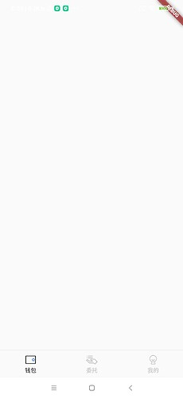
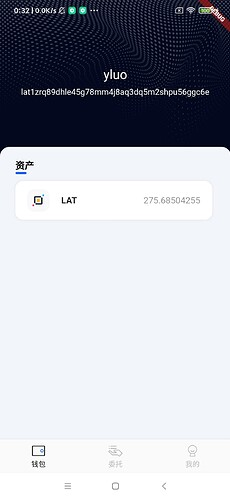
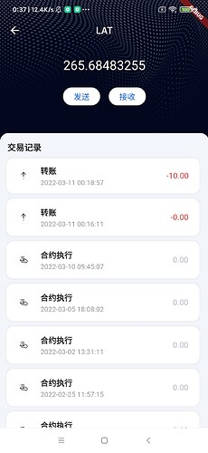
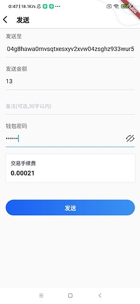
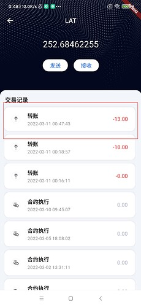

本章我们完成查看交易列表以及转账的功能。

### 增加WalletManager方法

这里笔者讲解几个比较重要的函数
1，加载所有钱包列表 -- loadAllWallet
代码如下：
```
  static Future<void> loadAllWallet() async {
   //  获取App的数据路径
    Directory appDocDir = await getApplicationDocumentsDirectory();
    String appDocPath = appDocDir.path;

    Directory directory = Directory("$appDocPath/keyfiles");

    if (!await directory.exists()) {
      return;
    }
   // 遍历目录下所有钱包文件，钱包文件名即为钱包名
    await directory.list(recursive: false).forEach((ele) async {
      String walletName = ele.path.split("/").last.split(".")[0];
      _walletSet.add(walletName);

      String address = await getWalletAddress(walletName);

      _addressWalletNameMap[address] = _walletName;
    });
  }
```
因为我们创建/导入钱包的钱包文件都是以{钱包名}.json的命名文件存放在keyfiles目录下的,因此我们需要获取walletFiles目录下文件列表,然后提取出钱包名

2, 获取当前选中的钱包名 -- getCurrentWalletName
```
  static Future<String> getCurrentWalletName() async {
    if (_walletName.isNotEmpty) {
      return _walletName;
    }

    final prefs = await SharedPreferences.getInstance();

    String? walletName = prefs.getString("curWallet");

    if (walletName != null) {
      _walletName = walletName;
    } else {
      if (_walletSet.isNotEmpty) {
        _walletName = _walletSet.first;
        prefs.setString("curWallet", _walletName);
      }
    }
    return _walletName;
  }
```
如果没有选中的钱包, 则获取钱包列表得到第一个钱包作为显示的钱包。然后把选中的钱包名持久化。笔者这里用到了**shared_preferences**包。

3，切换钱包 --  switchWallet
```
  static switchWallet(String walletName) async {
    final prefs = await SharedPreferences.getInstance();
    prefs.setString("curWallet", walletName);
    _walletName = walletName;
  }
```
更换当前显示的钱包，都要持久化。

完成改造后，我们就要在App入口的地方调用WalletManager.loadAllWallet函数加载所有的钱包。
调用代码在main.dart文件中， 代码如下：
```

void main() {
  // 使用测试网
  WidgetsBinding widgetsBinding = WidgetsFlutterBinding.ensureInitialized();

  NetworkParameters.init(BigInt.from(210309), "lat");
  FlutterNativeSplash.preserve(widgetsBinding: widgetsBinding);
  /// 加载钱包
  _loadWallet();
}
/// 加载钱包
void _loadWallet() async {
  await WalletManager.loadAllWallet();
  runApp(const HomeStatefulWidget());
  /// 设置状态栏为沉浸式
  SystemUiOverlayStyle systemUiOverlayStyle =
      const SystemUiOverlayStyle(statusBarColor: Colors.transparent);
  SystemChrome.setSystemUIOverlayStyle(systemUiOverlayStyle);
  /// 移除splash
  FlutterNativeSplash.remove();
}
```
笔者使用了**flutter_native_splash** 包来实现原生的开屏页功能
钱包加载完成后， 我们需要判断当前是否已有钱包，如果没有则进入导入钱包操作页，否则进入主页面。判断代码main.dar的HomeStatefulWidget类中t代码如下：
```
... 省略代码
class HomeStatefulWidget extends StatelessWidget {
  const HomeStatefulWidget({Key? key}) : super(key: key);

  @override
  Widget build(BuildContext context) {
    late String initRouter;
    /// 判断是否有钱包
    if (!WalletManager.isExistWallet()) {
      initRouter = "/import";
    } else {
      initRouter = "/main";
    }
    return GetMaterialApp(
      localizationsDelegates: const [
        RefreshLocalizations.delegate,
        GlobalWidgetsLocalizations.delegate,
        GlobalMaterialLocalizations.delegate
      ],
      supportedLocales: const [
        Locale('en'),
        Locale('zh'),
      ],
      initialRoute: initRouter,
      getPages: [
        GetPage(
            name: "/import",
            page: () {
              return AnnotatedRegion<SystemUiOverlayStyle>(
                  child: const OperateMenuStatelessWidget(),
                  value: StatusBarUtil.getDarkOverlayStyle());
            }),
        GetPage(
            name: "/main",
            page: () {
              return AnnotatedRegion<SystemUiOverlayStyle>(
                  child: const MainStatefulWidget(),
                  value: StatusBarUtil.getLightOverlayStyle());
            }),
...省略代码
```
笔者只用GetX库做路由跳转。

### 构建主页面

代码在app/page包的main_stateful_widget.dart文件中，控件的使用以及布局代码笔者就不讲解了，大家看源码即可。效果如下图：



用来具体页面的显示容器，具体的内容我们要构建响应的页面

### 构建资产显示页面 

代码在app/page包的asset_stateful_widget.dart文件中。效果如下图：



### 构建交易记录页面

代码在app/page包的asset_chain_stateful_widget.dart文件中。效果如下图：



在Android篇中我们获取交易记录是通过ATOM的Api接口获取的，在Flutter篇我们通PlatScan获取。获取测试链交易记录的地址为: 
```
https://devnetscan.platon.network/browserserver/transaction/transactionListByAddress
```
接口的参数：
```
  String address; // 获取的钱包地址
  int pageNo; // 获取页码
  int pageSize; // 每一页显示的数量
  String txType; // 交易类型，不填则全部获取
```
返回的参数：
```
  String errMsg = ""; // 错误信息

  int code = 0; // 错误码 为0 无错误

  BigInt totalCount = BigInt.zero; // 总记录数量

  BigInt displayTotalCount = BigInt.zero; // 显示的数量

  BigInt totalPages = BigInt.zero; // 总页数

  late List<TransactionListResp> data = []; // 记录列表

```
TransactionListResp 结构体的参数：
```
  String txHash = ""; //交易hash
  String from = ""; //发送方地址（操作地址）
  String to = ""; //接收方地址
  BigInt seq = BigInt.zero; //排序号
  double value = 0; //金额(单位:von)
  double actualTxCost = 0; //交易费用(单位:von)
  int txType = 0; //
  BigInt serverTime = BigInt.one; //服务器时间
  BigInt timestamp = BigInt.one; //出块时间
  BigInt blockNumber = BigInt.one; //交易所在区块高度
  String failReason = ""; //失败原因
  String receiveType = ""; //此字段表示的是to字段存储的账户类型：account-钱包地址，contract-合约地址
  int txReceiptStatus = 0;
```
txType交易类型字段代码表的意义如下：
```
0, 转账
1,EVM合约发布(合约创建)
2, 合约调用(合约执行)
6, ERC20合约发布(合约创建)
7,  ERC20合约调用(合约执行)
8. ERC721合约发布(合约创建)
9, ERC721合约调用(合约执行)
10, ERC1155合约发布(合约创建)
11, ERC1155合约调用(合约执行)
1004, 发起委托(委托)
1005,减持/撤销委托(赎回委托)
```
其中1155的交易类型，由DQT团队开发，将于下周交付给基金会。

### 构建发送LAT的页面


代码在app/page包的send_lat_stateful_widget.dart文件中。效果如下图：



笔者这里发送13个LAT给lat104g8hawa0mvsqtxesxyv2xvw04zsghz933wur5账号。可以在交易记录中看到该条记录，如下图:



好啦，本章内容就先到这里啦。

仓库地址: [GitHub - DQTechnology/Platon_DevGuideProject](https://github.com/DQTechnology/Platon_DevGuideProject)


Flutter篇往期链接:


[跟Dex学PlatON应用开发–Flutter篇(一)](https://forum.latticex.foundation/t/topic/6020)

[跟Dex学PlatON应用开发–Flutter篇(二)](https://forum.latticex.foundation/t/topic/6025)

[跟Dex学PlatON应用开发–Flutter篇(三)](https://forum.latticex.foundation/t/topic/6030)

[跟Dex学PlatON应用开发–Flutter篇(四)](https://forum.latticex.foundation/t/topic/6046)