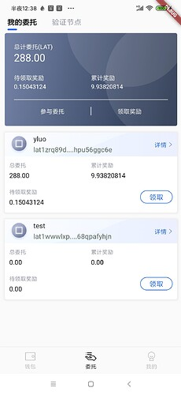
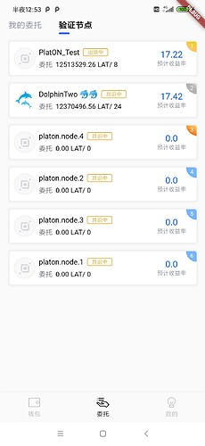
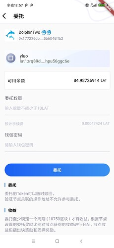
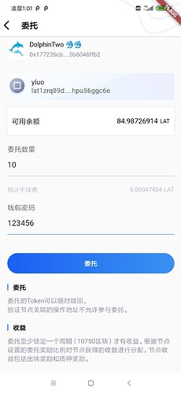
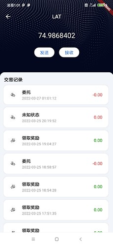
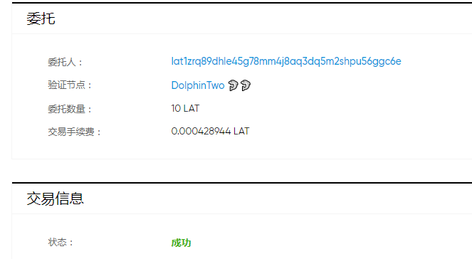

本章我们实现获取验证节点以及委托的功能。

### 构建委托页面
代码在app/page包的delegate_statueful_widget.dart文件中，这个页面有**我的委托**和**验证节点**两个子页面，其中**我的委托**代码放在app/page包的my_delegate_stateful_widget.dart文件中，效果如下图：



我们讲解如何获取总计委托，以及各个钱包的委托情况。

PlatON浏览器提供了获取单个钱包详情的接口，为了获取总计委托的情况，我们一个一个的获取钱包的委托详情，然后把所有的钱包的委托的情况相加就是总计委托。
代码在my_delegate_stateful_widget文件的_MyDelegateStatefulWidgetState类中，如下
```
  /// 获取所有钱包的详情
  _loadAllAddressDetailInfo() async {
    // 获取批量获取钱包详情的future列表
    List<Future<AddressDetailResp>> batchRequest = List.empty(growable: true);
    // 获取所有钱包地址
    addressList = WalletManager.getAllAddress();
    // 同时去获取多个钱包的详情
    for (String address in addressList) {
      batchRequest.add(PlatScanApi.getAddressDetail(address));
    }
    // 等待获取所有钱包的结果返回
    detailList = await Future.wait(batchRequest);
    // 总结委托
    totalDelegate = 0;
    // 累计奖励
    totalHaveReward = 0;
    // 待领取奖励
    totalDelegateClaim = 0;
    // 计算总计情况
    for (AddressDetailResp addressDetailResp in detailList) {
      totalDelegate += addressDetailResp.delegateValue;
      totalHaveReward +=
          (addressDetailResp.delegateClaim + addressDetailResp.haveReward);
      totalDelegateClaim += addressDetailResp.delegateClaim;
    }
    setState(() {});
  }
```
这里使用了Future.wait同时获取多个钱包的详情
通过PlatON浏览器得知，获取钱包详情的地址为：/address/details，返回的 AddressDetailResp，参数说明如下：
```
  double balance = 0; // 余额（单位：LAT）
  double restrictingBalance = 0; // 锁仓余额（单位：LAT）
  double stakingValue = 0; // 质押的金额
  double delegateValue = 0; // 委托的金额
  double redeemedValue = 0; // 赎回中的金额
  double haveReward = 0; // 已提取委托（单位：LAT）
  double delegateClaim = 0; //待领取的委托奖励（单位：LAT）
  double delegateReleased = 0; //待赎回委托（单位：LAT）
```
### 构建委托节点列表页面
代码在app/page包的validator_stateful_widget.dart文件中, 页面效果如下图：，




获取验证节点的接口为：/staking/aliveStakingList，获取节点列表的代码如下：
```
  /// 获取节点列表
  _loadAliveStakingList() async {

    AliveStakingListReq req = AliveStakingListReq(1, 300);
    /// 获取节点列表
    RespPage<AliveStakingListResp> respPage =
        await PlatScanApi.getAliveStakingList(req);
    aliveStakingList = respPage.data;
    /// 判断页面是否关闭,如果已经关闭,则不处理
    if(mounted) {
      setState(() {});
    }
  }
```
AliveStakingListResp的参数说明如下：
```
  int ranking = 0; // 排行

  String nodeId = ""; //节点Id

  String nodeName = ""; // 验证人名

  String stakingIcon = ""; // 验证人图标

  int status = 0; // 状态 1：候选中 2：活跃中 3 出块中 6 共识中

  String totalValue = "0.00"; // 质押总数 = 有效的质押 + 委托

  String delegateValue = "0"; //委托总数

  int delegateQty = 0; //委托人数

  int slashLowQty = 0; // 低出块率举报次数

  BigInt blockQty = BigInt.zero; // 产生的区块数

  String expectedIncome = "0.00%"; //预计年化率(从验证人加入时刻开始计算)

  String deleAnnualizedRate = "0.00%"; // 预计委托年化率（从验证人加入时刻开始计算）

  String delegatedRewardRatio = "0.00%"; //委托奖励比例

  String genBlocksRate = "0.00%"; // 出块率

  String version = "1"; //版本
```

### 构建委托页面

代码在app/page包的send_delegate_stateful_widget.dart文件中, 页面效果如下图：



发送委托的代码如下：
```
  /// 委托委托的代码
  _onSendDelegate() async {
    /// 获取密码
    String password = passwordController.value.text;
    /// 获取钱包
    Wallet wallet = await WalletManager.getWallet(_walletName, password);
    ///
    Credentials credentials = Credentials.createByECKeyPair(wallet.keyPair);

    /// 创建委托合约对象
    DelegateContract delegateContract =
        DelegateContract.load(_web3, credentials);

    BigInt amount = Convert.toVon(delegateAmountController.value.text, Unit.KPVON);
    /// 委托
    delegateContract.delegate(_nodeId, 0, amount);
  }
```
这里的委托，直接使用了本系列的SDK实现。

笔者这里演示委托 10个LAT，页面如下：



交易记录如下:



图中的委托记录并没有显示出委托LAT的数量，是因为浏览器返回的交易记录的并没有把委托/赎回委托/领取奖励的 LAT放到value字段中，因此这里显示为0。我们可以通过浏览器查看交易详情，如下图：



可以看到委托成功。

好啦，本章就先到这里啦。 下一章我们将完成赎回委托/领取奖励的功能


仓库地址: [GitHub - DQTechnology/Platon_DevGuideProject](https://github.com/DQTechnology/Platon_DevGuideProject)


Flutter篇往期链接:


[跟Dex学PlatON应用开发–Flutter篇(一)](https://forum.latticex.foundation/t/topic/6020)

[跟Dex学PlatON应用开发–Flutter篇(二)](https://forum.latticex.foundation/t/topic/6025)

[跟Dex学PlatON应用开发–Flutter篇(三)](https://forum.latticex.foundation/t/topic/6030)

[跟Dex学PlatON应用开发–Flutter篇(四)](https://forum.latticex.foundation/t/topic/6046)

[跟Dex学PlatON应用开发–Flutter篇(五)](https://forum.latticex.foundation/t/topic/6122)