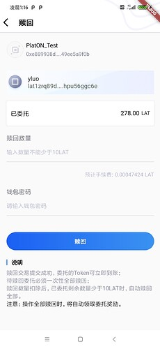
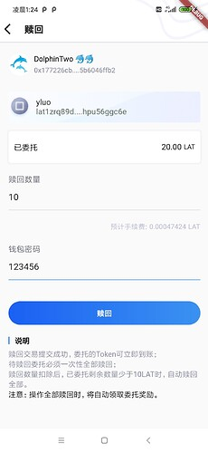
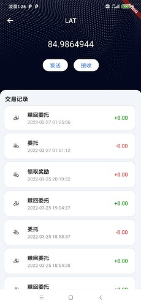
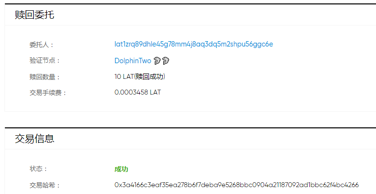
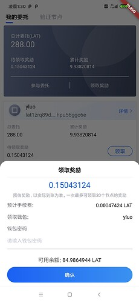
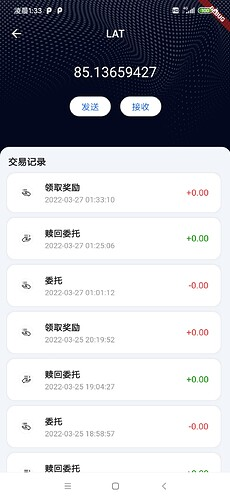
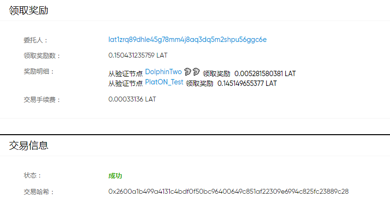

本章我们实现赎回委托以及领取奖励的功能。

### 构建赎回委托页面

代码在app/page包的withdraw_delegate_stateful_widget.dart文件中，效果如下图：




赎回委托的代码如下：
```
  /// 赎回委托
  _onWithDrawDelegate() async {

    String password = passwordController.value.text;
    //
    Wallet wallet = await WalletManager.getWallet(_walletName, password);
    //
    Credentials credentials = Credentials.createByECKeyPair(wallet.keyPair);
    //
    DelegateContract delegateContract =
        DelegateContract.load(_web3, credentials);
    /// 获取钱包地址所有委托的节点信息
    CallResponse<List<DelegationIdInfo>> delegationIdInfoRsp =
        await delegateContract.getRelatedListByDelAddr(_walletAddress);

    List<DelegationIdInfo>? delegationIdInfoList = delegationIdInfoRsp.data;

    if (delegationIdInfoList == null) {
      Fluttertoast.showToast(msg: "获取委托信息失败!");
      return;
    }
    /// 获取指定节点信息
    DelegationIdInfo? delegationIdInfo =
        getDelegationIdInfo(delegationIdInfoList);

    if (delegationIdInfo == null) {
      Fluttertoast.showToast(msg: "获取委托节点信息失败!");
      return;
    }
    /// 赎回的数量
    BigInt amount =
        Convert.toVon(delegateAmountController.value.text, Unit.KPVON);
    /// 赎回委托
    TransactionReceipt txReceipt = await delegateContract.undelegate(
        delegationIdInfo.nodeId, delegationIdInfo.stakingBlockNum, amount);

    if(txReceipt.status == BigInt.one) {
      Fluttertoast.showToast(msg: "赎回成功");
    } else {
      Fluttertoast.showToast(msg: "赎回失败");
    }
  }
```
赎回委托的，通过调用SDK的DelegateContract的undelegate接口，该接口的参数如下：
```
String nodeId,  /// 赎回的委托节点 
BigInt stakingBlockNumber,   /// 委托时的块高
BigInt amount  /// 赎回的LAT数量
```
nodeId为节点Id，委托节点详情也直接传递过来的，赎回的数量，我们输入即可。而stakingBlockNumber则需要调用，DelegateContract的getRelatedListByDelAddr接口获取，该接口返回钱包地址所有委托节点的列表，返回的信息为DelegationIdInfo，其参数如下：
```
  String address = ""; /// 钱包地址

  String nodeId = ""; /// 节点id

  BigInt stakingBlockNum = BigInt.zero; /// 委托时的块高
```
可知通过该接口即可获取到stakingBlockNum 参数。

笔者这里演示赎回10个LAT，页面如下：



交易记录如下：



上一章我们讲过，因为通过PlatON浏览器获取到的交易记录，并没有把委托/赎回委托/领取奖励的LAT解析到value字段中，因此这里看赎回委托的LAT数量为0。

通过查看浏览器交易详情如下：



从图中可知赎回成功。


### 构建领取奖励的对话框

代码在app/dialog包的claim_reward_dialog.dart文件中，效果如下图：



领取奖励的代码如下：
```
  /// 领取奖励
  _onClainReward() async {
    String password = passwordController.value.text;

    String walletName = WalletManager.getWalletNameByAddress(widget.address);

    Wallet wallet = await WalletManager.getWallet(walletName, password);

    Credentials credentials = Credentials.createByECKeyPair(wallet.keyPair);
    /// 构建领取奖励的智能合约实例
    RewardContract rewardContract = RewardContract.load(_web3, credentials);
    /// 领取奖励
    TransactionReceipt txReceipt =
        await rewardContract.withdrawDelegateReward();
    if (txReceipt.status == BigInt.one) {
      Fluttertoast.showToast(msg: "领取成功");
    } else {
      Fluttertoast.showToast(msg: "领取失败");
    }
    Navigator.pop(context);
  }
```
这里领取奖励使用了SDK中RewardContract 的withdrawDelegateReward接口。

笔者这里演示领取钱包地址：lat1zrq89dhle45g78mm4j8aq3dq5m2shpu56ggc6e的委托奖励，
交易记录如下：



浏览器中的交易详情如下：




好啦，本章内容就到这里啦。

下一章就是Flutter篇的最后一章啦。

仓库地址: [GitHub - DQTechnology/Platon_DevGuideProject](https://github.com/DQTechnology/Platon_DevGuideProject)


Flutter篇往期链接:


[跟Dex学PlatON应用开发–Flutter篇(一)](https://forum.latticex.foundation/t/topic/6020)

[跟Dex学PlatON应用开发–Flutter篇(二)](https://forum.latticex.foundation/t/topic/6025)

[跟Dex学PlatON应用开发–Flutter篇(三)](https://forum.latticex.foundation/t/topic/6030)

[跟Dex学PlatON应用开发–Flutter篇(四)](https://forum.latticex.foundation/t/topic/6046)

[跟Dex学PlatON应用开发–Flutter篇(五)](https://forum.latticex.foundation/t/topic/6122)

[跟Dex学PlatON应用开发–Flutter篇(六)](https://forum.latticex.foundation/t/topic/6161)