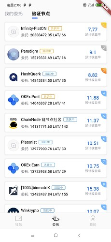

本章我们实现网络切换和账号切换的功能。

### 增加网络切换的页面

代码在app/page包的network_setting_stateful_widget.dart文件中，同时在AssetStatefulWidget页面中添加显示该页面的按钮。修改后页面效果如下图:


节点设置的页面如下:


节点的管理功能放在app/service/network_manager.dart 中，
该类的代码如下：
```
class NetworkInfo {

  String netName; // 网络名

  String hrp; // 链的可读前缀

  String nodeUrl; // 节点连接地址

  BigInt chainId; // 链Id

  String scanUrl; // 浏览器连接

  Color themeColor; // 首页背景颜色

  bool isSelected; // 当前是否被选中

  NetworkInfo(
      {required this.netName,
      required this.hrp,
      required this.nodeUrl,
      required this.chainId,
      required this.scanUrl,
      required this.themeColor,
      required this.isSelected});
}

class NetworkManager {
  // 初始化开发网和主网
  static List<NetworkInfo> networkList = [
    NetworkInfo(
        netName: "PLATON 开发网络",
        hrp: "LAT",
        nodeUrl: "http://35.247.155.162:6789",
        chainId: BigInt.from(210309),
        scanUrl: "https://devnetscan.platon.network/browser-server",
        themeColor: const Color(0xff04081f),
        isSelected: false),
    NetworkInfo(
        netName: "PLATON 主网络",
        hrp: "LAT",
        nodeUrl: "https://samurai.platon.network",
        chainId: BigInt.from(100),
        scanUrl: "https://scan.platon.network/browser-server",
        themeColor: const Color(0xff0912D4),
        isSelected: false),
  ];

  static int _curNetworkIndex = 0;

  static late NetworkInfo _curNetworkInfo;

  static loadNodeConfig() async {
    final prefs = await SharedPreferences.getInstance();

    int? networkIndex = prefs.getInt("network");

    if (networkIndex != null) {
      _curNetworkIndex = networkIndex;
    }

    _curNetworkInfo = networkList[_curNetworkIndex];
    _curNetworkInfo.isSelected = true;
  }


  /// 获取web3实例
  static Web3 getWeb3() {
    return Web3.build(_curNetworkInfo.nodeUrl);
  }


  static NetworkInfo getNetworkInfoByIndex(int index) {
    return networkList[index];
  }

  static int getNetworkNum() {
    return networkList.length;
  }

  static int getCurNetworkIndex() {
    return _curNetworkIndex;
  }

  static NetworkInfo getCurNetworkInfo() {
    return _curNetworkInfo;
  }

  static switchNetwork(int index) async {

    if(index == _curNetworkIndex) {
      return;
    }
    final prefs = await SharedPreferences.getInstance();
    await prefs.setInt("network", index);
    _curNetworkIndex = index;
    _curNetworkInfo.isSelected = false;
    _curNetworkInfo = networkList[index];
    _curNetworkInfo.isSelected = true;
  }
}
```
笔者这里是设置了开发网和主网的连接信息，同时把Web3的实例创建和抽取到该类中，方便统一管理。以下为测试网和主网的效果图：

测试网：


主网：


主网验证节点列表：




因为该账号在主网没有LAT，因此显示为0


### 主页面增加跳转到创建钱包和导入钱包功能

增加后页面效果如下图：


这里的弹出框笔者使用的是showMenu实现的，这里需要注意的是，如果直接使用PopupMenuItem作为菜单类的话，无法跳转到响应的页面，这是因为PopupMenuItem在handleTap函数中关闭了页面，其代码如下：
```
  @protected
  void handleTap() {
   // 跳转页面
    widget.onTap?.call();
   // 这里代码会立即把页面关闭
    Navigator.pop<T>(context, widget.value);
  }
```
因此我们需要继承PopupMenuItem实现自己的PopupMenuItem，然后把handleTap关闭页面的顺序调换即可，代码如下:
```
class CustomPopupMenuItem<T> extends PopupMenuItem<T> {

  const CustomPopupMenuItem({
    Key? key,
    T? value,
    bool enabled = true,
    VoidCallback? onTap,
    EdgeInsets? padding,
    double height = kMinInteractiveDimension,
    Widget? child,
  })  :
        super(
          key: key,
          value: value,
          onTap: onTap,
          enabled: enabled,
          padding: padding,
          height: height,
          child: child,
        );


  @override
  PopupMenuItemState<T, CustomPopupMenuItem<T>> createState() =>
      _CustomPopupMenuItemState<T>();
}

class _CustomPopupMenuItemState<T>
    extends PopupMenuItemState<T, CustomPopupMenuItem<T>> {

  @override
  void handleTap() {
    // 先执行关闭下拉菜单的代码
    Navigator.pop<T>(context, widget.value);
    // 再执行跳转页面的代码
    widget.onTap?.call();
  }
}
```

### 构建切换钱包的页面

代码在app/page包的select_address_stateful_widget.dart文件中，同时在main_stateful_widget.dart的将该页面以抽屉的形式显示，代码如下图：


页面展示的效果如下图：


下面笔者演示钱包切换的效果：
钱包1，


钱包2，


好啦, Flutter篇到这里就结束啦, 剩余的界面不涉及PlatON的知识点,大家只要掌握Flutter的知识即可构建, 因此笔者就不再做讲解。


下一篇我们开始讲解Solidity啦。


仓库地址: [GitHub - DQTechnology/Platon_DevGuideProject](https://github.com/DQTechnology/Platon_DevGuideProject)


Flutter篇往期链接:


[跟Dex学PlatON应用开发–Flutter篇(一)](https://forum.latticex.foundation/t/topic/6020)

[跟Dex学PlatON应用开发–Flutter篇(二)](https://forum.latticex.foundation/t/topic/6025)

[跟Dex学PlatON应用开发–Flutter篇(三)](https://forum.latticex.foundation/t/topic/6030)

[跟Dex学PlatON应用开发–Flutter篇(四)](https://forum.latticex.foundation/t/topic/6046)

[跟Dex学PlatON应用开发–Flutter篇(五)](https://forum.latticex.foundation/t/topic/6122)

[跟Dex学PlatON应用开发–Flutter篇(六)](https://forum.latticex.foundation/t/topic/6161)

[跟Dex学PlatON应用开发–Flutter篇(七)](https://forum.latticex.foundation/t/topic/6162)