《跟Dex学PlatON应用开发系列》分为：钱包篇,智能合约篇以及DApp篇。
钱包篇会分别教会大家用Javascript,Android,Flutter构建钱包.
本系列为Javascript篇, 将教会大家构建一个类似Samurai的浏览器插件钱包。

   Javascript篇基于Vue+ElementUI开发的，因此需要大家提前准备好相应的知识。

**1，	环境准备**
官网虽然提供安装的client-sdk-js的方法。但本着学习的目的,笔者直接拉client-sdk-js的源码编译.（注：笔者的所有操作系统都是在windows10上完成的）。

具体步骤如下： 
* a)	先下载node.js 网址：https://nodejs.org/dist/v16.13.0/node-v16.13.0-x64.msi 。这一步骤目标是为了能够使用npm下载相应的包。

* b)	下载源码：git clone https://github.com/PlatONnetwork/client-sdk-js.git  如果大家不想使用git的话 可以直接打开 https://github.com/PlatONnetwork/client-sdk-js  然后打包下载源码如下图：
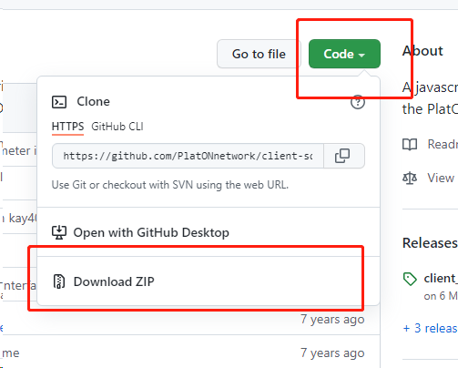 

* c) 	在源码目录打开控制台:
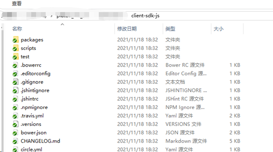 
在地址栏输入cmd，然后回车如下图：
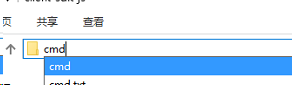 
在控制台输入： npm install
 
因为这里安装的东西比较多，需要耐心等待一会。如果输入命令后没有反应的话，可以Ctrl+C中断，再次输入npm install
安装完毕后会出现如下提示：
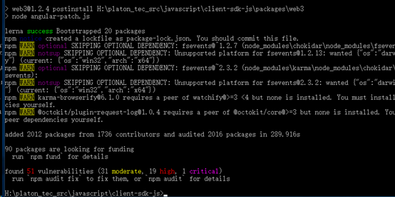 
* d)	包安装完毕后，继续输入命令 npm run build 编译sdk，如下图：
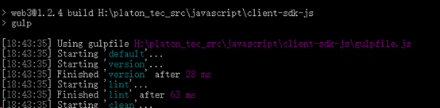 
编译完成后，在当前目录下会有一个dist目录：
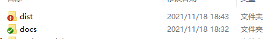 
打开会就会发现有如下文件：
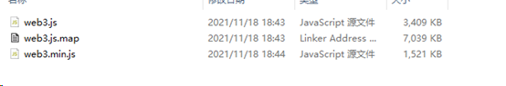 
文件web3.js是没有经过压缩的，我们在开发的时候使用这个文件，web.js.map符号映射文件，用来调试的。web3.min.js是经过压缩后的文件，生产环境使用这个文件。

**2，	代码编写**

新建一个目录，接着创建一个空index.html文件，把刚才编译好的sdk拷贝到这个目录下，拷贝完成后如下：
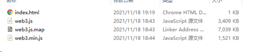 
然后我们用代码编辑器打开index.html文件。笔者这里用的vscode。把index.html代码修改如下：

```
<!DOCTYPE html>
<html lang="en">
<head>
    <meta charset="UTF-8">
    <meta http-equiv="X-UA-Compatible" content="IE=edge">
    <meta name="viewport" content="width=device-width, initial-scale=1.0">
    <title>demo1</title>
</head>
<body>
    <!-- 因为当前是开发状态，因此使用web3.js -->
    <script src="./web3.js"></script>
    <script>
    </script>
</body>
</html>
```
下面我们调用获取钱包余额的接口,代码如下：
```
<!DOCTYPE html>
<html lang="en">

<head>
    <meta charset="UTF-8">
    <meta http-equiv="X-UA-Compatible" content="IE=edge">
    <meta name="viewport" content="width=device-width, initial-scale=1.0">
    <title>demo1</title>
</head>

<body>
    <!-- 因为当前是开发状态，因此使用web3.js -->
    <script src="./web3.js"></script>
    <script>
        // 构建web3对象，这里的网址是PlatON的测试链地址
        let web3 = new Web3(new Web3.providers.HttpProvider('http://35.247.155.162:6789'));

        //笔者在测试链的钱包地址
        let walletAddress = "lat1zrq89dhle45g78mm4j8aq3dq5m2shpu56ggc6e";
        // 获取钱包地址
        web3.platon.getBalance(walletAddress).then(res=>{
            console.log(res);
        });

    </script>
</body>
</html>
```
双击打开index.html,界面显示如下：
);

        //笔者在测试链的钱包地址
        let walletAddress = "lat1zrq89dhle45g78mm4j8aq3dq5m2shpu56ggc6e";
        // 获取钱包地址
        web3.platon.getBalance(walletAddress).then(res=>{

            let balanceDom = document.getElementById("balance");
            // 把余额转换为LAT
            balanceDom.innerHTML = web3.utils.fromVon(res, "lat");
        });

    </script>
</body>
</html>
```
修改后我们再次刷新浏览器，显示如下:
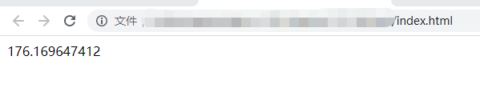 
为了验证我们获取到的余额是否是正确的，我们可以打开PlatON测试链的浏览器查看当前钱包的余额，地址如下：https://devnetscan.platon.network/
输入要查询的钱包地址,如下图，点击查询.
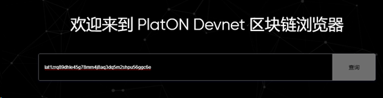 
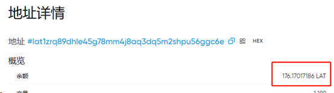 
看到余额和我们通过代码获取的余额是一致的。

好啦本章内容到此结束啦，下一章我们将会基于Vue开始开发我们的浏览器插件啦。好啦本章内容到此结束啦，下一章我们将会基于Vue开始开发我们的浏览器插件啦。

仓库地址: https://github.com/DQTechnology/Platon_DevGuideProject
