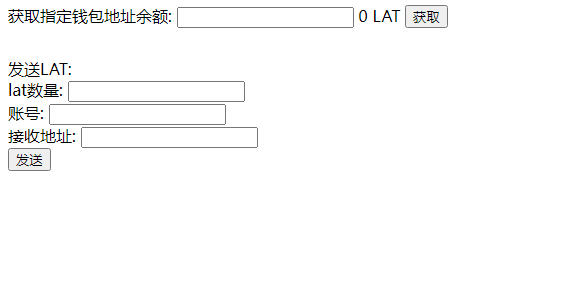
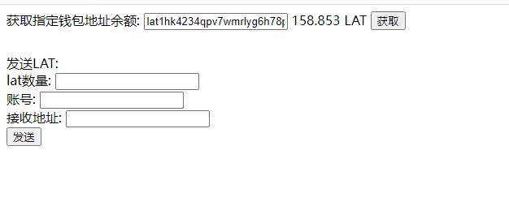
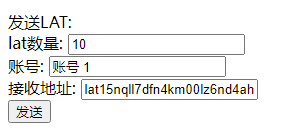
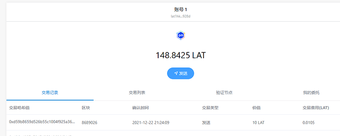

本章我们实现将Digging的接口导出,让网页可以调用.同时本章也作为JavaScript的终章.

### 编写导入接口
上一章我们在manifest.json文件中,添加了如下代码, 我们的添加的多网络才能够正常发送请求.
```
"content_scripts": [
    {
      "matches": [
        "file://*/*",
        "http://*/*",
        "https://*/*"
      ],
      "js": [
        "js/contentscript.js"
      ],
      "run_at": "document_start",
      "all_frames": true
    }
  ],
```
content_scripts的 是运行在网页上下文中的js脚本，它可以读取网页的DOM，也可以修改。但不能访问网页js中定义的函数和变量。可以用作网页和插件通讯的桥梁。而**matches**的作用是,content script可以对那些网站起作用, 这里默认对所有的网站都起作用. **js**要加载的js文件, **run_at**这里默认网页加载完成后开始执行.
public/js/contentscript.js文件的代码如下:
```
// 向页面注入JS
function injectCustomJs(jsPath) {
    // 因为content_script是不能直接访问网页的中的变量的
    // 因此需要给网页注入要一个js文件让其可以访问,
    jsPath = jsPath || 'js/inject.js';
    let scriptDom = document.createElement('script');
    scriptDom.setAttribute('type', 'text/javascript');
    scriptDom.src = chrome.extension.getURL(jsPath);
    let origin = ""
    // inject.js文件加载完成后,执行如下代码
    scriptDom.onload = () => {
        /**
         * 将消息发送给background.js
         */
        function sendMsgToBackground(data) {
            return new Promise((resolve, reject) => {

                chrome.runtime.sendMessage(data, (response) => {
                    resolve(response);
                });
            });
        }

        /**
         * background.js回复消息给inject.js
         * @param {}} id 
         * @param {*} data 
         */
        function sendMsgBackToInject(id, data) {
            window.postMessage({
                to: "diggingInject",
                type: "ack",
                id,
                data
            }, origin);
        }
        /**
         * 监听来自inject的消息
         */
        window.addEventListener("message", async function (e) {
            let data = e.data;
            if (data.to !== 'diggingConent') {
                return;
            }
            origin = data.origin;
            /**
             * 发型消息给后台
             */
            if (data.type === "send") {

                let res = await sendMsgToBackground(data);
                sendMsgBackToInject(data.id, res);
            } 
        }, false);
        /**
         * 接受来自后台的消息
         */
        chrome.runtime.onMessage.addListener(function (request, sender, sendResponse) {
            return true;
        });

    }
    
    document.body.appendChild(scriptDom);
}
// 网页加载后执行代码
document.addEventListener("DOMContentLoaded", () => {
    injectCustomJs();
});
```
因为网页是不能直接访问到content script的接口的, 需要在manifest.json中添加web_accessible_resources字段,指明可以可以访问网页的js文件, 而以上的content script的代码作用是把,web_accessible_resources指定的文件,添加在网页里面.
```
  "web_accessible_resources": [
    "js/inject.js"
  ],
```
在public/js目录下添加inject.js文件, 代码如下:
```
class Digging {
    /**
     * 回调函数的map
     */
    static callbackMap = {};
    /**
     * 给每一个请求分配一个唯一的id
     */
    static msgId = 1;

    /**
     * 获取指定钱包的地址
     * @param {} walletAddress
     * @returns
     */
    static async GetBalanceof(walletAddress) {
        /**
         * 这里把参数都打包成一个obj
         */
        return Digging.SendMsg("GetBalanceof", {
            walletAddress
        });
    }

    /**
     * 发送LAT到指定钱包
     * @param {} toAddress
     * @param {*} lat
     * @returns
     */
    static async SendLat(toAddress, lat) {
        /**
         * 这里把参数都打包成一个obj
         */
        return Digging.SendMsg("SendLat", {
            toAddress,
            lat
        });
    }

    /**
     * 发型消息给content script
     * @param {} msgType
     * @param {*} data
     * @returns
     */
    static SendMsg(msgType, data) {
        return new Promise(resolve => {
            let id = ++Digging.msgId;
            Digging.callbackMap[id] = resolve;
           // 发送给contentscript
            window.postMessage(
                {
                    to: "diggingConent",
                    type: "send",
                    id,
                    msgType,
                    origin: '*',
                    data
                },
              '*'
            );
        });
    }
}
// 把接口导出到window
window.Digging = Digging;
/**
 * 监听content script返回来的消息
 */
window.addEventListener(
    "message",
    function(e) {
        let data = e.data;
        if (data.to !== "diggingInject") {
            return;
        }

        if (data.type === "ack") {
            let resolve = Digging.callbackMap[data.id];
            if (!resolve) {
                return;
            }
            delete Digging.callbackMap[data.id];
            resolve(data.data);
            return;
        }
    },
    false
);
```
本章只拿获取地址余额和发送LAT做演示, 读者后面可以根据自己的需求,导出更多接口.
background.js的末尾,添加如下代码:
```
chrome.runtime.onMessage.addListener((request, sender, sendResponse) => {
    // 判断为获取余额的,直接调用 TransactionManager.GetBalanceOf
    if (request.msgType === "GetBalanceOf") {
        TransactionManager.GetBalanceOf(request.data).then(lat => {
            sendResponse({
                errCode: SUCCESS,
                data: lat
            });
        });
    } else if (request.msgType === "SendLat") {
        TransactionManager.SendLATTO(
            request.data.lat,
            request.data.account,
            request.data.toAddress
        ).then(res => {
            sendResponse(res);
        });
    }
    // 这里一定要返回true
    return true;
});
```
到这里我们就完成接口导出接口的功能啦.
### 编写网页调用代码
在当前工程目录下创建文件demo.html
代码如下:
```
<!DOCTYPE html>
<html lang="en">
  <head>
    <meta charset="UTF-8" />
    <meta http-equiv="X-UA-Compatible" content="IE=edge" />
    <meta name="viewport" content="width=device-width, initial-scale=1.0" />
    <title>Document</title>
  </head>
  <body>
    <div>
      获取指定钱包地址余额: <input id="balanceAddress" />
      <span id="balance">0 LAT</span> <button id="balanceBtn">获取</button>
    </div>

    <div style="margin-top:30px;">
      发送LAT:
      <div>lat数量: <input id="sendLatNum" /></div>
      <div>账号: <input id="account" /></div>
      <div>接收地址: <input id="toAddress" /></div>
      <div>
        <button id="sendBtn">发送</button>
      </div>
    </div>

    <script>
      window.onload = () => {
        let balanceAddressDom = document.getElementById("balanceAddress");
        let balanceDom = document.getElementById("balance");

        let balanceBtnDom = document.getElementById("balanceBtn");

        // 获取指定地址的lat数量
        balanceBtnDom.onclick = async () => {
          let res = await Digging.GetBalanceOf(balanceAddressDom.value);

          balanceDom.innerHTML = res.data + " LAT";
        };

        let sendLatNumDom = document.getElementById("sendLatNum");
        let accountDom = document.getElementById("account");
        let toAddressDom = document.getElementById("toAddress");

        let sendBtnDom = document.getElementById("sendBtn");

        sendBtnDom.onclick = async () => {
          let res = await Digging.SendLat(
            sendLatNumDom.value,
            accountDom.value,
            toAddressDom.value
          );
        };
      };
    </script>
  </body>
</html>
```
界面如下图:
 
我们获取本身账号的余额:
如下图:
 
接着我们发送LAT,如下图
 
我们在Digging的页面可以看到如下图:
 
余额由158变成148, 同时在交易记录列表可以看到发送的交易记录.

好啦, JavaScript篇就到此结束啦.

完篇总结:
本篇已经完成钱包的所有核心功能,但是有很多优化需要读者自己去实现的.比如说转账时,需要判断余额是否足够, 增加popup的显示功能等等. 这些读者感兴趣的话都可以去增加. DQT团队会基于当前基础,继续完成浏览器版本的Digging,直至成为一个好用的,功能完整的产品, 完成后也会开源出出来. 敬请关注.
好啦,下周我们就开始Android版本的教学, 需要大家提前掌握java, kotlin以及Android的开发知识.
谢谢大家的支持和关注.

仓库地址: https://github.com/DQTechnology/Platon_DevGuideProject