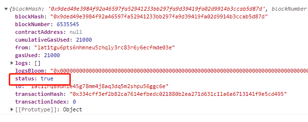

&nbsp;&nbsp;上一章我们完成了环境的搭建，以及查询钱包的余额。这一章我们将讲解如何通过JavaScript调用常用的接口。
&nbsp;&nbsp; 本章为了测试简单，所有输出都直接在控制一台打印。打开控制台的方法：在浏览器中按F12，弹出以下对话框，如下图：

 

然后选择Console选项接口。
### 1，批量获取钱包余额--BatchRequest

 官网实例只是说明这个接口的用法,并没对回调函数进行解释.经过笔者测试callback函数的返回值,第一个为null,忽略即可,第二个才是钱包的余额.代码如下:

```
<!DOCTYPE html>

<html lang="en">
<head>
    <meta charset="UTF-8">
    <meta http-equiv="X-UA-Compatible" content="IE=edge">
    <meta name="viewport" content="width=device-width, initial-scale=1.0">
    <title>demo1</title>
</head>
<body>

    <script src="./web3.js"></script>

    <script>

        // 构建web3对象，这里的网址是PlatON的测试链地址

        let platonWeb = new Web3(new Web3.providers.HttpProvider('http://35.247.155.162:6789'));

        // 1, 批量获取钱包的余额,以下为笔者准备的两个钱包地址

        let addr1 = "lat1zrq89dhle45g78mm4j8aq3dq5m2shpu56ggc6e";

        let addr2 = "lat1sc64spe34m4zt5mycf9njkvw7fg98g0uncwgsa";

        // 2, 创建批量请求
        let batch = new platonWeb.BatchRequest();
        // 3，添加请求
        batch.add(platonWeb.platon.getBalance.request(addr1, "latest",
            (arg1, balance) => {

                // arg1 忽略
                console.log("arg1:" + arg1 + ", balance_1:" + balance);
            }));

        batch.add(platonWeb.platon.getBalance.request(addr2, "latest",
            (arg1, balance) => {
                console.log("arg1:" + arg1 + ", balance_2:" + balance);
            }));

        // 执行请求
        batch.execute();
    </script>
</body>
</html>
```

我们可以在控制台选择Network, 然后点击请求,在Payload这里看到,这个接口会把我们两个请求合并成一个Http请求发出去.然后在各自的callback下返回余额.
结果如下图:
 
### 2，获取当前链的地址前缀--getAddressHrp

代码如下:
```
   // 获取当前链的地址前缀
    platonWeb.platon.getAddressHrp().then(res=>{
        console.log(res);
    });
```
因为platon的钱包地址前缀为lat,所有这个接口获取到的值为lat
 

### 3, 获取当前gas的价格 -- getGasPrice
代码如下:
```
    // 获取当前gas的价格
    platonWeb.platon.getGasPrice().then(res => {
        console.log("von:" + res, "lat:" + platonWeb.utils.fromVon(res));
    });
```
这个接口返回值的单位为VON, 如果获得lat的数量可以通过 web3.utils.fromVon函数进行转换.该值是由最近的若干块的中值决定的.可以作为我们设置gas的参考值.
 
### 4, 获取当前块高 -- getBlockNumber

代码如下:

```
    // 获取当前的块高
    platonWeb.platon.getBlockNumber().then(res => {
        console.log(res);
    });
```
### 5, 获取指定块的信息 -- getBlock

代码如下:

```
     // 获取指定块信息
    platonWeb.platon.getBlock(6533257).then(res => {
        console.log(res);
    });
```
 
以下是官网返回字段的解释:

- number - Number: 块编号，处于 pending 状态的块为 null, 因为我们查询的块编号为6533257, 因此这个值为6533257.

- hash 32 Bytes - String: 块哈希，处于 pending 状态的块为 null

- parentHash 32 Bytes - String: 父块哈希

- nonce 8 Bytes - String: 生成的 proof-of-work 的哈希，处于 pending 状态的块为 null

- logsBloom 256 Bytes - String: 块中日志的 bloom filter，处于 pending 状态的块为 null

- transactionsRoot 32 Bytes - String: 块中的交易树根节点

- stateRoot 32 Bytes - String: 块中的最终状态树根节点
- miner - String: 接收奖励的矿工地址
- extraData - String: 块 “extra data” 字段

- size - Number: 字节为单位的块大小

- gasLimit - Number: 该块允许的最大 gas 值

- gasUsed - Number: 该块中所有交易使用的 gas 总量

- timestamp - Number: 出块的 unix 时间戳

- transactions - Array: 交易对象数组，或者 32 字节长的交易哈希值，取决于 returnTransactionObjects 的设置

transactions为当前块所有交易哈希的数组,在我们的示例调用返回结果中,该字段是一个空的数组,说明该块为空块, 因此gasUsed字段为0.在这里问大家一个问题,空块的意义是什么?

### 6, 通过块编号或者块的哈希值获取块的交易数量 -- getBlockTransactionCount

我们先获取指定块编码获取指定块的交易数量,代码如下:
```
    // 获取指定块或者地址的交易数量
    platonWeb.platon.getBlockTransactionCount(6533257).then(res => {
        console.log(res);
    });
```
 
因为我们通过getBlock这个接口的返回值,已经知道该块为一个空块,因此可以看到返回的交易数量为0

下面我们通过块的哈希值获取块的交易数量,上面我们通过getBlock接口获取到块6533257的哈希值为:0x0561ab627d3053c486a552e594f6b3f40f7acc2fd107866169feb34de346129b 我们把块编码更换为块的哈希值

代码如下:

```
 // 获取指定块或者地址的交易数量

 platonWeb.platon.getBlockTransactionCount("0x0561ab627d3053c486a552e594f6b3f40f7acc2fd107866169feb34de346129b").then(res => {
        console.log(res);
    });

```

获取到的交易数量也是0.
### 7, 获取钱包地址的发出的交易数量 -- getTransactionCount

代码如下:
```

platonWeb.platon.getTransactionCount("lat1zrq89dhle45g78mm4j8aq3dq5m2shpu56ggc6e").then(res => {

        console.log(res);
    });

```
 
可以看到返回值为1255,我们到官网的浏览器查看,该地址的交易记录,地址为: https://devnetscan.platon.network/address-detailaddress=lat1zrq89dhle45g78mm4j8aq3dq5m2shpu56ggc6e 把页面拖动到最底部,看到我们的记录总数为1257条. 
 这好像多了2条记录.这是怎么回事呢?我们再看看这个接口的作用是什么,这个接口获取到的值是发出去的交易数量.我们在浏览器的交易记录里面发现,这个账号下有两笔接收转账的记录
 
接口转账,不属于发出的交易数量,因此需要减去2,刚好是我们通过接口获取到的值. 这个接口的常用于设置我们发出交易的nonce值.

### 8, 使用platon_sendRawTransaction完成第一笔转账

我们的目标是把lat转到lat1zrq89dhle45g78mm4j8aq3dq5m2shpu56ggc6e.

- 1, 第一步我们先申请一个新私钥,用来转账.我们在ATON里面创建一个新的钱包,然后获取里面的私钥. 笔者创建的私钥为:a4ac816da1ab40f805d026009247002f47c8c0a9af95b35ca9741c576466e1a8, 钱包地址为:lat1tgu6pts6nhmneu5zhqly3rc83r6y6ecfmde03e

- 2, 到水龙头领取LAT,网址为: https://faucet.platon.network/faucet/?id=e5d32df10aee11ec911142010a667c03 领取成功后,我们可以在浏览器看到账号已经有200个LAT,地址如下:https://devnetscan.platon.network/address-detail?address=lat1tgu6pts6nhmneu5zhqly3rc83r6y6ecfmde03e

- 3, 因为调用platon_sendRawTransaction我们需要sdk下的其他功能,因此我们需要编译出更多的组件.步骤和第一章编译sdk一样.我们首先进入client-sdk-js的目录,如下图:,
 
在编译之前我们需要修改一个BUG. 打开文件 client-sdk-js/packages/web3-utils/src/utils.js,找到decodeBech32Address函数,然后在address之前加上var 关键字如下图:
 
 
在当前目录下打开控制台, 然后输入npm run build-all 
 
编译的过程需要等下一下.执行完毕后如下图:
 有些错误,不影响使用直接忽略.编译完成之后我们在dist目录下,可以看到新编译出来的组件.
 
- 4, 引入sdk, 这里我们多引入 web3-eth-accounts.js,引入的代码如下:
```
    <!DOCTYPE html>
    <html lang="en">
    <head>
        <meta charset="UTF-8">
        <meta http-equiv="X-UA-Compatible" content="IE=edge">
        <meta name="viewport" content="width=device-width, initial-scale=1.0">
        <title>demo1</title>
    </head>
    <body>
        <!-- 新引入的sdk -->
        <script src="./web3-eth-accounts.js"></script>
        <script src="./web3.js"></script>
        <script>
            // 构建web3对象，这里的网址是PlatON的测试链地址
            let platonWeb = new Web3(new Web3.providers.HttpProvider('http://35.247.155.162:6789'));
     </script>
    </body>
    </html>
 ```


- 5, 下面开始编写代码

```

    // 1, 第一个通过getTransactionCount获取当前账号的交易数量,用作nonce值

  platonWeb.platon.getTransactionCount("lat1tgu6pts6nhmneu5zhqly3rc83r6y6ecfmde03e").then(nonce => {

        // 2, 获取近期块的gasprice

        platonWeb.platon.getGasPrice().then(gasPrice => {

            // 3, 构建交易参数

            let txData = {

                from: "lat1tgu6pts6nhmneu5zhqly3rc83r6y6ecfmde03e", //转账的钱包地址

                to: "lat1zrq89dhle45g78mm4j8aq3dq5m2shpu56ggc6e", // 接收转账的地址

                value: '10000000000000000000', //value的单位为von 从官网得知 1Lat = 1e18个VON, 这里转10lat

                chainId: "210309", // 链ID 从官网得知 测试链的id为 210309

                gasPrice: gasPrice, //每一步的费用

                gas: 21000, // 步数 就是gasLimit

                nonce: nonce,

                data: ""

            };

            // 4, 使用私钥对参数签名

            platonWeb.platon.accounts.signTransaction(txData, "a4ac816da1ab40f805d026009247002f47c8c0a9af95b35ca9741c576466e1a8").then(signTxtData => {

                // 5, 调用接口把请求发送出去, 这里只需要发送rawTransaction
                platonWeb.platon.sendSignedTransaction(signTxtData.rawTransaction).then(res => {
                    // 6, 使用 transactionHash值去查询发送情况
                    platonWeb.platon.getTransactionReceipt(res.transactionHash).then(receipt => {
                        console.log(receipt);
                    });
                });
            });
        });
    });

```
 输出结果:
  

    步骤说明:

     1, 第一个通过getTransactionCount获取当前账号的交易数量,用作nonce值

     2, 获取近期块的gasprice

     3, 构建交易参数

     4, 使用私钥对参数签名

     5, 调用接口把请求发送出去

     6, 通过交易哈希值, 获取判断交易是否成功,在本步骤的返回值中有一个status字段,如果为true则成功, false则为失败.

- 6, 最后我们通过浏览器查看两个钱包的交易记录:

    发送钱包的浏览器地址: https://devnetscan.platon.network/address-detail?address=lat1tgu6pts6nhmneu5zhqly3rc83r6y6ecfmde03e 
 
因为笔者在演示过程中调用了两次,因此可以看到两条转账记录.查看接受钱包的收款记录,浏览器地址:https://devnetscan.platon.network/address-detail?address=lat1zrq89dhle45g78mm4j8aq3dq5m2shpu56ggc6e 可以看到有两条收款记录.
 

     

好啦本章内容到此结束啦, 下一章我们可以构建浏览器插件咯.

仓库地址: https://github.com/DQTechnology/Platon_DevGuideProject
