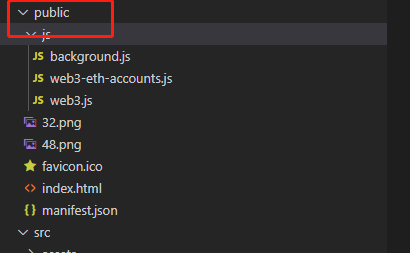

本章我们开始构建基于浏览器的钱包.
  
## 工程的创建.
 构建的过程笔者在这里就不展开讲解了. 基于vue-cli构建出来的功能目录如下:

工程创建好后我们打开public目录,如果创建的工程没有的话,需要手动创建.
 
然后在该目录下创建js文件夹, 把我们第二章用的web3.js和web3-eth-accounts.js两个文件放入该目录.再手动创建一个空的background.js文件.接着我们在public目录下创建manifest.json文件,该文件用来配置所有和插件相关的配置.内容如下:
```
{
  
    "manifest_version": 2,
    "name": "DigDing",
    "version": "1.0",
    "description": "DigDing钱包",
    "author": "DQTech",
    "content_security_policy": "default-src 'self';script-src 'self' 'unsafe-eval'; style-src 'self' 'unsafe-inline';img-src 'self' data: base64; connect-src *",
    "icons": {
        "48": "48.png"
    },
    "browser_action": {
        "default_icon": "32.png",
        "default_title": "DigDing",
        "default_popup": "index.html"
    },
    "background": {
        "scripts": [
            "js/web3-eth-accounts.js",
            "js/web3.js",
            "js/background.js"
        ]
    },
    "permissions": [
        "tabs",
        "storage"
    ]
}
```
下面我们对各个字段进行描述:
* manifest_version  清单文件的版本，这个必须写，而且必须是2
* name 插件的名称
* version 插件的版本
* description 插件描述
* icons  图标, 本教程只用了48像素, 读者可以填写多个,比如 16 32 128等
* browser_action  浏览器右上角图标设置
   default_icon 右上角的图标
   default_title 图标悬停时的标题
   default_popup 鼠标点击右上角插件图标时的弹出页面

* background 会一直常驻的后台JS或后台页面,本教程只用到scripts,表示插件要引入的js文件.
* permissions 权限申请, 本教程用到的权限 tabs 打开页面权限, storage存储权限

### 构建欢迎页面
我们在src目录创建page目录,然后新增welcome-page.vue文件
 
代码如下(注为了减少篇幅,样式代码,笔者在这里就不放出来, 读者可以去github下载工程,连接在文末):
```
<template>
  <div class="welcome-page">
    
    <div class="header">欢迎使用DigDing PlatON专属钱包</div>
    <div class="description">我们很高兴与您见面</div>
    <el-button class="first-time-flow-btn" type="primary">开始使用</el-button>
  </div>
</template>
```
接着打开App.vue,文件,代码修改如下:
```
  mounted() {
    if (this.IsOpenByPopup()) {
      chrome.tabs.create({ url: "index.html#/welcome" });
    }
  },

  methods: {
    /**
     * 判断是不是通过点击右上角图标进来的
     */
    IsOpenByPopup() {
      return (
        !window.location.href ||
        !window.location.hash ||
        window.location.hash === "#/"
      );
    },
  },
```
因为chrome的插件打开都是默认以弹出框方式显示的,这里我们要直接显示在浏览器,需要通过chorme.tabs创建页面, 打开tabs的权限我们刚才已经在manifest.json文件的permissions里面申请.
急着我们打开router.js文件,编写跳转路由, 代码如下:
```
const router = new Router({
    base: process.env.BASE_URL,
    routes: [
        {
            path: '/welcome',
            name: 'welcome',
            component: () => import('@/page/welcome-page.vue'),
          },
    ]
});
```
代码编写好之后, 我们在当前工程目录下打开控制台, 输入 npm run alpha命令
 
编译好之后我们就会在当前工程下看到dist目录如下图,接下来我们开始安装插件.
 
####  安装步骤如下:
打开chrome,打开右上角的三个点的菜单,然后在弹出菜单中选择更多工具,接着选择扩展程序
 ,在弹出页面的右上角,打开开发者选模式如下图:
 

然后我们用鼠标这打包好的整个dist目录拖动到这个页面,这样就安装好了.
 
然后我们在右上角看到一个插件的图标,如下图:
 
在弹出的菜单中,选择将DigDing钱包固定后
 
就可以在右上角直接看到DigDing钱包啦
 

安装之后,我们点击右上角的DigDing图标,就可以看到我们构建好的欢迎页面.如下图:
 

### 构建创建/导入钱包的引导页面
在page目录下增加 select-action-page.vue文件
 
select-action-page.vue文件部分代码如下:
```
<template>
  <div class="select-action-page vertical-only-layout">
    <header-bar />
    <div class="select-action-container horzontal-layout">
      <div
        class="
          select-action-btn
          vertical-only-layout
          flex-horzontal-center flex-1
        "
        style="margin-right: 16px"
      >
        <div class="el-icon-download icon"></div>
        <div class="select-action__button-text-big">
          不，我已经有一个种子密语了。
        </div>
        <div class="select-action__button-text-small">
          请使用 12 字种子密语导入现有钱包
        </div>
        <el-button class="action-btn" type="primary">导入钱包</el-button>
      </div>
      <div
        class="
          select-action-btn
          vertical-only-layout
          flex-horzontal-center flex-1
        "
      >
        <div class="el-icon-plus icon"></div>
        <div class="select-action__button-text-big">是的。立即开始设置！</div>
        <div class="select-action__button-text-small">
          该操作将为您创建新钱包和种子密语
        </div>
        <el-button class="action-btn" type="primary">创建钱包</el-button>
      </div>
    </div>
  </div>
</template>
```
然后在router.js文件添加跳转路由:
```
 {
          path: '/select-action',
          name: 'select-action',
          component: () => import('@/page/select-action-page.vue'),
},
```
编写好代码之后, 我们重新编译工程,运行命令 npm run alpha.编译好后,我们直接在chrome的插件管理页面,找到DigDing,然后点击刷新按钮.
 .
然后再次点击右上角DigDing的图标.点击欢迎页面的开始使用按钮,就可以看到如下页面啦.
 

### 构建创建钱包的密码页面
在page目录下增加create-password-page.vue文件
 
create-password-page.vue文件部分代码如下:
```
<template>
  <div class="create-password-page vertical-only-layout">
    <header-bar />
    <div class="go-back" @click="onGoBack">< Back</div>

    <div class="create-password-title">创建密码</div>
    <el-form ref="passwordForm" :model="passwordInfo">
      <el-form-item
        prop="newPassword"
        label="新密码(至少8个字符)"
        :rules="[
          {
            required: true,
            message: '请输入新密码(至少8个字符)',
            validator: validator.ValidatePassword,
          },
        ]"
      >
        <el-input
          class="pwd-input"
          type="password"
          v-model="passwordInfo.newPassword"
          placeholder="请输入新密码(至少8个字符)"
          :minlength="8"
        />
      </el-form-item>
      <el-form-item
        prop="confirmPassword"
        label="确认密码"
        :rules="[
          {
            required: true,
            message: '请再次输入密码',
            validator: validator.ValidatePassword,
          },
        ]"
      >
        <el-input
          class="pwd-input"
          type="password"
          v-model="passwordInfo.confirmPassword"
          placeholder="请再次输入密码"
          :minlength="8"
        />
      </el-form-item>
      <el-form-item>
        <el-button class="create-btn" type="primary" @click="onCreate"
          >创建</el-button
        >
      </el-form-item>
    </el-form>
  </div>
</template>
```
然后在router.js文件添加跳转路由:
```
  {
     path: '/create-password',
     name: 'create-password',
     component: () => import('@/page/create-password-page.vue'),
 },
```
然后再重新编译, 最后界面如下:
 


好啦,本章内容先到这里啦, 下一章我们开始学习如何生成秘钥.

仓库地址: https://github.com/DQTechnology/Platon_DevGuideProject