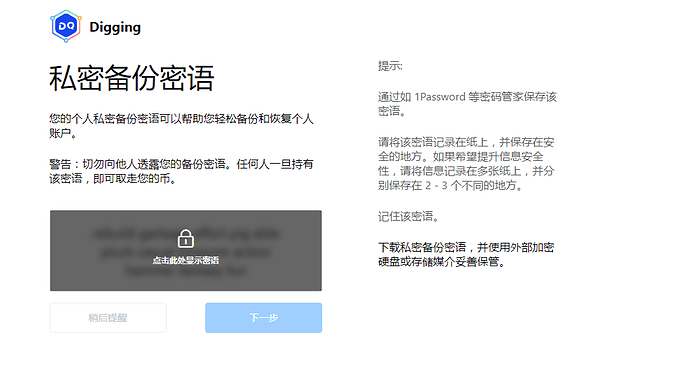
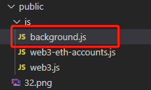
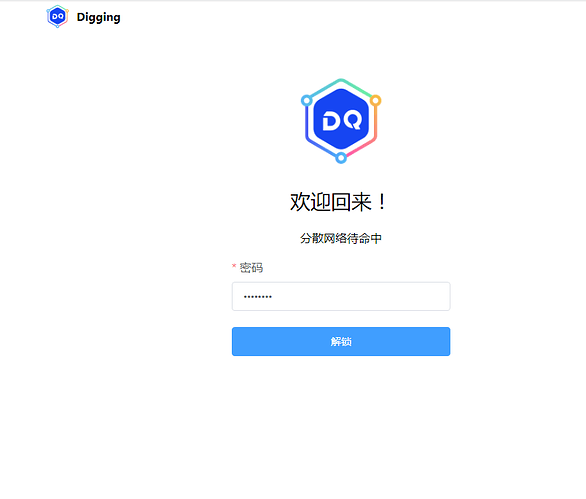
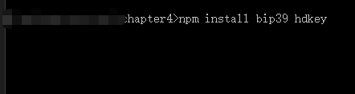
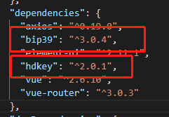
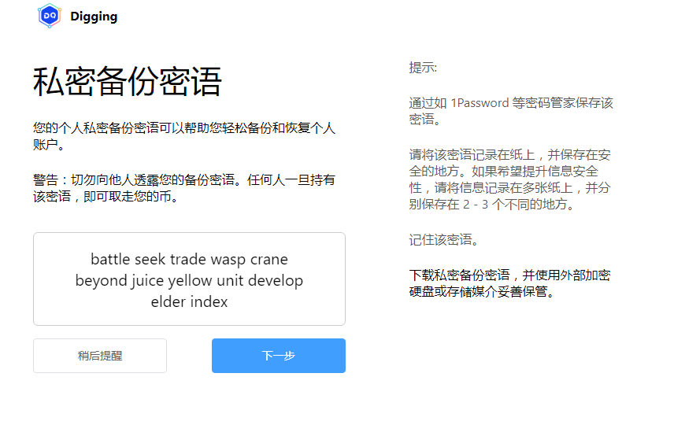
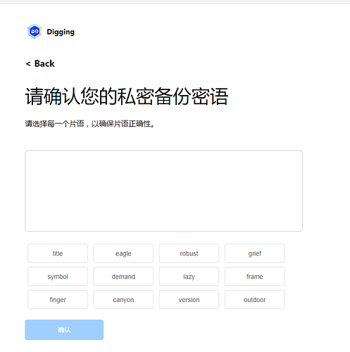
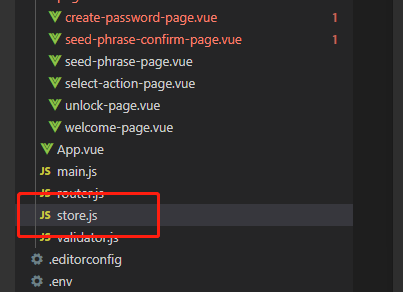

本章我们学习如何通过助记词构建私钥.

### 构建私密备份密语
我们在page目录, 新增seed-phrase-page.vue文件,部分代码如下:
```
<template>
  <div class="seed-phrase-page vertical-only-layout">
    <header-bar />
    <div class="horzontal-layout">
      <div class="seed-phrase-main">
        <page-title>私密备份密语</page-title>
        <div class="text-block">
          您的个人私密备份密语可以帮助您轻松备份和恢复个人账户。
        </div>
        <div class="text-block">
          警告：切勿向他人透露您的备份密语。任何人一旦持有该密语，即可取走您的币。
        </div>
        <div class="reveal-seed-phrase-secret">
          <div class="secret-words">
            <!-- 显示助记词 -->
            rebuild garbage effort pig able pluck casual blossom action hammer
            fantasy fun
          </div>
          <div class="secret-blocker">
            <div class="el-icon-lock"></div>
            <div class="reveal-txt">点击此处显示密语</div>
          </div>
        </div>

        <div class="horzontal-layout" style="margin-top: 16px">
          <el-button class="seed-phrase-btn" :disabled="disableBtn"
            >稍后提醒</el-button
          >
          <!-- 让两个按钮靠两边 -->
          <span class="flex-1"></span>
          <el-button
            class="seed-phrase-btn"
            type="primary"
            :disabled="disableBtn"
            >下一步</el-button
          >
        </div>
      </div>
      <div class="seed-phrase-aside">
        <div class="text-block">提示:</div>
        <div class="text-block">通过如 1Password 等密码管家保存该密语。</div>
        <div class="text-block">
          请将该密语记录在纸上，并保存在安全的地方。如果希望提升信息安全性，请将信息记录在多张纸上，并分别保存在
          2 - 3 个不同的地方。
        </div>
        <div class="text-block">记住该密语。</div>
        <div>下载私密备份密语，并使用外部加密硬盘或存储媒介妥善保管。</div>
      </div>
    </div>
  </div>
</template>
```
重新编译工程,就可以看到如下效果:

 

在生成助记词之前,我们先来看如何保存创建密码页的密码.我们打开public/js下的background.js文件

 

编写密码管理类PasswordManager, 部分代码如下:
```
/**
 * 密码管理类
 */
class PasswordManager {
    // 密码解锁后,把密码保存在这里
    static password = "";

    static IsUnlock() {
        return !!PasswordManager.password;
    }
    /**
     * 判断密码是否存在
     * @returns 
     */
    static async IsPasswordExist() {
        let password = await PasswordManager.getPassword();

        return !!password;

    }
    /**
     * 获取密码
     * @returns password
     */
    static getPassword() {
        return new Promise((resolve) => {
            chrome.storage.local.get(['password'], (res) => {
                // errCode为0是表示
                console.log(res);
                let password = res['password'];
                resolve(password);
            });
        });
    }
    /**
     * 创建密码
     * @param {新密码} newPassword 
     * @returns 
     */
    static CreatePassword(newPassword) {
        return new Promise((resolve) => {
            // 使用 chrome.storage存储数据,把key设置为password
            chrome.storage.local.set({
                "password": newPassword
            }, () => {

                // errCode为0是表示
                resolve({ errCode: SUCCESS, errMsg: "" });

            });
        });
    }
    /**
     * 判断密码是否正确
     * @param {密码} inputPassword 
     */
    static async UnLock(inputPassword)
    /**
     * 更新密码
     * @param {旧密码} oldPassword 
     * @param {新密码} newPassword 
     */
    static async UpdatePassword(oldPassword, newPassword)
}

```
这里用到了ES6的Promise和async/await语法. 这里存储密码的方式是**chrome.storage.local**,因为这里是写在background.js里面的,属于后台功能, 为了能让页面调用这些接口,需要把接口导出.导出方式如下:
在background.js中编写如下代码:
```
// 导出PasswordManager
window.digging = {
    PasswordManager
}
```
然后为了能够在vue组件里面直接使用接口, 需要把digging的接口注册到vue中,方法如下:
打开main.js文件, 添加如下代码:
```
let digging = chrome.extension.getBackgroundPage().window.digging;
installPlugin(digging, 'digging'); // 注册digging到全局
```
然后我们打开page目录下的create-password-page.vue文件. 这里我们要做如下修改:
之前我们只是显示创建密码的页面, 但是现在有一种情况是,如果当前已经密码, 那么需要显示的是解锁的页面,而不是创建密码的页面.
因此我们需要增加解锁的页面,部分代码如下:
```
<template>
  <div class="unlock-page vertical-only-layout">
    <header-bar />
    <div class="main vertical-layout flex-center">
      
      <div class="header">欢迎回来！</div>
      <div class="description">分散网络待命中</div>

      <el-form
        ref="passwordForm"
        :model="passwordInfo"
        style="margin-top: 10px; width: 300px"
      >
        <el-form-item
          prop="password"
          label="密码"
          :rules="[
            {
              required: true,
              message: '请输入密码',
              validator: validator.ValidatePassword,
            },
          ]"
        >
          <el-input
            type="password"
            v-model="passwordInfo.password"
            placeholder="请输入密码"
            :minlength="8"
          />
        </el-form-item>

        <el-form-item class="horzontal-layout vertical-only-layout flex-center ">
          <el-button
            class="first-time-flow-btn"
            type="primary"
            @click="onUnLock"
            >解锁</el-button
          >
        </el-form-item>
      </el-form>
    </div>
  </div>
</template>
```
页面效果如下图:

 

下面我们开始编写逻辑代码:
#### 1, 创建密码页面的逻辑
在create-password-page.vue页面的created函数判断当前是否已经存在密码,如果存在则继续判断是否已经解锁,如果未解则跳转到主界面.如果密码未创建,则显示创建面的页面,部分代码如下:
```
  created() {
    // 需要判断是否已经创建密码,方式跳转错误
    this.judgeExistPassword();
  },
methods: {
    /**
     * 判断密码是否存在, 如果存在跳转到解锁,页面
     */
   async judgeExistPassword() {
      let IsPwdExist = await this.digging.PasswordManager.IsPasswordExist();
      if (IsPwdExist) {
        // 密码存在说明已经创建密码,然后判断是否已经解锁,未解锁,跳转到界面页面
        let isUnlock = await this.digging.PasswordManager.IsUnlock();
        if (!isUnlock) {
          this.$router.push("/unlock");
        } else {
          // todo 跳转到主界面
        }
      } else {
        this.bShowPage = true;
      }
    },
}
```
接着我们编写创建密码的代码,代码如下:
```
method: {
...省略部分
    onCreate() {
      this.$refs.passwordForm.validate((vaild) => {
        if (!vaild) {
          return;
        }
        // 去掉密码的两边空格
        let newPassword = this.passwordInfo.newPassword.trim();
        let confirmPassword = this.passwordInfo.confirmPassword.trim();
        if (newPassword !== confirmPassword) {
          this.$message.error("两次密码不一致");
          return;
        }
        // 执行创建创建密码的动作
        this.doCreatePassword(newPassword);
      });
    },
    /**
     * 执行创建创建密码的动作
     */
    async doCreatePassword(newPassword) {
      await this.digging.PasswordManager.CreatePassword(newPassword);
      this.$message.success("创建密码成功!");
      //跳转到创建助记词的页面
      this.$router.push("/seed-phrase");
    },
...省略部分
}
```
#### 2, 创建解锁密码页面的逻辑
unlock-page.vue页面的部分逻辑如下:
```
  methods: {
    onUnLock() {
      // 判断密码长度是否符合
      this.$refs.passwordForm.validate((vaild) => {
        if (!vaild) {
          return;
        }
           // 去掉密码的两边空格
        let password = this.passwordInfo.password.trim();
        this.doUnLock(password);
      });
    },
    async doUnLock(password) {
      // 解锁钱包
      let bSuccees = await this.digging.PasswordManager.UnLock(password);
      if (bSuccees) {
        this.$message.success("解锁成功!");
        // todo
        // 1, 解锁成功后,需要判断是否已经有钱包,如果还没钱包,则跳转到创建或者导入钱的页面
        // 2, 如果已经有钱包则跳转到主界面
      } else {
        this.$message.error("密码错误,解锁失败!");
      }
    },
  },
```
#### 3, 生成助记词的逻辑
使用助记词需要安装bip39和hdkey在两个库.在当前工程目录打开控制人, 输入 npm install bip39 hdkey 如下图:

 

安装完毕后会在工程目录下的package.json文件看到这两个库的信息,如下图:

 

接着打开seed-phrase-page.vue页面,在这里引入bip39库, 代码如下:
```
<script>
... 省略代码
const bip39 = require("bip39");
... 省略代码
</script>
```
注意这个库的引入方式不能使用import而是使用require的方式.
生成助记词的代码如下:
```
... 省略代码
 generateMnemonic() {
     // 生成助记词
    this.curRandomSeed = bip39.generateMnemonic();
 }
... 省略代码
```

 

#### 4,助记词确认页面

在page目录, 新增seed-phrase-confirm-page.vue文件,部分代码如下
```
<template>
  <div class="seed-phrase-confirm-page vertical-only-layout">
    <header-bar />
    <div class="go-back" @click="onGoBack">< Back</div>
    <page-title>请确认您的私密备份密语</page-title>
    <div class="text-block">请选择每一个片语，以确保片语正确性。</div>

    <div class="grid-layout select-seed-words">
      <el-button
        class="seed-word"
        v-for="(item, index) in selectWords"
        :key="index"
      >
        {{ item }}
      </el-button>
    </div>
    <div class="grid-layout">
      <el-button
        class="seed-word"
        :type="getBtnType(item)"
        v-for="(item, index) in seedWords"
        :key="index"
        @click="onSelectWord(item)"
      >
        {{ item }}
      </el-button>
    </div>
    <el-button
      type="primary"
      class="confirm-btn"
      :disabled="disableBtn"
      @click="onConfirm"
      >确认</el-button
    >
  </div>
</template>
```
界面如下:

 

为了可以在seed-phrase-page.vue页生成的助记词传递到确认页面.需要安装Vuex组件. 安装好Vuex组建后,在当前工程目录下载创建store.js文件, 如下图:

 

store.js的代码如下:
```
import Vue from 'vue';
import Vuex from 'vuex';
Vue.use(Vuex);
export default new Vuex.Store({
    state: {
        mnemonic: "", // 保存当前助记词
    },
    getters: {
        GetMnemonic(state) {
            return state.mnemonic;
        },
    },
    mutations: {
        SetMnemonic(state, mnemonic) {
            state.mnemonic = mnemonic;
        },
    }
});
```
接着 在main.js文件,引入store,代码如下:
```
... 省略代码

import store from './store';

... 省略代码

new Vue({
  router,
  store,
  render: h => h(App),
}).$mount('#app');

... 省略代码

```
接着我们修改seed-phrase-page.vue的代码,让其生成的助记词保存在Vuex:
```
    generateMnemonic() {
      if (this.mnemonic) {
        return;
      }
      let mnemonic = bip39.generateMnemonic();
      // 把助记词保存在Vuex
      this.$store.commit("SetMnemonic", mnemonic);
    },
    jumpToConfirmPage() {
      this.$store.commit("SetMnemonic", this.mnemonic);
      this.$router.push("/seed-phrase-confirm");
    },
```
助记词确认的页面部分代码如下:
```
// 引入 bip39 ,hdkey 两个包
const bip39 = require("bip39");
const hdkey = require("hdkey");

... 省略代码
  mounted() {

    if (!this.mnemonic) {
      let mnemonic = bip39.generateMnemonic();
      this.$store.commit("SetMnemonic", mnemonic);
    }
    // 保存正确顺序的助记词
    this.orginSeedWords = this.mnemonic.split(" ");
    // 打算助记词的顺序, 这里 [...this.orginSeedWords] 复制数组
    this.seedWords = this.shuffle([...this.orginSeedWords]);
  },

... 省略代码

    onSelectWord(word) {
      // 判断单词是否被选中, 如果为选中则恢复为未选中
      if (this.seedWordsMap[word]) {
        this.seedWordsMap[word] = false;
        let newSelectWords = [];
        this.selectWords.forEach((ele) => {
          if (ele === word) {
            return;
          }
          newSelectWords.push(ele);
        });
        this.selectWords = newSelectWords;
      } else {
        // 选中单词
        this.seedWordsMap[word] = true;
        this.selectWords.push(word);
      }
      // 计算集配的数量
      let matchWordNum = 0;
      for (let i = 0; i < this.selectWords.length; ++i) {
        let orginWord = this.orginSeedWords[i];
        let selectedWord = this.selectWords[i];

        if (orginWord === selectedWord) {
          ++matchWordNum;
        } else {
          break;
        }
      }
      // 如果全部匹配那么设置确认按钮为可用状态
      this.disableBtn = matchWordNum !== this.orginSeedWords.length;

      this.$forceUpdate();
    },

... 省略代码

    onConfirm() {
      /**
       * 助记词转换为种子
       */
      bip39.mnemonicToSeed(this.mnemonic).then((seed) => {
        const hdSeed = hdkey.fromMasterSeed(seed);

        // 利用hdPath导出子私钥
        const hdPath = "m/44'/60'/0'/0/0"; // platon默认使用路径为0

        const privateKey = hdSeed.derive(hdPath).privateKey.toString("hex");

        console.log(privateKey);
        // 清空store里面的助记词
        this.$store.commit("SetMnemonic", "");
      });
    },

... 省略代码
```
在这个页面需要引入bip39和hdkey这两个库, 引入的方式为require.

好啦,本章内容先到这里啦, 下一章我们开始学习如何导入秘钥,以及如何保存助记词和秘钥.
仓库地址: https://github.com/DQTechnology/Platon_DevGuideProject
