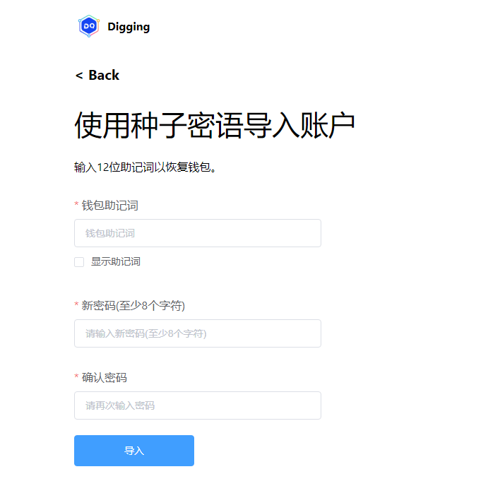
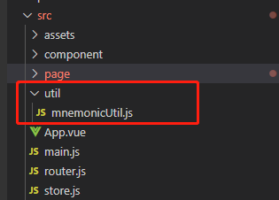
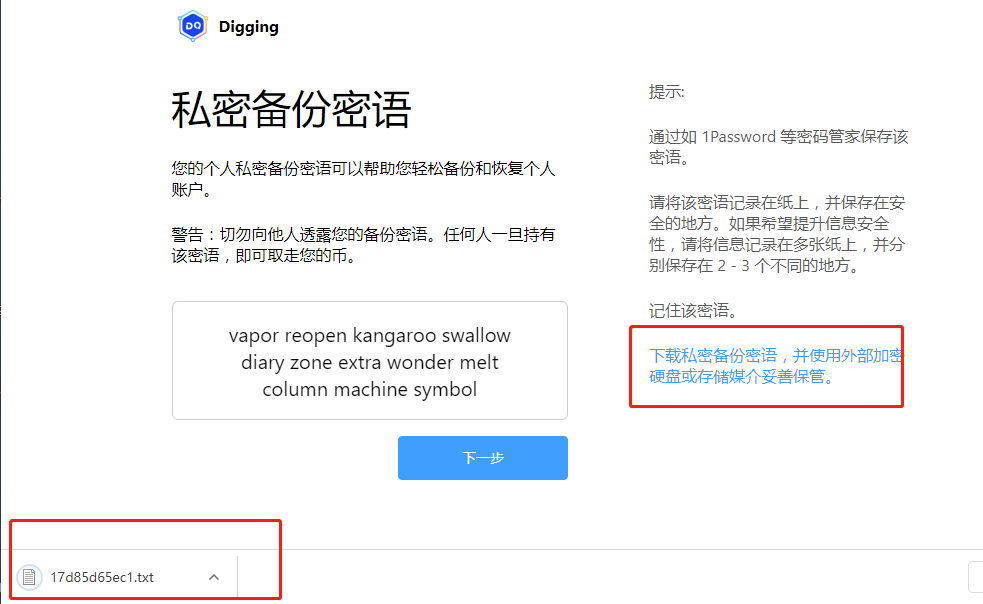
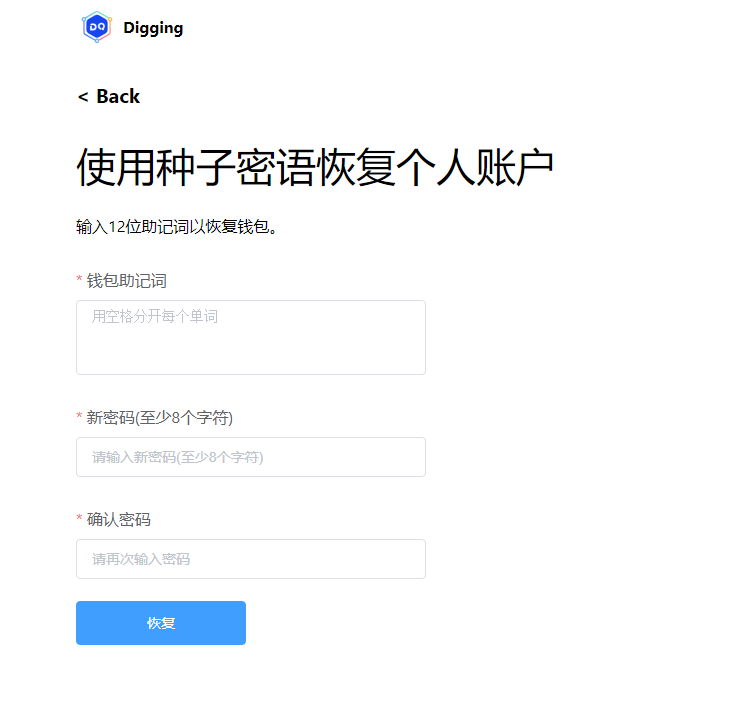

本章我们将完成助记词的导入,秘钥的保存,通过助记词重置密码的功能

### 构建导入助记词的页面
在page目录下,创建文件import-seed-phrase-page.vue, 部分代码如下:
```
<template>
    <div class="import-seed-phrase-page vertical-only-layout">
        <header-bar />
        <div class="go-back" @click="onGoBack">< Back</div>
        <page-title>使用种子密语导入账户</page-title>
        <div class="text-block">
            输入12位助记词以恢复钱包。
        </div>
        <el-form ref="importForm" :model="importInfo">
            <el-form-item
                prop="mnemonic"
                label="钱包助记词"
                :rules="[
                    {
                        required: true,
                        message: '助记词为12个单词',
                        validator: validator.ValidateMnemonic,
                        trigger: 'change'
                    }
                ]"
            >
                <el-input
                    v-if="!bShowSeedPhrase"
                    class="pwd-input"
                    type="password"
                    v-model="importInfo.mnemonic"
                    placeholder="钱包助记词"
                />
                <el-input
                    v-else
                    type="textarea"
                    class="pwd-input"
                    rows="3"
                    resize="none"
                    placeholder="用空格分开每个单词"
                    v-model="importInfo.mnemonic"
                >
                </el-input>

                <el-checkbox v-model="bShowMnemonic">显示助记词</el-checkbox>
            </el-form-item>
            <el-form-item
                prop="newPassword"
                label="新密码(至少8个字符)"
                :rules="[
                    {
                        required: true,
                        message: '请输入新密码(至少8个字符)',
                        validator: validator.ValidatePassword
                    }
                ]"
            >
                <el-input
                    class="pwd-input"
                    type="password"
                    v-model="importInfo.newPassword"
                    placeholder="请输入新密码(至少8个字符)"
                    :minlength="8"
                />
            </el-form-item>
            <el-form-item
                prop="confirmPassword"
                label="确认密码"
                :rules="[
                    {
                        required: true,
                        message: '请再次输入密码',
                        validator: validator.ValidatePassword
                    }
                ]"
            >
                <el-input
                    class="pwd-input"
                    type="password"
                    v-model="importInfo.confirmPassword"
                    placeholder="请再次输入密码"
                    :minlength="8"
                />
            </el-form-item>
            <el-form-item>
                <el-button class="import-btn" type="primary" @click="onImport">导入</el-button>
            </el-form-item>
        </el-form>
    </div>
</template>
```
界面如下:
 
接下来我们开始编写逻辑, 为了复用第四章通过助记词生成秘钥的代码. 我们把第四章生成秘钥的代码单独抽取成一个工具类.问在src/util目录下创建文件mnemonicUtil.js,如下图:
 
mnemonicUtil.js的代码如下:
```
const bip39 = require("bip39");
const hdkey = require("hdkey");

export default class MnemonicUtil {
    // 生成秘钥的路径
    static hdPath = "m/44'/60'/0'/0/0";
    /**
     * 验证助记词是否有效
     * @param {助记词} mnemonic 
     * @returns 
     */
    static ValidateMnemonic(mnemonic) {
        let seedWords = mnemonic.split(" ");
        seedWords = seedWords.filter(word => {
            word = word.trim();
            return !!word;
        });
        return seedWords.length === 12; 
    }
    /**
     * 
     * @param {助记词} mnemonic 
     * @returns 
     */
    static async GeneratePrivateKeyByMnemonic(mnemonic) {
        // 这里先把助记词分割, 防止助记词之间有多个空格
        let seedWords = mnemonic.split(" ");
        //  然后再把分割好的单词 已一个空格合并成字符串
        mnemonic = seedWords.join(" ");

        let seed = await bip39.mnemonicToSeed(mnemonic);

        const hdSeed = hdkey.fromMasterSeed(seed);

        const privateKey = hdSeed.derive(MnemonicUtil.hdPath).privateKey.toString("hex");

        return privateKey;
    }
}
```
seed-phrase-confirm-page.vue文件的代码修改如下:
```
... 省略代码

import MnemonicUtil from "@/util/mnemonicUtil.js";
... 省略代码
// 确认生成私钥代码
        async onConfirm() {
          let privateKey = await MnemonicUtil.GeneratePrivateKeyByMnemonic(
                this.mnemonic
            )
        },
... 省略代码
```
seed-phrase-confirm-page.vue 不在需要引入bip32和hdkey两个类, 只需要引入mnemonicUtil.js文件即可.
接着我们回到import-seed-phrase-page.vue页面, 导入助记词的逻辑代码如下:

```
... 省略代码
import MnemonicUtil from "@/util/mnemonicUtil.js";
... 省略代码
// 导入助记词代码
        onImport() {
            this.$refs.importForm.validate(vaild => {
                if (!vaild) {
                    return;
                }
                // 去掉密码的两边空格
                let newPassword = this.importInfo.newPassword.trim();
                let confirmPassword = this.importInfo.confirmPassword.trim();

                if (newPassword !== confirmPassword) {
                    this.$message.error("两次密码不一致");
                    return;
                }
                // 执行创建创建密码的动作
                this.doImport(newPassword);
            });
        },
      //
        async doImport(newPassword) {
            // 先保存好密码
            await this.digging.PasswordManager.CreatePassword(newPassword);
            //
            //  生成私钥
            let privateKey = await MnemonicUtil.GeneratePrivateKeyByMnemonic(
                this.importInfo.seedPhrase
            );
        },
```

可以看到只要是通过助记词生成私钥的, 直接引入mnemonicUtil.js文件即可. 在生成秘钥之前,需要先把密码保存.

### 保存秘钥功能

打开public/js目录下的background.js文件, 增加如下代码(这里只给出接口描述,具体的实现,请参看源码):
```
/**
 * 私钥管理类
 */
class PrivateKeyManager {
    // 存储私钥的键
    static privateKeyName = "privateKeys";
    // 存储当前选中的账号
    static curAccountKey = "currentAccount";
    /**
     *
     * @param {账号名} accountName 为了支持多个私钥,因为每个私钥都有一个名字
     * @param {私钥} privateKey
     * @param {是否强制导入} force 如果是强制导入的话, 会把之前所存储的私钥全部先删除,再执行导入
     */
    static async StorePrivateKey(account, privateKey, force);
    /**
     * 删除账号
     * @param {}} account
     * @returns
     */
    static async DeleteAccount(account) ;

    /**
     * 导出加密后的文件
     * @param {账号名} account
     */
    static async ExportKeyStore(account) ;
    /**
     * 导出私钥
     * @param {} account
     * @param {*} password
     * @returns
     */
    static async ExportPrivateKey(account, password);
    /**
     * 切换账号
     * @param {账号名} account
     */
    static async SwitchAccount(account);
    /**
     * 获取所有钱包地址列表
     */
    static async GetAccountList() ;

    /**
     * 判断是否有账号
     */
    static async HasAccount() ;

    /**
     * 获取当前选中的账号
     * @returns
     */
    static getCurrentAccount() ;
    /**
     * 保存当前选中的账号
     * @param {账号名} account
     * @returns
     */
    static storeCurrentAccount(account) ;

    /**
     * 保存加密后的私钥列表
     * @param {私钥列表} encryptPrivateKeys
     */
    static storePriateKeys(encryptPrivateKeys);
    /**
     * 获取所有私钥的对象
     * @returns
     */
    static getPrivateKeys();}
}

```
在这里保存私钥一定要用**chrome.storage.local**进行保存, 这样保存的信息只能是当前插件才可以访问.最后导出PrivateKeyManager. 该类提供的功能有:
- StorePrivateKey 保存私钥函数
- DeleteAccount 通过账号名,删除私钥
- ExportKeyStore 导出加密后的私钥文件
- ExportPrivateKey 导出私钥
- SwitchAccount 切换账号,这里同时会将当前选中的账号持久化,保证每次进入钱包显示的都是上次选中的钱包地址
- GetAccountList 获取账号列表
- HasAccount 判断当前是否有账号

这里用到了sdk的Web3EthAccounts类，该类用来把私钥加密成一个keystore，该内容可以直接导入其他钱包中使用。

下面我们讲解如何使用该类.
打开助记词确认页 seed-phrase-confirm-page.vue把onConfirm的代码修改如下:
```
        async onConfirm() {
            let privateKey = await MnemonicUtil.GeneratePrivateKeyByMnemonic(this.mnemonic);

            let defaultAccount = "账号 1";
            // 调用PrivateKeyManager的StorePrivateKey接口保存私钥
            // 这里创建第一个账号默认为账号 1
            // 设置未强制导入, 这样可以把之前存在的账号一次性清空
            let res = await this.digging.PrivateKeyManager.StorePrivateKey(defaultAccount, privateKey, true);
            if (res.errCode !== 0) {
                this.$message.error(res.errMsg);
                return;
            }
            // 保存成功后, 把账号切换为刚刚导入的账号
            res = await this.digging.PrivateKeyManager.SwitchAccount(defaultAccount);
            if (res.errCode !== 0) {
                this.$message.error(res.errMsg);
                return;
            }
            this.$message.success("创建秘钥成功!");
        },
```
接着打开导入助记词的页面,import-seed-phrase-page.vue, 把doImport的代码修改如下:
```

        async doImport(newPassword) {
            // 先保存好密码
            await this.digging.PasswordManager.CreatePassword(newPassword);
            //
            //  生成私钥
            let privateKey = await MnemonicUtil.GeneratePrivateKeyByMnemonic(
                this.importInfo.seedPhrase
            );

            let defaultAccount = "账号 1";
            // 调用PrivateKeyManager的StorePrivateKey接口保存私钥
            // 这里创建第一个账号默认为账号 1
            // 设置未强制导入, 这样可以把之前存在的账号一次性清空
            let res = await this.digging.PrivateKeyManager.StorePrivateKey(
                defaultAccount,
                privateKey,
                true
            );
            if (res.errCode !== 0) {
                this.$message.error(res.errMsg);
                return;
            }
            // 保存成功后, 把账号切换为刚刚导入的账号
            res = await this.digging.PrivateKeyManager.SwitchAccount(defaultAccount);
            if (res.errCode !== 0) {
                this.$message.error(res.errMsg);
                return;
            }
            this.$message.success("导入秘钥成功!");
        }
```
以上就是到处助记词以及保存生成的秘钥的功能. 下面来完善生成助记词以及解密钱包页面功能.

### 增加生成助记词页面把助记词保存成txt文件的功能
打开页面seed-phrase-page.vue, 添加以下代码:

```
        /**
         * 把助记词保存成txt文本
         */
        onSaveAsText() {
            let blob = new Blob([this.mnemonic]);
            let link = document.createElement("a");
            link.href = window.URL.createObjectURL(blob);
            link.download = MnemonicUtil.GenHexString() + ".txt";
            link.click();
            //释放内存
            window.URL.revokeObjectURL(link.href);
        },
```
这样当我们点击文字的时候,会自动把助记词保存成txt文件,并下载, 效果如下图:

 

### 增加解锁页面通过导出助记词来重置密码的功能
在page目录下创建restore-vault-page.vue文件,部分代码如下:
```
<template>
    <div class="restore-vault-page vertical-only-layout">
        <header-bar />
        <div class="go-back" @click="onGoBack">< Back</div>
        <page-title>使用种子密语恢复个人账户</page-title>
        <div class="text-block">
            输入12位助记词以恢复钱包。
        </div>
        <el-form ref="importForm" :model="restoreInfo">
            <el-form-item
                prop="mnemonic"
                label="钱包助记词"
                :rules="[
                    {
                        required: true,
                        message: '助记词为12个单词',
                        validator: validator.ValidateMnemonic,
                        trigger: 'change'
                    }
                ]"
            >
                <el-input
                    type="textarea"
                    class="pwd-input"
                    rows="3"
                    resize="none"
                    placeholder="用空格分开每个单词"
                    v-model="restoreInfo.mnemonic"
                >
                </el-input>
            </el-form-item>
            <el-form-item
                prop="newPassword"
                label="新密码(至少8个字符)"
                :rules="[
                    {
                        required: true,
                        message: '请输入新密码(至少8个字符)',
                        validator: validator.ValidatePassword
                    }
                ]"
            >
                <el-input
                    class="pwd-input"
                    type="password"
                    v-model="restoreInfo.newPassword"
                    placeholder="请输入新密码(至少8个字符)"
                    :minlength="8"
                />
            </el-form-item>
            <el-form-item
                prop="confirmPassword"
                label="确认密码"
                :rules="[
                    {
                        required: true,
                        message: '请再次输入密码',
                        validator: validator.ValidatePassword
                    }
                ]"
            >
                <el-input
                    class="pwd-input"
                    type="password"
                    v-model="restoreInfo.confirmPassword"
                    placeholder="请再次输入密码"
                    :minlength="8"
                />
            </el-form-item>
            <el-form-item>
                <el-button class="import-btn" type="primary" @click="onImport">恢复</el-button>
            </el-form-item>
        </el-form>
    </div>
</template>
```
页面如下图:
 

重置页面的逻辑和导入助记词的页面的功能基本一样,具体的代码逻辑参考该页面即可.就不再做详细介绍.

### 修复助记词确认页面单词重复不能选择的BUG
当生成的助记词的单词重复时,出现不能选中相同的单词的问题, 因此seed-phrase-confirm-page.vue的mounted函数的代码需要修改如下
```
  mounted() {
        if (!this.mnemonic) {
            let mnemonic = bip39.generateMnemonic();
            this.$store.commit("SetMnemonic", mnemonic);
        }
        // 保存正确顺序的助记词
        let splitSeedWords = this.mnemonic.split(" ");

        this.orginSeedWords = [];
        // 这里给每一个单词排序号,避免有重复单词智能选择一个的问题
        for (let i = 0; i < splitSeedWords.length; ++i) {
            this.orginSeedWords.push({
                index: i,
                word: splitSeedWords[i]
            });
        }

        // 打算助记词的顺序, 这里 [...this.orginSeedWords] 复制数组

        this.seedWords = this.shuffle([...this.orginSeedWords]);
    },
```

好啦,本章内容先到这里啦, 下一章我们将学习实现钱包转账以及查看交易列表
仓库地址: https://github.com/DQTechnology/Platon_DevGuideProject


