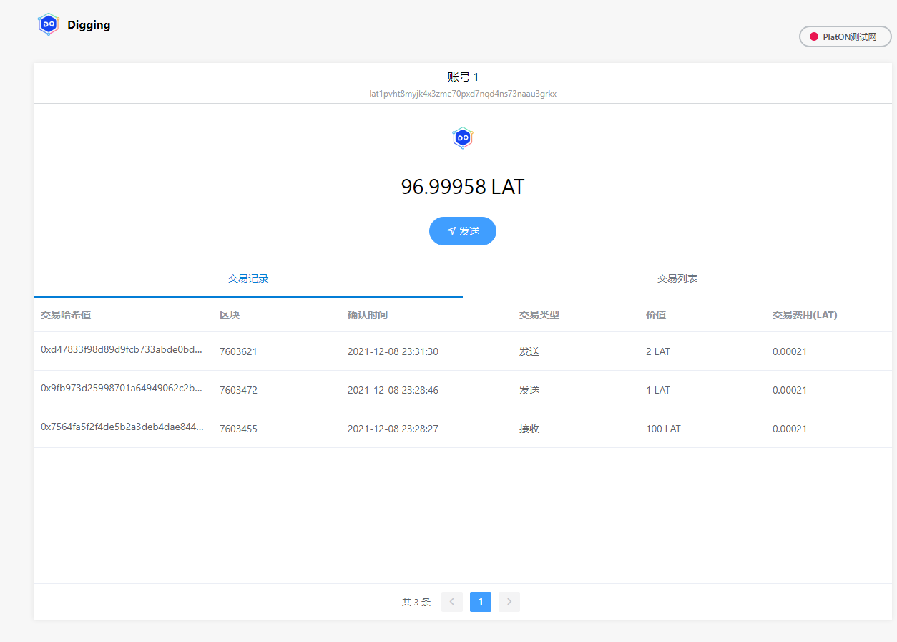
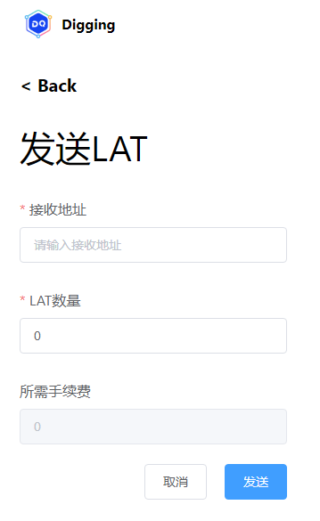
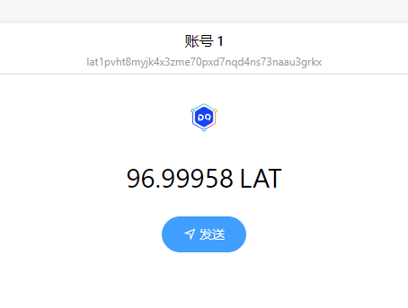
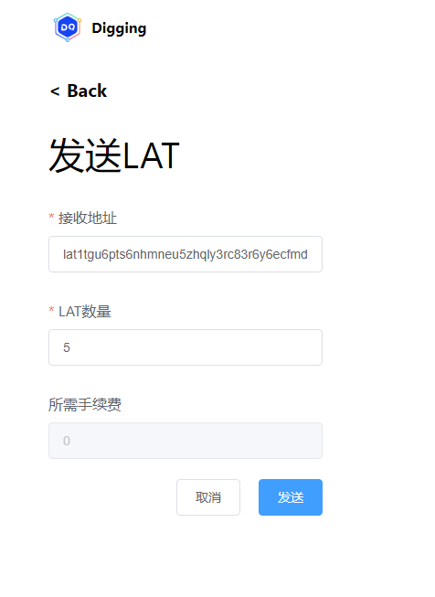
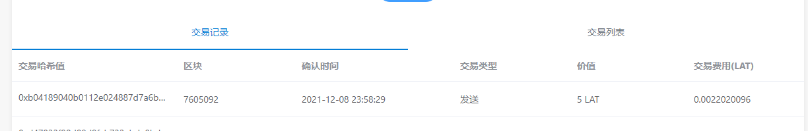
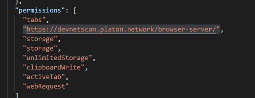
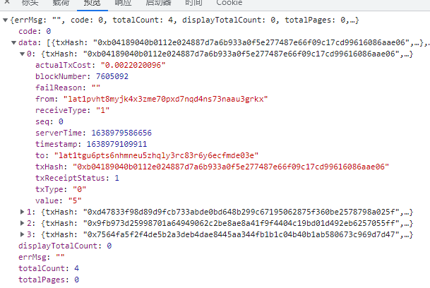
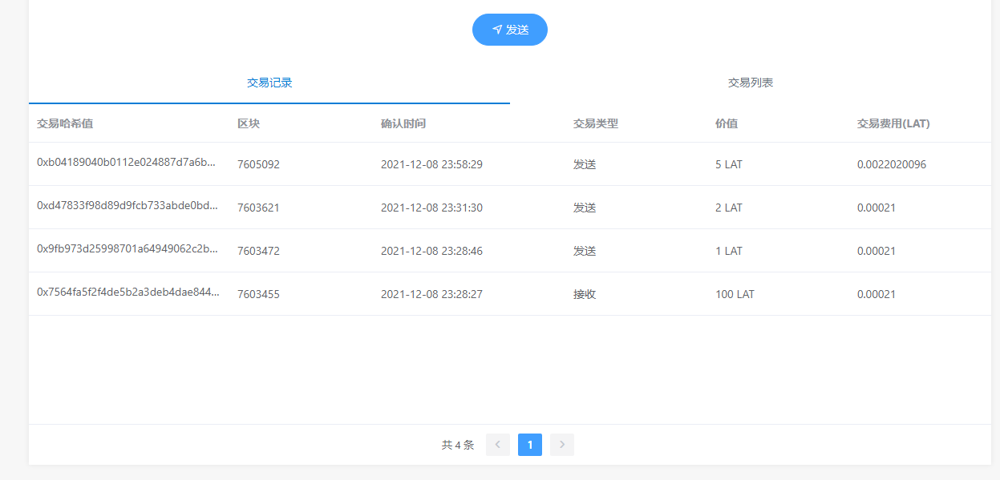

本章我们将学会钱包转账以及查询交易记录的功能,由于交易功能比较多,因此分成两章讲解

### 构建主页面。
在page目录下创建main-page.vue文件, 部分代码如下：
```
<template>
    <div class="main-outer-page">
        <div class="main-page vertical-only-layout">
            <div class="horzontal-layout flex-center ">
                <header-bar />
                <span class="flex-1"></span>
                <div class="network-component horzontal-layout flex-center">
                    <span style="background:#e91550" class="circle-dot"></span>
                    <span class="network-name">PlatON测试网</span>
                </div>
            </div>
            <div class="vertical-layout main-container ">
                <div class="horzontal-layout menu-bar ">
                    <div class="flex-1"></div>
                    <div class="vertical-layout flex-1 flex-center ">
                        <span class="account">{{ accountName }}</span>
                        <span class="address">{{ address }}</span>
                    </div>
                    <div class="flex-1"></div>
                </div>
                <div class="wallet-overview vertical-layout-center">
                    

                    <div class="horzontal-layout flex-center currency-container">
                        <span class="currency" style="margin-right:6px;">{{ lat }}</span>
                        <span class="currency">LAT</span>
                    </div>
                    <el-button type="primary" round @click="onJumpToSendLatPage">
                        <i class="el-icon-position"  ></i>
                        发送</el-button
                    >
                </div>

                <div class="horzontal-layout tab-bar">
                    <div
                        @click="onChangeTab(0)"
                        class="flex-1 horzontal-layout  flex-center tab"
                        :class="`${tabIndex === 0 ? 'active' : ''}`"
                    >
                        交易记录
                    </div>
                    <div
                        @click="onChangeTab(1)"
                        class="flex-1 horzontal-layout flex-center tab"
                        :class="`${tabIndex === 1 ? 'active' : ''}`"
                    >
                        交易列表
                    </div>
                </div>

                <div class="transaction-record-container" v-if="tabIndex === 0">
                    <transaction-table :address="address" />
                </div>

                <div class="transaction-record-container" v-if="tabIndex === 1"></div>
            </div>
        </div>
    </div>
</template>
```
页面如下:
 

在该页面, 把交易记录的表抽成一个Vue组件transaction-table.vue, 放在component目录下,这样可以减少main-page.vue页面的代码, 更好维护.

接着我们先构建发送LAT的页面
### 构建发送LAT的页面

在page目录下创建send-lat-page.vue文件, 部分代码如下：
```
<template>
    <div class="send-lat-page vertical-only-layout">
        <header-bar />
        <div class="go-back" @click="onGoBack">< Back</div>
        <page-title>发送LAT</page-title>
        <el-form ref="sendForm" :model="sendInfo">
            <el-form-item
                prop="toAddress"
                label="接收地址"
                :rules="[
                    {
                        required: true,

                        validator: ValidateAddress
                    }
                ]"
            >
                <el-input
                    class="send-input"
                    v-model="sendInfo.toAddress"
                    placeholder="请输入接收地址"
                />
            </el-form-item>
            <el-form-item
                prop="lat"
                label="LAT数量"
                :rules="[
                    {
                        required: true,
                        message: '请输入要发送的LAT数量',
                        validator: ValidateLAT
                    }
                ]"
            >
                <el-input
                    class="send-input"
                    type="number"
                    v-model="sendInfo.lat"
                    placeholder="请输入要发送的LAT数量"
                />
            </el-form-item>

            <el-form-item label="所需手续费">
                <el-input disabled class="send-input" v-model="sendInfo.gasfee" />
            </el-form-item>

            <el-form-item>
                <div class="horzontal-layout">
                    <span class="flex-1"></span>
                    <el-button class="create-btn" @click="onGoBack">取消</el-button>

                    <el-button class="create-btn" type="primary" @click="onSend">发送</el-button>
                </div>
            </el-form-item>
        </el-form>
    </div>
</template>
```
页面如下:
 

### 编写主页面的逻辑
我们打开background.js文件, 添加交易管理类TransactionManager的代码. 部分代码如下:
```
/**
 * 交易管理类
 */
class TransactionManager {
    static web3; // Web3 实例

    static chainId = "210309"; // 测试网的chainId

    static getWeb3Ins() ;

    /**
     * 获取余额
     * @param {钱包地址} address
     * @returns
     */
    static async GetBalanceOf(address);
    /**
     * 判断是不是有效的钱包地址
     * @param {} address 
     * @returns 
     */
    static IsBech32Address(address) ;
    /**
     *
     * @returns 获取当前gas的价格
     */
    static async GetGasPrice();
    /**
     * 发送lat
     * @param {lat数量} lat
     * @param {接收地址} toAddress
     */
    static async SendLATTO(lat, account, toAddress);
}
```
该类主要是对第二章的Api的封装.功能有:
- GetBalanceOf 获取地址余额
- IsBech32Address 判断是否是有效地址
- GetGasPrice 获取当前价格
- SendLATTO 发送LAT函数

**在这里我们修复导入钱包的BUG, 找到私钥管理类PrivateKeyManager的StorePrivateKey的函数在这里我们需要对私钥进行判断, 判断其是否是以0x开头,如果不是我们需要添加上,否则解密出来的地址对应不上**代码如下:
```
   static async StorePrivateKey(account, privateKey, force) {
        if (!privateKey.startsWith("0x")) {
            privateKey = "0x" + privateKey;
        }

        // 强制导入的话,会把之前的私钥全部删除
        if (force) {
            chrome.storage.local.remove(PrivateKeyManager.privateKeyName);
        }
... 省略代码
}
```

编写好交易管理类之后, 接着打开main-page.vue文件.获取当前选中钱包的信息. 代码如下:
```
... 省略代码
        /**
         * 显示当前钱包信息
         */
        async getCurAccount() {
            // 调用PrivateKeyManager获取当前选中钱包
            let res = await this.digging.PrivateKeyManager.GetAccountInfo();
            if (res === null) {
                this.$message.error("当前无账号,请导入钱包或者创建钱包");
                // 3s后跳转界面
                setTimeout(() => {
                    this.$router.push("/select-action-page.vue");
                }, 3000);
                return;
            }

            this.accountName = res.accountName;
            this.address = res.address;
            // 获取钱包的余额
            this.getBalanceOf();
        },
... 省略代码
```
接着我们要去获取钱包的余额, 代码如下:
```
... 省略代码
 /**
 * 获取lat
 */
async getBalanceOf() {
     this.lat = await this.digging.TransactionManager.GetBalanceOf(this.address);
}
... 省略代码
```
这样我们就可以获取钱包的余额了. 效果如下:
 

### 编写发送LAT逻辑
打开send-lat-page.vue文件,发送LAT的部分代码如下:

```
        /**
         * 执行发送的动作
         */
        async doSend() {
            let res = await this.digging.TransactionManager.SendLATTO(
                this.sendInfo.lat,
                this.account,
                this.sendInfo.toAddress
            );
            if (res.errCode !== 0) {
                this.$message.error("发送失败!");
                return;
            }

            this.$message.success("发送成功!");
            this.onGoBack();
        },
```
这里需要注意的是, 我们需要钱包的验证函数,代码如下:
```
        ValidateAddress(rule, value, callback) {
            if (!this.digging.TransactionManager.IsBech32Address(this.sendInfo.toAddress)) {
                callback(new Error("请输入合法的地址"));
                return;
            }
            callback();
        },
```
这里调用的是TransactionManager的IsBech32Address进行验证.

下面就用我们编写的功能执行第一笔转账:

 

**注:本章还没有完成所需所需费显示功能,因此暂时显示为0**
发送完成后,我们就可以查看到交易记录啦, 如下图:

 


### 构建显示交易记录的页面
该页面前面已经提到, 笔者把其抽成组件transaction-table.vue,放在component目录下,部分代码如下:
```
<template>
    <div class="tx-record">
        <el-table :data="datas" style="width: 100%" height="400">
            <el-table-column prop="txHash" label="交易哈希值" width="250">
                <template slot-scope="scope">
                    <span class="ellipsis">{{ scope.row.txHash }}</span>
                </template>
            </el-table-column>
            <el-table-column prop="blockNumber" label="区块"> </el-table-column>

            <el-table-column label="确认时间" width="240">
                <template slot-scope="scope">
                    <span>{{ timestampToStr(scope.row.timestamp) }}</span>
                </template>
            </el-table-column>
            <el-table-column prop="address" label="交易类型">
                <template slot-scope="scope">
                    <span>{{ getTXType(scope.row) }}</span>
                </template>
            </el-table-column>
            <el-table-column prop="value" label="价值">
                <template slot-scope="scope">
                    <span>{{ scope.row.value }} LAT</span>
                </template>
            </el-table-column>
            <el-table-column prop="actualTxCost" label="交易费用(LAT)"> </el-table-column>
        </el-table>
        <div class="horzontal-layout flex-center tx-record-footer">
            <el-pagination
                class="table-pager"
                background
                layout="total,  prev, pager, next"
                :total="totals"
                :page-size="20"
                :current-page.sync="curPageIndex"
                @current-change="loadData"
            ></el-pagination>
        </div>
    </div>
</template>
```
这里获取交易记录, 在sdk里面没有,我们需要去官网的浏览器获取. 我们需要编写http接口.在src目录下创建 api目录. 然后添加 tx-record.js和index.js两个文件, 如下图:
 

tx-record.js的代码如下:
```
import axios from "axios";
const txRecorcdService = axios.create({
    baseURL: "https://devnetscan.platon.network/browser-server",
    timeout: 30000,
    withCredentials: true
});

txRecorcdService.interceptors.response.use(
    response => {
        return response.data;
    },
    error => {
        Message.error(error.response.data.errMsg);
        return Promise.reject(error)
    }
);

export default {
    /**
     * 获取交易记录列表
     * @param {*} params
     * @returns
     */
    GetTransactionListByAddress(params) {
        return txRecorcdService.post("/transaction/transactionListByAddress", params);
    }
};
这里用到了axios这个http库.
```
index.js的代码如下:
```
import txRecord from "./tx-record.js";
export default {
    txRecord
};
```
index.js文件做入口文件. 接着我们打开main.js文件, 添加如下代码,把http api注册到全局对象:
```
... 省略代码
import api from "./api";
... 省略代码
installPlugin(api, "api"); // api注册到全局
... 省略代码
```

接着我们打开manifest.json文件,在permissions下添加: https://devnetscan.platon.network/browser-server/, 如下图:

 

因为我们官网的地址属于跨域请求,因此需要申请权限.


获取交易记录的代码如下:

```
... 省略代码
       async loadData() {
            let res = await this.api.txRecord
                .GetTransactionListByAddress({
                    address: this.address, // 钱包地址
                    pageNo: this.curPageIndex, // 当前页面
                    pageSize: 20, // 每页显示的行数
                })
                .catch(e => {
                    console.log(e);
                });

            if (res.code !== 0) {
                this.$message.error(res.errMsg);
                return;
            }
            this.datas = res.data;
            this.totals = res.totalCount;
        }
... 省略代码
```
该接口返回的结果如下图:

 

我们对必要的字段进行说明:
- totalCount 总的交易数量
- actualTxCost 手续费
- blockNumber 区块
- serverTime 当前服务的时间戳
- timestamp 确认时间戳
- txHash 交易哈希值
- from 发送方钱包地址
- to 接收方地址
- txType 交易类型 0表示转账功能, 如果from字段为自己的钱包地址,则表示发送LAT,否则为接受LAT.
1, 创建合约  2 执行合约

最后效果如下图:

 
                         

好啦, 本章的内容就先到这里啦, 下一章.我们继续完成交易列表以及检测转账是否成功的功能.

仓库地址: https://github.com/DQTechnology/Platon_DevGuideProject