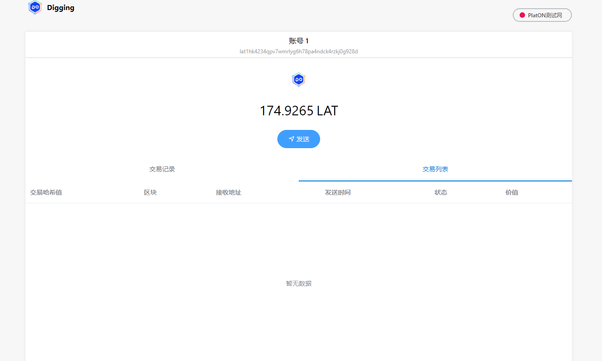
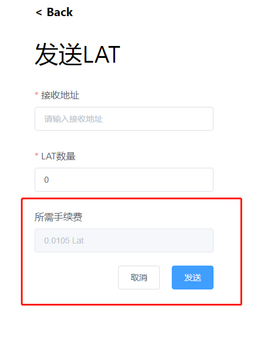
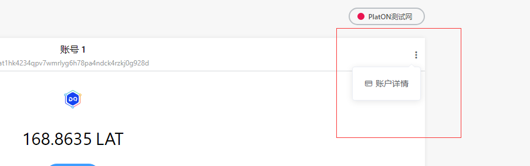
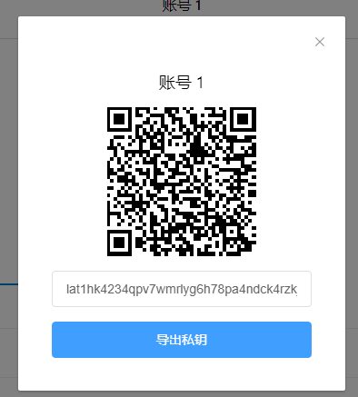
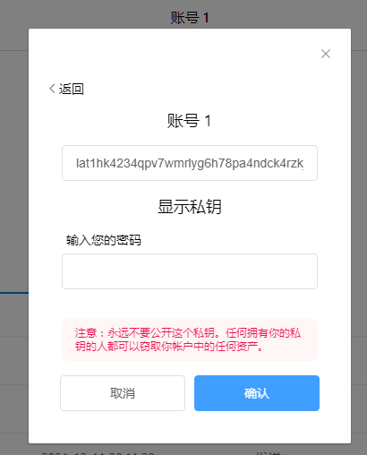

本章我们完成交易列表以及检测转账是否成功以及导出钱包秘钥的功能。

### 创建交易列表页面
把交易列表和交易记录一样编写成一个组件。在component目录下创建pending-transaction-table.vue文件，部分代码如下：
``` 
<template>
    <div class="pending-tx-record">
        <el-table :data="datas" style="width: 100%" height="400">
            <el-table-column prop="txHash" label="交易哈希值" width="250">
                <template slot-scope="scope">
                    <span class="ellipsis" :title="scope.row.txHash">{{ scope.row.txHash }}</span>
                </template>
            </el-table-column>
            <el-table-column prop="blockNumber" label="区块"> </el-table-column>

            <el-table-column prop="to" label="接收地址" width="240">
                <template slot-scope="scope">
                    <span class="ellipsis" :title="scope.row.to">{{ scope.row.to }}</span>
                </template>
            </el-table-column>

            <el-table-column label="发送时间" width="240">
                <template slot-scope="scope">
                    <span>{{ timestampToStr(scope.row.timestamp) }}</span>
                </template>
            </el-table-column>

            <el-table-column prop="status" label="状态"> </el-table-column>

            <el-table-column prop="value" label="价值"> </el-table-column>
        </el-table>
    </div>
</template>
```
在这里显示的字段有:
- 交易哈希
- 接收地址
- 当前状态
- 发送时间
- 所在区块
- 发送LAT数量
- 状态 状态有: 确认中,待处理两个状态

打开main-page.vue页面,使用该组件

```
import pendingTransactionTable from "@/component/pending-transaction-table.vue";
```
然后使用该组件
```
 <div class="transaction-record-container" v-if="tabIndex === 1">
      <pending-transaction-table :address="address" />
</div>
```
效果如下图:
 

### 记录交易记录逻辑
交易列表的数据, 需要我们自己去记录.打开background.js文件,找到交易管理类TransactionManager,添加一下代码:
- 1, 增加 记录交易记录得到函数 addTxRecord,代码如下:
```
    /**
     * 添加交易记录
     * @param {交易哈希} transactionHash
     * @param {交易数据} txData
     * @param {收据} receipt
     */
    static async addTxRecord(transactionHash, txData, receipt) {
        let web3 = TransactionManager.getWeb3Ins();
        // 以交易哈希作为key
        let txRcordInfo = {
            txHash: transactionHash,
            value: web3.utils.fromVon(txData.value, "lat"), // lat数量
            from: txData.from, // 发送人
            to: txData.to, // 接收人
            timestamp: new Date().getTime() // 发送时间
        };
        // 记录交易记录
        TransactionManager.pendingTxRecords[transactionHash] = txRcordInfo;

        if (receipt) {
            txRcordInfo.status = "确认中";
            txRcordInfo.blockNumber = receipt.blockNumber; // 记录所在块高
        } else {
            txRcordInfo.status = "待处理";
        }
        //  持久化交易记录
        await TransactionManager.persistTXRecord();
        // 启动监控器
        TransactionManager.startTxMonitor();
    }
```
- 2,  修改SendLATTO函数的代码, 修改部分如下:
```
    /**
     * 发送lat
     * @param {lat数量} lat
     * @param {接收地址} toAddress
     */
    static async SendLATTO(lat, account, toAddress) {
   ... 省略代码   

        let signTxtData = await web3.platon.accounts.signTransaction(txData, walletInfo.privateKey);
        let txInfo = await web3.platon.sendSignedTransaction(signTxtData.rawTransaction);
        // 获取的收据
        let receipt = await web3.platon.getTransactionReceipt(txInfo.transactionHash);
       
        if (receipt === null) {
            // pending状态
            // 持久化交易记录
            TransactionManager.addTxRecord(txInfo.transactionHash, txData, receipt);
            return {
                errCode: WARNNING,
                errMsg: "交易等待处理中"
            };
        }

        // 如果交易失败,则直接返回
        if (!receipt.status) {
            return {
                errCode: Error,
                errMsg: "发送失败!",
                data: {
                    txHash: txInfo.transactionHash,
                    receipt: receipt
                }
            };
        }
        // 持久化交易记录
        TransactionManager.addTxRecord(txInfo.transactionHash, txData, receipt);
        return {
            errCode: SUCCESS,
            data: {
                txHash: txInfo.transactionHash,
                receipt: receipt
            }
        };
    }
```
这个函数增加了调用**addTxRecord**的逻辑, 这里需要注意的是,如果交易收据receipt为null时,交易则处在待处理中.

- 3, 添加监控交易记录状态的函数
交易记录好后,我们需要启动一个定时器,定时器去监控每一个交易的状态,代码如下:
```
   static startTxMonitor() {
        // 监控器已经在 运行中,不重复运行
        if (TransactionManager.isMonitoring) {
            return;
        }
        //正在监控中
        TransactionManager.isMonitoring = true;

        TransactionManager.checkTXRecordStatus();
    }
    // 检查交易记录状态
    static checkTXRecordStatus() {
        setTimeout(async () => {
            let txHashList = Object.keys(TransactionManager.pendingTxRecords);
            if (txHashList.length === 0) {
                // 当前没有待确认的交易列表
                // 把监控状态设置为false然后直接返回
                TransactionManager.isMonitoring = false;
                return;
            }
            let web3 = TransactionManager.getWeb3Ins();
            // 获取当前块高
            let blockNumber = await web3.platon.getBlockNumber();
            for (let i = 0; i < txHashList.length; ++i) {
                let txHash = txHashList[i];
                // 获取交易记录
                let txRcordInfo = TransactionManager.pendingTxRecords[txHash];
                if (txRcordInfo.status === "确认中") {
                    // 设置确认块高为6, 则认为交易已经成功!
                    if (blockNumber - txRcordInfo.blockNumber > 6) {
                        // 已经确认的,则从监控列表中删除
                        delete TransactionManager.pendingTxRecords[txHash];
                        continue;
                    }
                } else if (txRcordInfo.status === "待处理") {
                    // 获取的收据
                    let receipt = await web3.platon.getTransactionReceipt(txHash);
                    // 还是没有获取到收据,交易还在待处理中,需要处理
                    if (receipt === null) {
                        continue;
                    }
                    // 判断确认块高是否已经超过6,如果超过6则已经交易成功
                    if (blockNumber - receipt.blockNumber > 6) {
                        delete TransactionManager.pendingTxRecords[txHash];
                        continue;
                    }

                    // 确认块高未超过6, 交易记录状态编程确认中
                    txRcordInfo.blockNumber = receipt.blockNumber; // 记录所在块高
                    txRcordInfo.status = "确认中";
                }
            }

            //  持久化交易记录
            await TransactionManager.persistTXRecord();
            // 继续监听
            TransactionManager.checkTXRecordStatus();
            // 10s检查一次
        }, 1000);
```
监控器10秒去检查一次状态, 如果确认块高大于6,则认为交易完成.

- 4, 添加插件启动时加载交易记录
因为插件可能在有未完成交易记录的情况下被关闭,因此,插件在启动时必须继续去监听未完成的交易记录,代码如下:
```
    /**
     * 插件启动时,需要从store加载未完成的交易记录
     */
    static LoadPendingTxRecord() {
        chrome.storage.local.get(["pendingTxRecords"], res => {
            let records = res["pendingTxRecords"];
            // 没有交易记录直接返回
            if (!records) {
                return;
            }
            TransactionManager.records = records;

            // 启动监控器

            TransactionManager.startTxMonitor();
        });
    }
```
调用该函数的方法如下:
```
// 加载交易记录
TransactionManager.LoadPendingTxRecord();
// 导出PasswordManager
window.digging = {
    PasswordManager,
    PrivateKeyManager,
    TransactionManager
};
```

- 5, 添加获取交易列表的函数
```
    /**
     * 获取交易列表
     * @param {钱包地址} address
     */
    static GetPendingRecords(address) {
        let txHashList = Object.keys(TransactionManager.pendingTxRecords);
        let txRecords = [];
        for (let i = 0; i < txHashList.length; ++i) {
            let txHash = txHashList[i];
            // 获取交易记录
            let txRcordInfo = TransactionManager.pendingTxRecords[txHash];
            if (txRcordInfo.from === address) {
                txRecords.push(txRcordInfo);
            }
        }
        return txRecords;
    }
```
通过这个函数可以获取到每个钱包的交易列表.

- 6, 编写pending-transaction-table.vue逻辑,代码如下:
```
        loadData() {
            //
            this.datas = this.digging.TransactionManager.GetPendingRecords(this.address);
      
            if (this.isPooling) {
                return;
            }
            this.isPooling = true;

            this.loopPullData();
        },

        loopPullData() {
            //  做退出标记,否则及时页面销毁了,也会一直执行
            if (this.bStop) {
                return;
            }
            setTimeout(() => {
                this.loadData();
            }, 10000);
        }
```
这里用到了一个定时器,定时去获取交易列表.需要注意的是,一定要给定时器添加一个提出标志,否则会就算页面销毁,定时器也是在执行的.

编写好逻辑后,我们发送一笔转账,看出交易列表如下:
 
大概在10s后交易记录就会完成,然后该列表显示为空

接着我们完成剩余功能,

### 显示交易收费
在TransactionManager中添加一下代码:
```
    /**
     * 计算手续费
     */
    static async CalcGasUsed() {
        let web3 = TransactionManager.getWeb3Ins();
        let gasPrice = await web3.platon.getGasPrice();
        // 
        // 手续费 = gasPrice * gasLimit  gasLimit设置为= 21000;
        // 这里需要把值换成字符串,
        return web3.utils.fromVon((gasPrice * 21000) + "", "lat");
    }
```
打开send-lat-page.vue文件, 在mount函数中,添加一下代码:
```
    async mounted() {
        this.sendInfo.gasfee = (await this.digging.TransactionManager.CalcGasUsed()) + " Lat";
    },
```
效果如下图:
 

### 添加导出秘钥的功能

在main-page.vue文件中,添加如下代码:
```
<div class="horzontal-layout menu-bar ">
    <div class="flex-1"></div>
    <div class="vertical-layout flex-1 flex-center ">
        <span class="account">{{ accountName }}</span>
        <span class="address">{{ address }}</span>
    </div>
    <div class="flex-1 horzontal-layout flex-center">
        <span class="flex-1"></span>
        <el-dropdown trigger="click">
            <i title="账户选项" class="el-icon-more more-btn"></i>
            <el-dropdown-menu slot="dropdown">
                <el-dropdown-item icon="el-icon-bank-card"
                    >账户详情</el-dropdown-item
                >
            </el-dropdown-menu>
        </el-dropdown>
    </div>
</div>
```
效果如下图:
 

接着编写导出秘钥的页面, 在component目录下添加account-detail-info.vue页面, 部分代码如下:
```
<template>
    <div class="account-detail-info">
        <div v-show="!showExport">
            <div class="horzontal-layout flex-center" style="margin-bottom:16px;">
                <span style="font-size:18px;color: black;"> {{ accountName }}</span>
            </div>
            <div class="horzontal-layout flex-center" style="margin-bottom:16px;">
                <div class="qrCode" ref="qrCodeDiv"></div>
            </div>

            <div class="horzontal-layout flex-center" style="margin-bottom:16px;">
                <el-input v-model="address" style=" width: 286px;" />
            </div>

            <div class="horzontal-layout flex-center" style="margin-bottom:6px;">
                <el-button class="export-btn" type="primary" @click="showExport = true"
                    >导出私钥</el-button
                >
            </div>
        </div>
        <div v-show="showExport">
            <div class="horzontal-layout" style="margin-bottom:16px;">
                <span
                    style="color: black;"
                    @click="showExport = false"
                    class="pointer el-icon-arrow-left"
                    >返回</span
                >
            </div>

            <div class="horzontal-layout flex-center" style="margin-bottom:16px;">
                <span style="font-size:18px;color: black;"> {{ accountName }}</span>
            </div>
            <div class="horzontal-layout flex-center" style="margin-bottom:16px;">
                <el-input v-model="address" style=" width: 286px;" />
            </div>
            <div class="horzontal-layout flex-center" style="margin-bottom:16px;">
                <span style="font-size:18px;color: black;"> 显示私钥</span>
            </div>

            <template v-if="!privateKey">
                <div class="horzontal-layout " style="margin-bottom:6px;">
                    <span style="color: black;margin-left: 22px;"> 输入您的密码</span>
                </div>
                <div class="horzontal-layout flex-center" style="margin-bottom:16px;">
                    <el-input type="password" v-model="password" style=" width: 286px;" />
                </div>
            </template>
            <template v-else>
                <div class="horzontal-layout " style="margin-bottom:6px;">
                    <span style="color: black;margin-left: 22px;"> 这是您的私钥</span>
                </div>
                <div class="horzontal-layout flex-center">
                    <el-input
                        class="private-key-password-display-textarea"
                        type="textarea"
                        v-model="privateKey"
                        rows="2"
                        resize="none"
                    />
                </div>
            </template>

            <div class="horzontal-layout flex-center">
                <div class="private-key-password-warning">
                    注意：永远不要公开这个私钥。任何拥有你的私钥的人都可以窃取你帐户中的任何资产。
                </div>
            </div>

            <div class="horzontal-layout flex-center" style="margin-bottom:6px;">
                <el-button class="bar-btn" @click="showExport = false"> 取消</el-button>

                <el-button class="bar-btn" type="primary" @click="onExportPrivateKey"
                    >确认</el-button
                >
            </div>
        </div>
    </div>
</template>
```
这里生成钱包地址的二维码,需要安装qrcodejs2库, 在工程目录下打开控制台,输入 npm install qrcodejs2命令即可.在main-page.vue页面以对话框的方式,使用该组件, 代码如下:
```
       <el-dialog
            v-if="bShowAccountDlg"
            width="360px"
            :visible.sync="bShowAccountDlg"
            append-to-body
        >
            <account-detail-info :accountName="accountName" :address="address" />
        </el-dialog>
```
页面效果如下:

 
 

好啦本章内容到此结束啦, 下一章我们实现质押LAT以及领取质押奖励.

仓库地址: [https://github.com/DQTechnology/Platon_DevGuideProject ](https://github.com/DQTechnology/Platon_DevGuideProject)