本章我们实现多账号,切换测试网和主网,以及委托LAT的功能
由于PlatON的开发测试网当前没有可以质押的节点,因此我们本章在主网实现委托功能.

### 增加网络管理类
之前我们连接测试网的连接地址是放在TransactionManager里面的,为了能够支持多网络切换,我们把节点的连接抽取成网络管理类NetworkManager. 在background.js文件里面添加NetworkManager的代码,部分代码如下:
```
    static webIns = null;
    static curNetwork = "PlatON开发测试网";

    static networkInfos = {
        PlatON开发测试网: {
            rpcUrl: "http://35.247.155.162:6789",
            chainId: "210309",
            browserUrl: "https://devnetscan.platon.network"
        },
        PlatON网络: {
            rpcUrl: "https://samurai.platon.network",
            chainId: "100",
            browserUrl: "https://scan.platon.network"
        }
    };
    static async InitNetwork()
    /**
     * 加载网络信息
     * @returns
     */
    static loadNetworkInfos() 
    /**
     * 获取所有网络信息
     * @returns
     */
    static GetNetworkNameList() 


    static GetCurNetworkName()
    /**
     * 获取区块链浏览器地址
     * @returns
     */
    static GetBrowserUrl() 
    /**
     * 切换网络
     * @param {}} networkName
     * @returns
     */
    static SwitchNetwork(networkName)
    /**
     * 加载网络信息
     * @returns
     */
    static loadCurNetwork()
    /**
     * 获取网页实例
     * @returns
     */
    static GetWebIns()
    /**
     * 
     * @returns 获取链id
     */
    static GetChainId()
```
这个类默认有PlatON的开发测试网和主网的信息. 接着在background.js增加NetworkManager的初始化代码.
```
... 省略代码
//  初始化钱包
async function InitWallet() {
    // 加载网络
    await NetworkManager.InitNetwork();
    // 加载交易记录
    TransactionManager.LoadPendingTxRecord();
}
// 调用初始化函数
InitWallet();
```
这样可以保证是打开插件页面之前,插件的网络已经完成加载.

### 增加Api的切换网络的功能
切换网络的同时也需要,切换钱包获取交易记录的地址,因此需要增加Api切换地址的函数.
打开src/api目录下的tx-record.js,代码修改如下:
```
import axios from "axios";
let txRecorcdService = null;
export default {
    SwitchNetwork(browserUrl) {
        txRecorcdService = axios.create({
            baseURL: `${browserUrl}/browser-server`,
            timeout: 30000,
            withCredentials: true
        });

        txRecorcdService.interceptors.response.use(
            response => {
                return response.data;
            },
            error => {
                return Promise.reject(error);
            }
        );
    },
    /**
     * 获取交易记录列表
     * @param {*} params
     * @returns
     */
    GetTransactionListByAddress(params) {
        return txRecorcdService.post("/transaction/transactionListByAddress", params);
    }
};
```
在每次切换网络的是否都调用SwitchNetwork函数,切换网络.

### 构建切换网络的页面
打开main-page, 布局页面修改如下:
```
... 省略代码
<el-dropdown trigger="click">
    <div class="network-component  horzontal-layout flex-center">
        <span style="background:#e91550" class="circle-dot"></span>
        <span class="network-name">{{ curNetworkName }}</span>
        <i class="el-icon-arrow-down"></i>
    </div>
    <el-dropdown-menu slot="dropdown">
        <el-dropdown-item
            @click.native="onSwitchNetwork(item)"
            v-for="(item, index) in networkList"
            :key="index"
            >{{ item }}</el-dropdown-item
        >
    </el-dropdown-menu>
</el-dropdown>
... 省略代码
```
界面效果如下图:
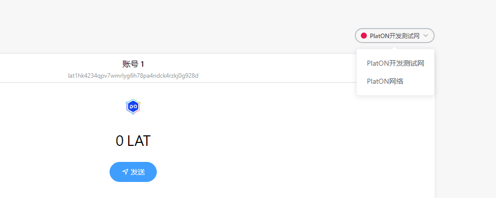 

### 编写切换页面网络的逻辑
在main-page.vue添加一下代码
```
async onSwitchNetwork(item) {
    let res = await this.digging.NetworkManager.SwitchNetwork(item);
    if (res.errCode !== 0) {
        this.$message.error(res.errMsg);
        return;
    }
    this.curNetworkName = item;
    // 切换网络
    this.api.SwitchNetwork();
    // 加载表数据
    this.reloadTableData();
   },

 reloadTableData() {
   if (this.tabIndex === 0) {
       this.$refs.txTable.ReloadData();
   } else if (this.tabIndex === 1) {
       this.$refs.pendingTxTable.ReloadData();
   }
}
```
以上代码我们就可以实现在PlatON的测试网和主网切换的功能啦.

### 创建显示验证节点页面
验证节点页面我们以组件的方式构建,然后再main-page.vue页面中显示.在component目录下创建validator-table.vue文件,部分代码如下:
```
<template>
    <div class="validator-table">
        <el-table :data="datas" style="width: 100%" height="400">
            <el-table-column prop="ranking" label="排名" width="100" />

            <el-table-column prop="nodeName" label="节点名"  width="120"> </el-table-column>

            <el-table-column label="状态">
                <template slot-scope="scope">
                    <span>{{ getStatus(scope.row) }}</span>
                </template>
            </el-table-column>
            <el-table-column prop="totalValue" label="总质押">
                <template slot-scope="scope">
                    <span>{{ scope.row.totalValue }}LAT</span>
                </template>
            </el-table-column>

            <el-table-column prop="delegateValue" label="委托人数">
                <template slot-scope="scope">
                    <span>{{ scope.row.delegateValue }}LAT</span>
                </template>
            </el-table-column>

            <el-table-column prop="delegatedRewardRatio" label="委托奖励比例" />

            <el-table-column prop="delegateQty" label="委托者" />
            <el-table-column prop="blockQty" label="已产生区块数" />

            <el-table-column prop="expectedIncome" label="预计年收化率" />

            <el-table-column prop="deleAnnualizedRate" label="预计委托年化率" />
            <el-table-column prop="genBlocksRate" label="出块率" />
            <el-table-column prop="version" label="版本号" />
        </el-table>
        <div class="horzontal-layout flex-center validator-table-footer">
            <el-pagination
                class="table-pager"
                background
                layout="total,  prev, pager, next"
                :total="totals"
                :page-size="20"
                :current-page.sync="curPageIndex"
                @current-change="loadData"
            ></el-pagination>
        </div>
    </div>
</template>
```
然后再main-page.vue引入该组件. 部分代码如下:
```
...省略代码
import validatorTable from "@/component/validator-table.vue";
...省略代码
```
在主页面的增加验证节点的tab
```
...省略代码
           <div class="transaction-record-container" v-if="tabIndex === 2">
                    <validator-table />
                </div>
...省略代码
```
效果如下图:
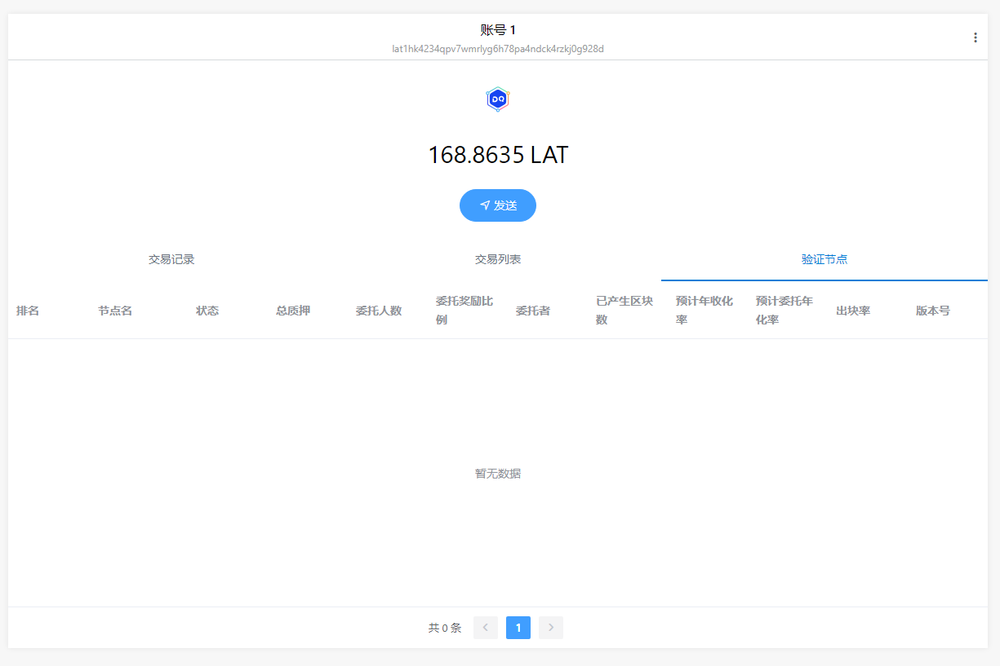   

### 编写获取验证节点接口

获取验证节点的信息,需要我们编写接口去浏览器获取.在api目录下新建validator.js文件,如下图:
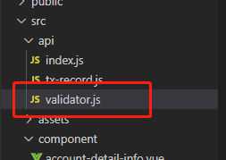 
代码如下:
```
import axios from "axios";

const txRecorcdService = axios.create({
    baseURL: "https://devnetscan.platon.network/browser-server",
    timeout: 30000,
    withCredentials: true
});

txRecorcdService.interceptors.response.use(
    response => {
        return response.data;
    },
    error => {
        Message.error(error.response.data.errMsg);
        return Promise.reject(error)
    }
);

export default {
    /**
     * 获取验证节点列表
     * @param {*} params
     * @returns
     */
    GetAliveStakingList(params) {
        return txRecorcdService.post("/staking/aliveStakingList", params);
    }
};
```
调用该接口返回如下字段:
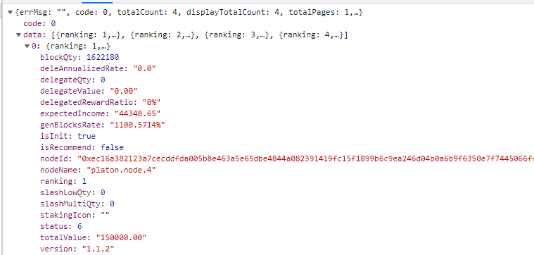 

- ranking 排名
- nodeName节点名
- status 节点状态 1 候选中 2 活跃中 3 出块中 6 共识中
- totalValue 总质押
- delegateValue 委托人数
- delegatedRewardRatio 委托奖励比例
- delegateQty 委托者数量
- blockQty  已产生区块数
- expectedIncome 预计年收化率
- deleAnnualizedRate 预计委托年化率
- genBlocksRate 出块率
- version  版本号
在 validator-table.vue中调用该接口, 代码如下:
```
        async loadData() {
            let res = await this.api.validator
                .GetAliveStakingList({
                    pageNo: this.curPageIndex,
                    pageSize: 20,
                    queryStatus: "all"
                })
                .catch(e => {
                    console.log(e);
                });

            if (res.code !== 0) {
                this.$message.error(res.errMsg);
                return;
            }
            this.datas = res.data;
            this.totals = res.totalCount;
        }
```
测试网验证节点:
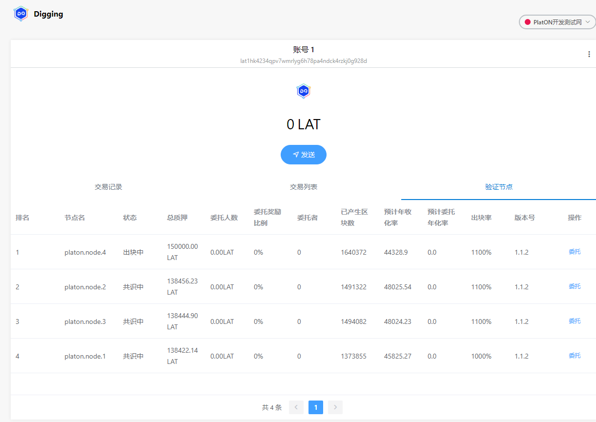  
主网验证节点:
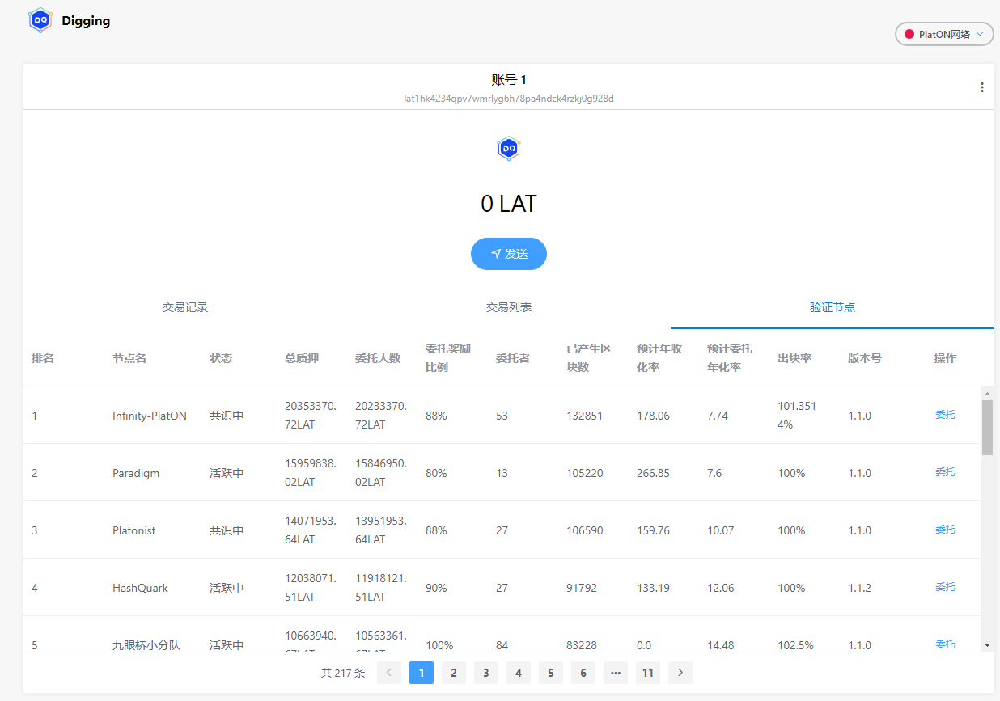 

由于当前我们的测试账号没有LAT,在这里大家可以把主网的LAT转到测试账户上,进行测试.这里笔者增加通过秘钥导入主网钱包的功能.

### 增加账号菜单弹出框
在目录component下新建文件account-menu.vue, 部分代码如下:
```
<template>
    <div class="account-menu vertical-layout">
        <div class="account-list">
            <div
                class="horzontal-layout account-item flex-horzontal-center"
                v-for="(item, index) in accountList"
                :key="index"
            >
                
                <div class="vertical-layout">
                    <div class="account-name">{{ item.account }}</div>
                    <div class="account-lat">
                        <span>{{ item.lat }}</span> LAT
                    </div>
                </div>
            </div>
        </div>

        <div class="account-item-2" @click="onJumpToImportAccount">
            <i class="el-icon-download"></i>
            <span class="item-name">导入账户</span>
        </div>
    </div>
</template>
<script>
```
获取账号列表逻辑如下:
```
        async loadAccountList() {
            let res = await this.digging.PrivateKeyManager.GetAccountList();

            this.accountList = res.accountList;

            this.accountMap = {};
            this.accountList.forEach(async ele => {
                ele.lat = 0;
                // 获取钱包余额
                ele.lat = await this.digging.TransactionManager.GetBalanceOf(ele.address);
                this.$forceUpdate();
            });

            this.curAccount = res.curAccount;
        },
```
这里使用到私钥管理类PrivateKeyManager的获取账号列表的接口, 在main-page.vue页面使用该组件的代码如下:
```
...省略代码
<el-popover placement="bottom" width="320" trigger="click">
    <account-menu />
    <div class="account-select-btn vertical-layout flex-center" slot="reference">
    
    </div>
</el-popover>
...省略代码
```
效果如下图:
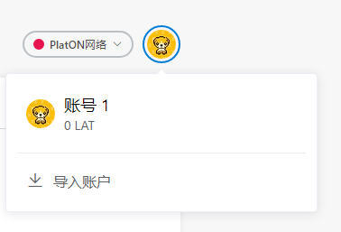 

### 增加导入私钥的页面
在page目录下新建import-account-page.vue页面,部分代码如下:
```
<template>
    <div class="import-account-page vertical-only-layout">
        <header-bar />
        <div class="go-back" @click="onGoBack">< Back</div>
        <page-title>导入账户</page-title>
        <div class="desc-text">
            导入的账户将不会与最初创建的 Digging 账户助记词相关联。
        </div>
        <div class="horzontal-layout " style="margin-bottom:6px;">
            <span style="color: black;">请输入账号名:</span>
        </div>
        <div class="horzontal-layout flex-center" style="margin-bottom: 10px;">
            <el-input class="private-key-password-display-textarea" v-model="accountName" />
        </div>

        <div class="horzontal-layout " style="margin-bottom:6px;">
            <span style="color: black;">请粘贴您的私钥:</span>
        </div>
        <div class="horzontal-layout flex-center">
            <el-input
                class="private-key-password-display-textarea"
                type="textarea"
                v-model="privateKey"
                rows="3"
                resize="none"
            />
        </div>

        <div class="horzontal-layout flex-center" style="margin-top:20px;">
            <el-button round class="import-btn" @click="onGoBack">取消</el-button>
            <span class="flex-1"></span>
            <el-button round class="import-btn " type="primary" @click="onImport">创建</el-button>
        </div>
    </div>
</template>
...省略代码
async onImport() {
    if (!this.accountName) {
        this.$message.error("请输入账号名");
        return;
    }

    if (!this.privateKey) {
        this.$message.error("请输入秘钥");
        return;
    }

    let res = await this.digging.PrivateKeyManager.StorePrivateKey(
        this.accountName,
        this.privateKey,
        false
    );

    if (res.errCode !== 0) {
        this.$message.error(res.errMsg);
        return;
    }
    this.$message.success("导入账户成功!");
}
}
```
这里导入私钥使用私钥管理类PrivateKeyManager的存储私钥StorePrivateKey接口,注意这里第三个参数一定为**false**否则情况之前的账号的. 效果如下图:
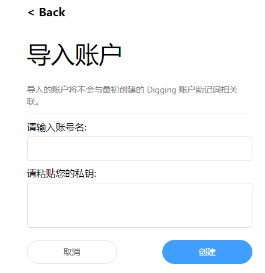 

笔者导入一个主网的测试账,效果如下图:

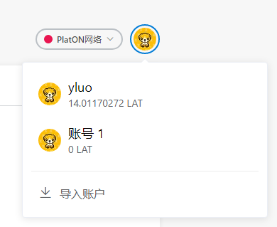 

### 编写切换账号的逻辑
在main-page.vue添加onSwitchAccount函数,代码如下:
```
async onSwitchAccount(accountName) {
    let res = await this.digging.PrivateKeyManager.SwitchAccount(accountName);
    if (res.errCode !== 0) {
        this.$message.error(res.errMsg);
        return;
    }
    this.accountName = accountName;
    this.address = res.data;
    this.makeShowAddress();
    this.getBalanceOf();
},
```
切换账号效果如下:
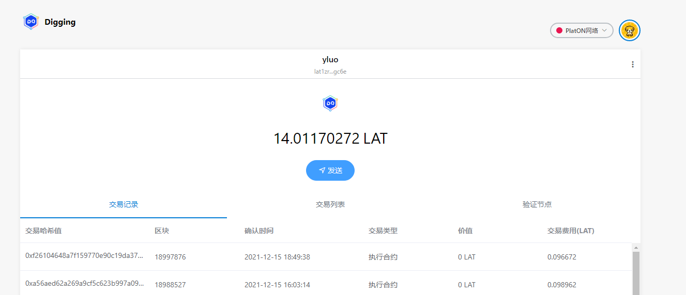 

### 编写委托页面
在page目录下新建delegate-lat-page.vue文件, 部分代码如下:
```
<template>
    <div class="delegate-lat-page vertical-only-layout">
        <header-bar />
        <div class="go-back" @click="onGoBack">< Back</div>
        <page-title>委托LAT</page-title>
        <el-form ref="delegateForm" :model="delegateInfo">
            <el-form-item prop="nodeName" label="节点名">
                <el-input disabled class="send-input" v-model="delegateInfo.nodeName" />
            </el-form-item>

            <el-form-item prop="nodeId" label="节点id">
                <el-input disabled class="send-input" v-model="delegateInfo.nodeId" />
            </el-form-item>

            <el-form-item
                prop="lat"
                label="委托数量"
                :rules="[
                    {
                        required: true,
                        message: '请输入要委托的LAT数量',
                        validator: ValidateLAT
                    }
                ]"
            >
                <el-input
                    class="send-input"
                    type="number"
                    v-model="delegateInfo.lat"
                    placeholder="请输入要委托的LAT数量(不少于10LAT)"
                />
            </el-form-item>

            <el-form-item label="所需手续费">
                <el-input disabled class="send-input" v-model="delegateInfo.gasfee" />
            </el-form-item>

            <el-form-item>
                <div class="horzontal-layout">
                    <span class="flex-1"></span>
                    <el-button class="create-btn" @click="onGoBack">取消</el-button>
                    <el-button class="create-btn" type="primary" @click="onDelegate"
                        >委托</el-button
                    >
                </div>
            </el-form-item>
        </el-form>
    </div>
</template>
```
效果如下图:
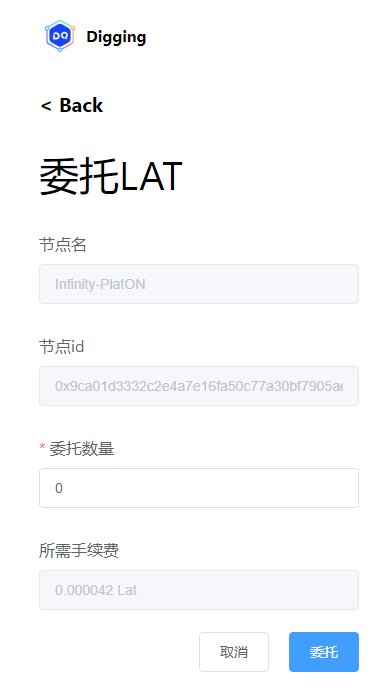 

### 增加委托管理类
在background.js中添加如下代码:
```
/**
 * 委托管理类
 */
class DelegateManager {
    /**
     * 委托LAT
     * @param {}} nodeId 
     * @param {*} lat 
     * @returns 
     */
    static async Deletgate(nodeId, lat) {
        let web3 = NetworkManager.GetWebIns();

        let curAccount = await PrivateKeyManager.GetCurrentAccount();
        let privateketRes = await PrivateKeyManager.ExportPrivateKey(
            curAccount,
            PasswordManager.GetPassPassword()
        );
        if (privateketRes.errCode !== 0) {
            return privateketRes;
        }

        let walletInfo = privateketRes.data;

        let ppos = new web3.PPOS({ provider: NetworkManager.GetCurNetworkRPCUrl() });

        ppos.updateSetting({
            privateKey: walletInfo.privateKey,
            chainId: 100
        });

        let params = {
            funcType: 1004, // 委托LAT的函数
            typ: 0,
            nodeId: ppos.hexStrBuf(nodeId),
            amount: ppos.bigNumBuf(web3.utils.toVon(lat, "lat"))
        };

        let reply = await ppos.send(params);
        return reply;
    }
}
```
本章我们只实现委托LAT的功能. **在这里我们需要修复sdk的bug,打开public/js目录下的web3.js文件,找,PPOS.prototype.bigNumBuf, 将代码修改如下**
```
PPOS.prototype.bigNumBuf = function (intStr, radix, byteLen) {
  radix = radix || 10;
  BN.Buffer = Buffer; // 添加这行代码,否则报错
  var num = new BN(intStr, radix);
  byteLen = byteLen || Math.ceil(num.byteLength() / 8) * 8; // 好像宽度没用...
  return num.toTwos(byteLen).toBuffer();
};
```
接着找到函数  BN.prototype.toBuffer,将代码修改如下:
```
  BN.prototype.toBuffer = function toBuffer(endian, length) {
    assert(typeof BN.Buffer !== 'undefined');
    return this.toArrayLike(BN.Buffer, endian, length);
  };
```
笔者演示将10个LAT委托到节点名为:Infinity-PlatON, 节点ID为:0x9ca01d3332c2e4a7e16fa50c77a30bf7905aee1c0d7c456769b33c2939b3ee410a79a6fb204d826a5997b903964ff0fff62cf8f1c2a0b73b3bbc5f96c265ad49的节点.

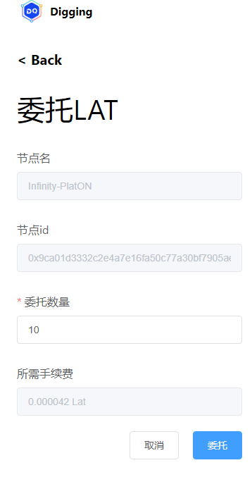 
最后在区块链浏览器中可以看到如下交易记录:

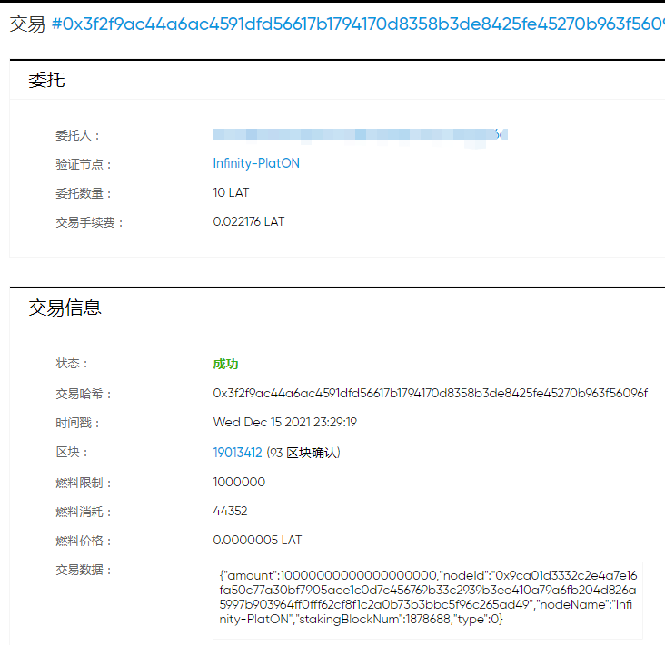 

好啦,以上就是本章内容啦.下一章我们将完善委托LAT以及多网络对接的功能.

仓库地址: [https://github.com/DQTechnology/Platon_DevGuideProject ](https://github.com/DQTechnology/Platon_DevGuideProject)