本章我们实现领取委托奖励, 赎回委托以及实现多网络节点功能.

### 编写显示钱包委托列表页面

在component目录下创建my-delegate-table.vue文件, 如下图
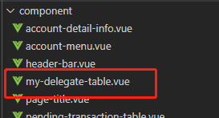 
部分代码如下:
```
<template>
    <div class="my-delegate-table">
        <div class="horzontal-layout header-bar flex-horzontal-center ">
            <span class="flex-1"></span>
            <span>总委托</span>
            <span style="margin:0 16px;">{{ totalDelegate }}LAT</span>
            <span>可领取</span>
            <span style="margin:0 16px;">{{ totalReward }}LAT</span>
            <el-button type="primary" size="mini" round style="margin:0 16px 0 0;">领取</el-button>
        </div>
        <el-table :data="datas" style="width: 100%" height="400">
            <el-table-column prop="nodeName" label="节点名" width="120"> </el-table-column>

            <el-table-column prop="nodeId" label="节点ID" width="500">
                <template slot-scope="scope">
                    <span class="ellipsis">{{ scope.row.nodeId }}</span>
                </template>
            </el-table-column>

            <el-table-column prop="deletegateLAT" label="委托LAT"> </el-table-column>

            <el-table-column prop="reward" label="待领取奖励" />

            <el-table-column label="操作" header-align="center" align="center" fixed="right">
                <template slot-scope="scope">
                    <el-button size="mini" type="text" @click="onUnDelegate(scope.row)"
                        >赎回委托</el-button
                    >
                </template>
            </el-table-column>
        </el-table>
    </div>
</template>
```
然后再main-page.vue页面使用该组件, 效果如下图:
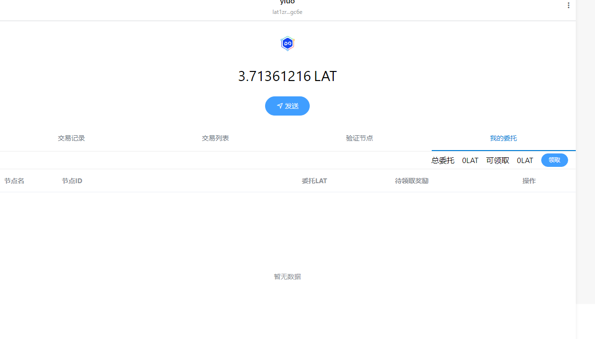 

### 编写获取委托列表的逻辑
在background.js页面的委托管理类, 添加如下代码:
```
    /**
     * 获取所有节点委托信息
     * @returns
     */
    static async GetDelegateInfoList() ;
        /**
     * 获取单个节点的委托情况
     * @param {*} ppos 
     * @param {*} hexStrBufAddr 
     * @param {*} nodeStrBufId 
     * @param {*} delegateNode 
     * @returns 
     */
    static async getSingleDelegateInfo(ppos, hexStrBufAddr, nodeStrBufId, delegateNode) ;
    /**
     * 获取节点信息
     * @param {} ppos
     * @param {*} nodeId
     */
    static async getNodeInfo(ppos, nodeStrBufId) ;
    /**
     * 获取所有节点未领取的奖励
     * @param {*} ppos
     * @param {*} hexStrBufAddr
     * @param {*} delegateNodeList
     */
    static async getRewardMap(ppos, hexStrBufAddr);
    /**
     * 查询当前账户地址所委托的节点的NodeID和质押Id
     * @param {*} address
     */
    static async getRelatedListByDelAddr(ppos, hexStrBufAddr);
```
由于节点并没提供直接获取所有委托信息的接口, 因此我们需要通过调用几个接口才能获取.其流程如下:

- 先调用1103这个接口获取钱包地址所有委托的节点预计委托的时的块高信息, 该接口返回以下信息:
  Addr: 委托人的账户地址
  NodeId: 委托的节点 Id
  StakingBlockNum: 发起质押时的区块高度
- 接着调用5100接口,获取当前地址,所有节点Id的委托奖励情况, 该接口返回一下信息:
  reward: 未领取的委托收益
  nodeID: 委托的节点 Id
  stakingNum: 发起质押时的区块高度
  这里需要注意的是, reward返回的类型是16进制的,需要调用web3.utils.hexToNumberString转成10进制的字符串.
- 接着通过1105接口,获取节点名.该接口返回的字段很多, 但是我们只用到界面名NodeName这个字段
- 最后调用1104获取,在该节点上委托的LAT数量, 委托的数量包括自由LAT Released字段和锁仓LAT RestrictingPlan字段,总的质押LAT数量需要把这两个相加.

最后我们可以看到,我们上一章委托10LAT的获得的奖励情况,如下图:
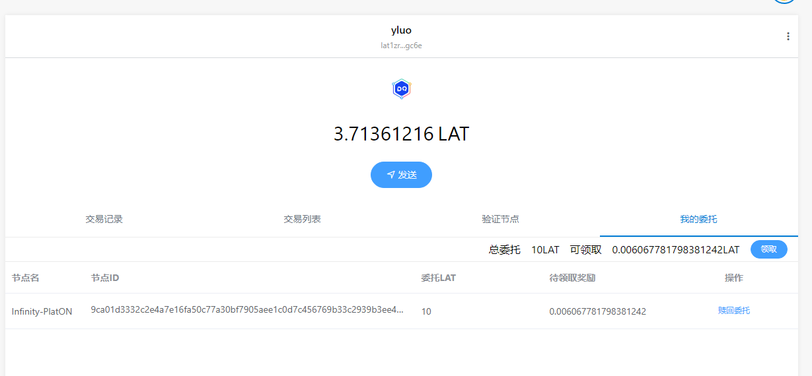 
浏览器上的奖励如下图:
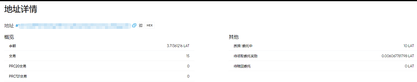 
可以看到, 我们编写的逻辑获取到的奖励和区块链浏览器是一致的.

### 编写领取委托奖励的页面
在page目录下新建文件withdraw-delegate-reward-page.vue, 部分代码如下:
```
<template>
    <div class="withdraw-delegate-reward-page vertical-only-layout">
        <header-bar />
        <div class="go-back" @click="onGoBack">< Back</div>
        <page-title>领取委托奖励</page-title>
        <el-form ref="sendForm" :model="withdrawInfo">
            <el-form-item label="领取奖励">
                <el-input class="send-input" disabled v-model="withdrawInfo.withdrawNum" />
            </el-form-item>

            <el-form-item label="所需手续费">
                <el-input disabled class="send-input" v-model="withdrawInfo.gasfee" />
            </el-form-item>

            <el-form-item>
                <div class="horzontal-layout">
                    <span class="flex-1"></span>
                    <el-button class="create-btn" @click="onGoBack">取消</el-button>

                    <el-button class="create-btn" type="primary" @click="onWithdraw"
                        >领取</el-button
                    >
                </div>
            </el-form-item>
        </el-form>
    </div>
</template>
```
页面效果如下图:
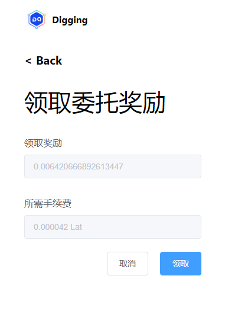 

### 编写领取委托奖励的逻辑
在background.js文件中的委托管理类DelegateManager添加领取奖励的代码:
```
    static async WithdrawDelegateReward() {
        let web3 = NetworkManager.GetWebIns();
        let curAccount = await PrivateKeyManager.GetCurrentAccount();
        let privateketRes = await PrivateKeyManager.ExportPrivateKey(
            curAccount,
            PasswordManager.GetPassPassword()
        );
        if (privateketRes.errCode !== 0) {
            return privateketRes;
        }
        let walletInfo = privateketRes.data;

        let ppos = new web3.PPOS({ provider: NetworkManager.GetCurNetworkRPCUrl() });

        ppos.updateSetting({
            privateKey: walletInfo.privateKey,
            chainId: NetworkManager.GetChainId()
        });

        let params = {
            funcType: 5000 // 领取委托的函数
        };

        let reply = await ppos.send(params);
        return {
            errCode: SUCCESS
        };
    }
```
领取奖励后的截图如下:
 
可以看到奖励已经被领取.
切换到我们的交易记录页面, 可以看到领取奖励的记录:
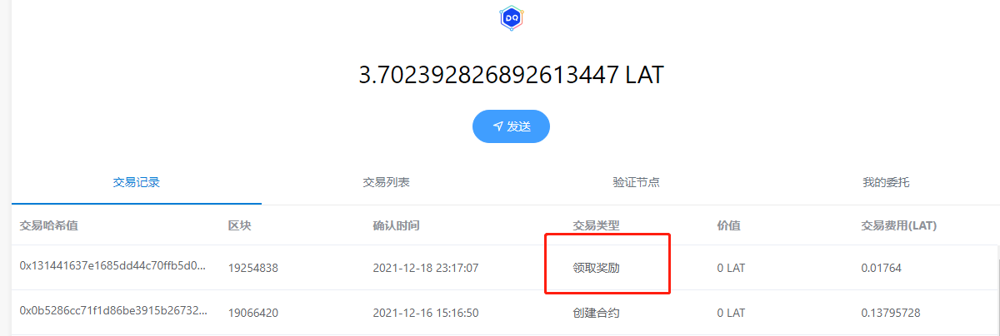 

### 编写赎回委托页面
在page目录下创建 undelegate-lat-page.vue文件, 部分代码如下:
```
<template>
    <div class="delegate-lat-page vertical-only-layout">
        <header-bar />
        <div class="go-back" @click="onGoBack">< Back</div>
        <page-title>赎回委托</page-title>
        <el-form ref="delegateForm" :model="unDelegateInfo">
            <el-form-item prop="nodeName" label="节点名">
                <el-input disabled class="send-input" v-model="unDelegateInfo.nodeName" />
            </el-form-item>

            <el-form-item prop="nodeId" label="节点id">
                <el-input disabled class="send-input" v-model="unDelegateInfo.nodeId" />
            </el-form-item>

            <el-form-item prop="lat" label="委托数量">
                <el-input class="send-input" disabled v-model="unDelegateInfo.deletegateLAT" />
            </el-form-item>

            <el-form-item
                prop="lat"
                label="赎回数量"
                :rules="[
                    {
                        required: true,
                        message: '请输入要委托的LAT数量(不少于10LAT)',
                        validator: ValidateLAT
                    }
                ]"
            >
                <el-input
                    class="send-input"
                    type="number"
                    v-model="unDelegateInfo.withdrawLat"
                    placeholder="请输入要赎回的LAT数量"
                />
            </el-form-item>

            <el-form-item label="所需手续费">
                <el-input disabled class="send-input" v-model="unDelegateInfo.gasfee" />
            </el-form-item>

            <el-form-item>
                <div class="horzontal-layout">
                    <span class="flex-1"></span>
                    <el-button class="create-btn" @click="onGoBack">取消</el-button>
                    <el-button class="create-btn" type="primary" @click="onUnDelegate"
                        >赎回</el-button
                    >
                </div>
            </el-form-item>
        </el-form>
    </div>
</template>
```
**注意:赎回最小的LAT数量为10**
界面效果如下:
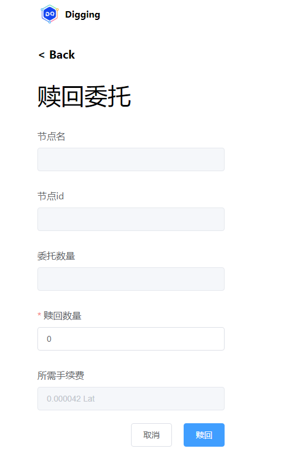 
### 编写赎回逻辑
在background.js的委托管理类DelegateManager添加以下代码:
```
    /**
     * 赎回委托
     * @param {}} stakingBlockNum
     * @param {*} nodeId
     * @param {*} lat
     * @returns
     */
    static async UnDeletgate(stakingBlockNum, nodeId, lat) {
        debugger
        let web3 = NetworkManager.GetWebIns();
        let curAccount = await PrivateKeyManager.GetCurrentAccount();
        let privateketRes = await PrivateKeyManager.ExportPrivateKey(
            curAccount,
            PasswordManager.GetPassPassword()
        );
        if (privateketRes.errCode !== 0) {
            return privateketRes;
        }
        let walletInfo = privateketRes.data;

        let ppos = new web3.PPOS({ provider: NetworkManager.GetCurNetworkRPCUrl() });
        ppos.updateSetting({
            privateKey: walletInfo.privateKey,
            chainId: NetworkManager.GetChainId()
        });
        debugger
        stakingBlockNum = parseInt(stakingBlockNum);

        let params = {
            funcType: 1005, // 委托LAT的函数
            stakingBlockNum: stakingBlockNum,
            nodeId: ppos.hexStrBuf(nodeId),
            amount: ppos.bigNumBuf(web3.utils.toVon(lat, "lat"))
        };

        let reply = await ppos.send(params);
        return reply;
    }
```
赎回的接入如下图:
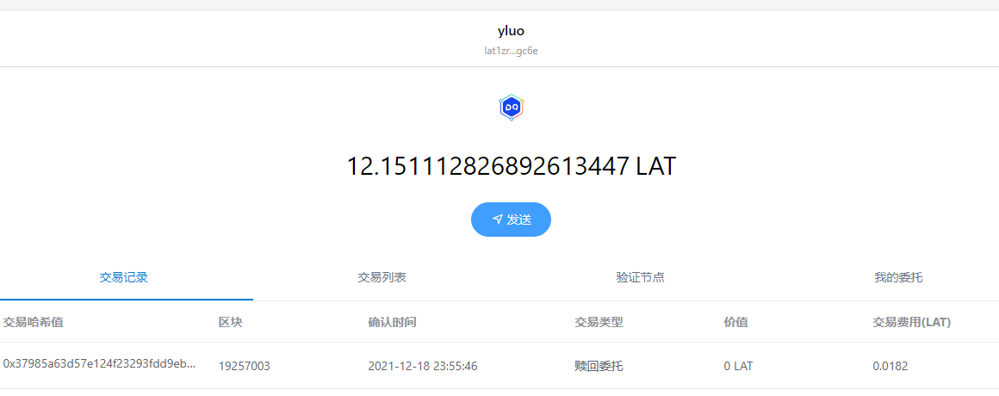 

以上就是LAT领取委托奖励和赎回委托的功能啦, 接着我们实现添加多网络.

### 编写添加网络节点页面
在page目录下新建文件add-networks-page.vue, 部分代码如下:
```
<template>
    <div class="add-networks-page vertical-only-layout">
        <header-bar />
        <div class="go-back" @click="onGoBack">< Back</div>
        <page-title>添加网络</page-title>
        <el-form ref="networkForm" :model="networkInfo">
            <el-form-item prop="name" label="网络名">
                <el-input
               
                    class="send-input"
                    v-model="networkInfo.name"
                    :rules="[
                        {
                            required: true,
                            message: '请输入网络名'
                        }
                    ]"
                />
            </el-form-item>

            <el-form-item prop="rpcUrl" label="新增RPC URL">
                <el-input
                
                    class="send-input"
                    v-model="networkInfo.rpcUrl"
                    :rules="[
                        {
                            required: true,
                            message: '请输入RPC URL'
                        }
                    ]"
                />
            </el-form-item>
            <el-form-item prop="chainId" label="ChainId">
                <el-input
                 
                    class="send-input"
                    v-model="networkInfo.chainId"
                    :rules="[
                        {
                            required: true,
                            message: '请输入chainId'
                        }
                    ]"
                />
            </el-form-item>

            <el-form-item prop="browserUrl" label="浏览器地址">
                <el-input
                 
                    class="send-input"
                    v-model="networkInfo.browserUrl"
                    :rules="[
                        {
                            required: true,
                            message: '浏览器地址'
                        }
                    ]"
                />
            </el-form-item>

            <el-form-item>
                <div class="horzontal-layout">
                    <span class="flex-1"></span>
                    <el-button class="create-btn" @click="onGoBack">取消</el-button>
                    <el-button class="create-btn" type="primary" @click="onAdd">添加</el-button>
                </div>
            </el-form-item>
        </el-form>
    </div>
</template>
```
页面效果如下:
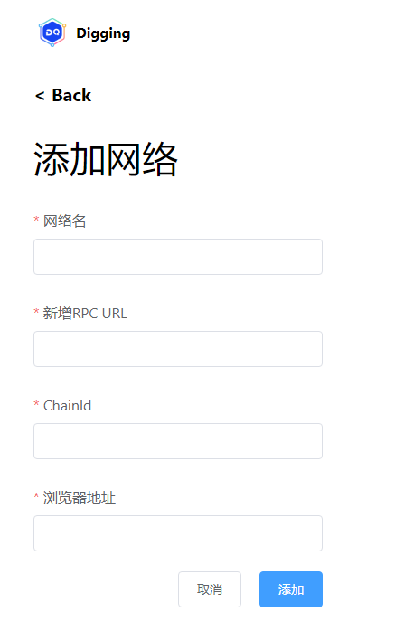 

接着我们在main-page.vue页面增加跳转, 代码如下:
```
...省略代码
<el-dropdown trigger="click">
       <div class="network-component  horzontal-layout flex-center">
           <span style="background:#e91550" class="circle-dot"></span>
           <span class="network-name">{{ curNetworkName }}</span>
           <i class="el-icon-arrow-down"></i>
       </div>
       <el-dropdown-menu slot="dropdown">
           <el-dropdown-item
               @click.native="onSwitchNetwork(item)"
               v-for="(item, index) in networkList"
               :key="index"
               >{{ item }}</el-dropdown-item
           >
           <div class="line"></div>
           <el-dropdown-item @click.native="onAddNetwork">添加网络</el-dropdown-item>
       </el-dropdown-menu>
</el-dropdown>
...省略代码
```
效果如下图:
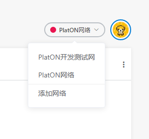 

### 编写添加网络节点逻辑
在manifest.json文件中添加以下配置, 若不添加会出现跨域限制问题,具体作用,我们下一章讲导出Api的时在解释:
```
  "content_scripts": [
    {
      "matches": [
        "file://*/*",
        "http://*/*",
        "https://*/*"
      ],
      "js": [
        "js/contentscript.js"
      ],
      "run_at": "document_start",
      "all_frames": true
    }
  ],
```

在background.js中的网络管理类NetworkManager,添加以代码:
```
    /**
     * 添加网络
     * @param {*} netWorkInfo 
     * @returns 
     */
    static AddNetwork(netWorkInfo) {
        return new Promise(resolve => {
            // 判断网络是否已经存在
            if (NetworkManager.networkInfos[netWorkInfo.name]) {
                resolve({
                    errCode: ERROR,
                    errMsg: "网络已经存在!"
                });
                return;
            }

            NetworkManager.networkInfos[netWorkInfo.name] = {
                rpcUrl: netWorkInfo.rpcUrl,
                chainId: netWorkInfo.chainId,
                browserUrl: netWorkInfo.browserUrl
            };

            chrome.storage.local.set(
                {
                    networkInfos: NetworkManager.networkInfos
                },
                () => {
                    resolve({ errCode: SUCCESS });
                }
            );
        });
    }
```
笔者在本地部署了测试网和主网的节点如下图:
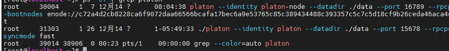 
进程30004为测试网节点,31303位主网节点.
添加测试网节点:
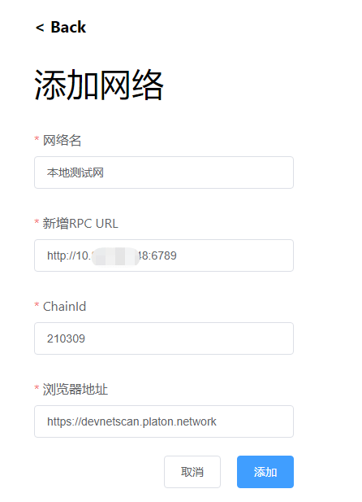 

这里笔者没有搭建自己的区块链浏览器, 使用的还是官网提供的.

效果如下图:
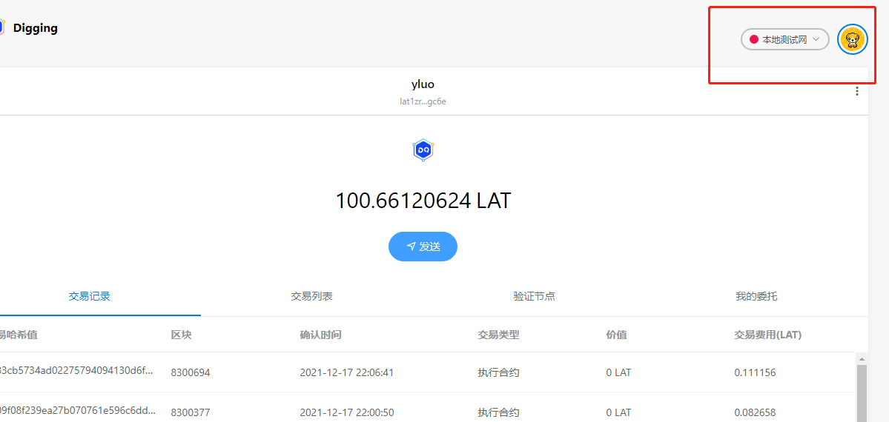 
添加主节点效果如下图:
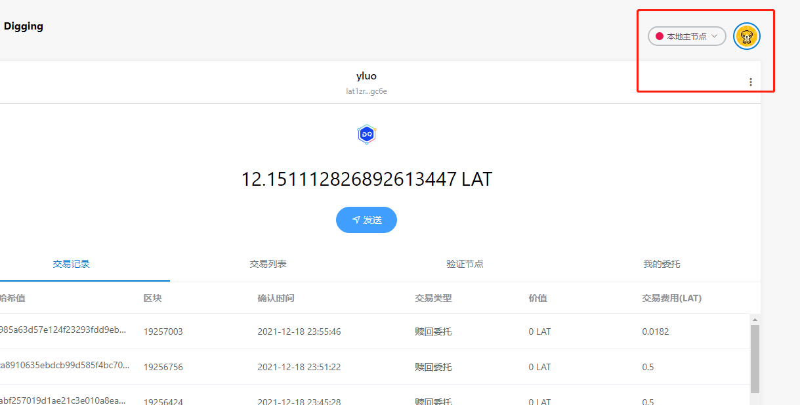 

好啦，本章就到此结束啦.同时浏览器版的Digging所有核心功能已经完成了. 下一章,我们讲解如何把Digging的接口导出给网页使用.

仓库地址: https://github.com/DQTechnology/Platon_DevGuideProject