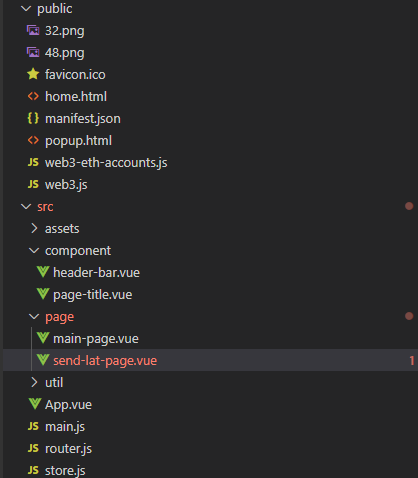
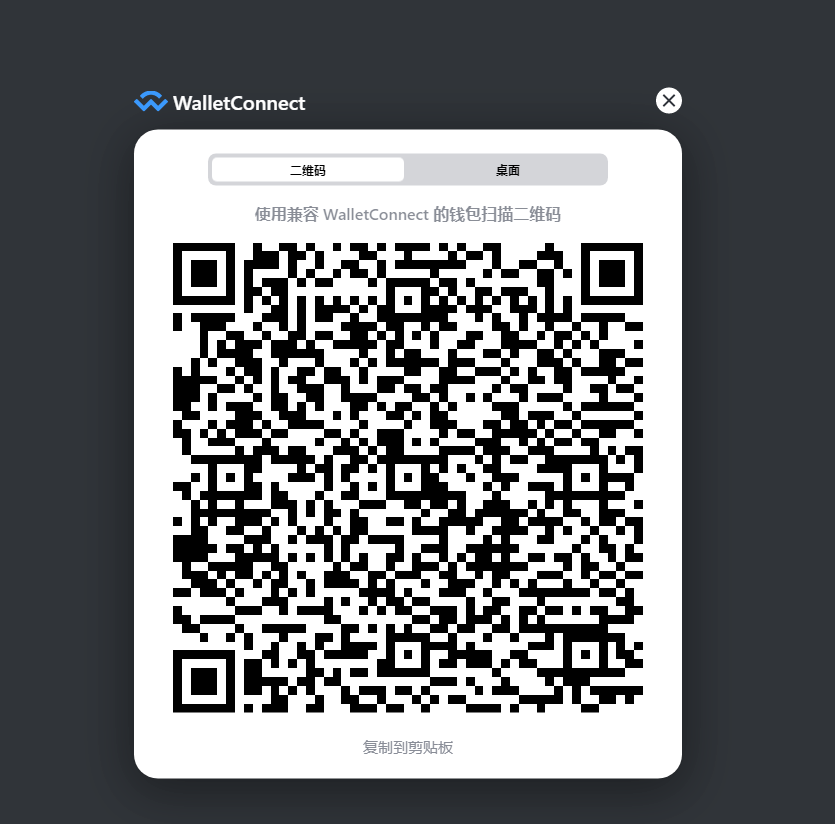
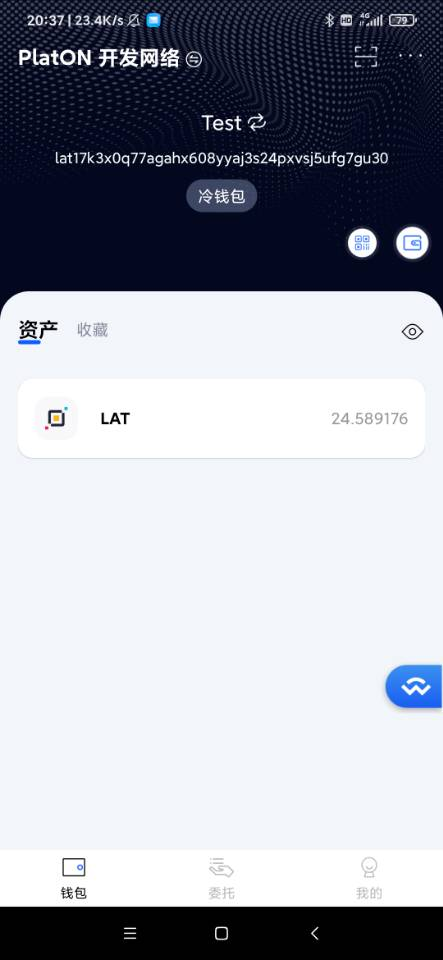
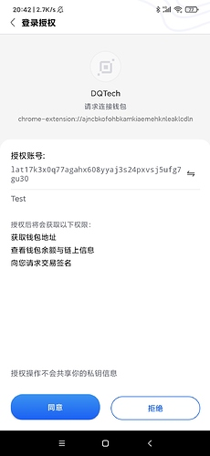
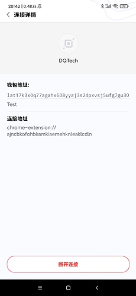
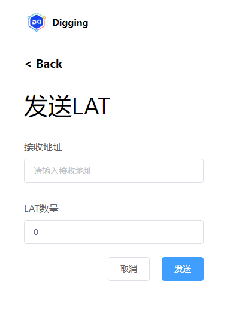
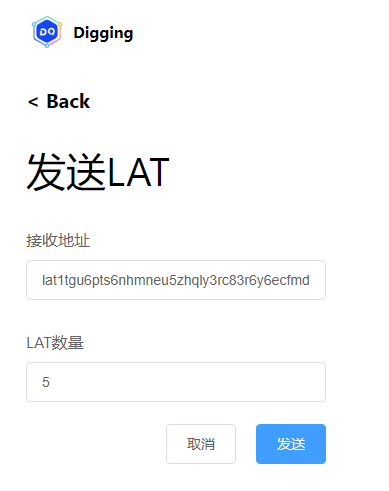
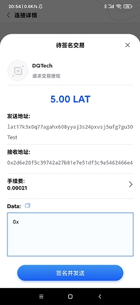
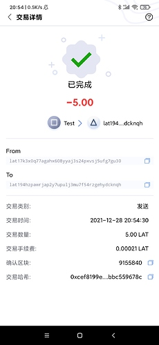
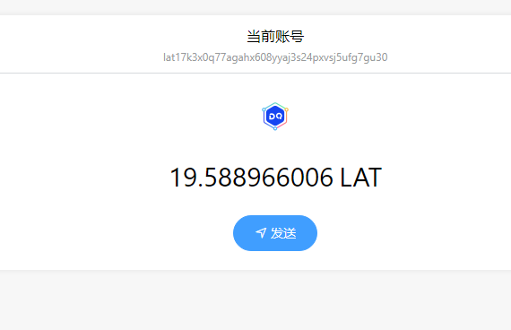

ATON 1.1.0 版本已经支持了 WalletConnect 协议。用户可以在保持私钥不离开移动设备，不暴露给 DApp 的前提下，实现与 DApp 的连接和交易签名。本章通过改造浏览器版本的Digging，通过WallectConnect实现转账功能。

### 创建工程
功能通过删减《跟Dex学PlatON应用开发–JavaScript篇》的源码构建的，改造后的工程目录如下：

 

这里只保留main-page.vue和send-lat-page.vue两个页面。同时把public/js目录下的文件全部移动到public目录，这里只保留web3.js和web3-eth-accounts.js两个文件。同时manifest.json的内容修改如下：
```
{
  "manifest_version": 2,
  "name": "Digging",
  "version": "0.10",
  "description": "Digging Wallect Connect",
  "author": "DQTech",
  "content_security_policy": "default-src 'self';script-src 'self' 'unsafe-eval'; style-src 'self' 'unsafe-inline';img-src 'self' data: base64; connect-src *",
  "icons": {
    "48": "48.png"
  },
  "browser_action": {
    "default_icon": "32.png",
    "default_title": "Digging",
    "default_popup": "popup.html"
  },

  "permissions": [
    "tabs",
    "storage",
    "unlimitedStorage",
    "clipboardWrite",
    "activeTab",
    "webRequest"
  ]
}
```
接着在home.html中引入web3.js和web3-eth-accounts.js两个文件，代码如下：
```
<!DOCTYPE html>
<html lang="en">
  <head>
    <meta charset="utf-8" />
    <meta http-equiv="X-UA-Compatible" content="IE=edge" />
    <meta name="viewport" content="width=device-width,initial-scale=1.0" />
    <link rel="icon" href="<%= BASE_URL %>favicon.ico" />
    <title>DQTech</title>

    <style>
      .mord {
        padding-left: 0px !important;
      }
    </style>
  </head>

  <body>
    <div id="app"></div>
    <script src="./web3.js"></script>
    <script src="./web3-eth-accounts.js"></script>
  </body>
</html>
```
### 安装WallectConnect SDK
用控制台打开当前控制台，输入命令 
```
npm install @walletconnect/client @walletconnect/qrcode-modal
```
安装完成后，我们开始编写main-page.vue的代码
### 编写main-page代码
布局代码如下：
```
<template>
    <div v-if="isConnect" class="main-outer-page">
        <div class="main-page vertical-only-layout">
            <div class="horzontal-layout flex-center ">
                <header-bar />
                <span class="flex-1"></span>
            </div>
            <div class="vertical-layout main-container ">
                <div class="horzontal-layout menu-bar ">
                    <div class="flex-1"></div>

                    <el-tooltip effect="dark" :content="copyText" placement="bottom">
                        <div
                            class="account-bar vertical-layout flex-1 flex-center pointer"
                            @mouseleave="onTipLeave"
                            @click="onCopyAccount"
                        >
                            <span class="account">当前账号</span>
                            <span class="address">{{ address }}</span>
                        </div>
                    </el-tooltip>
                    <span class="flex-1"></span>
                </div>
                <div class="wallet-overview vertical-layout-center">
                    

                    <div class="horzontal-layout flex-center currency-container">
                        <span class="currency" style="margin-right:6px;">{{ lat }}</span>
                        <span class="currency">LAT</span>
                    </div>
                    <el-button type="primary" round @click="onJumpToSendLatPage">
                        <i class="el-icon-position"></i>
                        发送</el-button
                    >
                </div>
            </div>
        </div>
    </div>
</template>
```
逻辑代码如下：
```
<script>
import headerBar from "@/component/header-bar.vue";
// 引入walletconnect的sdk
import WalletConnect from "@walletconnect/client";
import QRCodeModal from "@walletconnect/qrcode-modal";

import { mapState } from "vuex";
export default {
    components: {
        headerBar
    },
    computed: {
        ...mapState(["connector"])
    },
    data() {
        return {
            isConnect: false, //判断是否和aton连接,如果未连接不显示主页面
            address: "", // 地址
            lat: 0, // 当前余额
            web3Ins: null
        };
    },
    mounted() {
        let isOpenInTab = window.location.pathname !== "/popup.html";

        //先默认在tab打开
        if (!isOpenInTab) {
            chrome.tabs.create({ url: "home.html" });
        } else {
            this.init();
        }
    },
    methods: {
        init() {
            // 创建web的对象,用于获取余额和转换地址
            this.web3Ins = new Web3(new Web3.providers.HttpProvider("http://35.247.155.162:6789"));
            this.walletConnectInit();
        },

        async walletConnectInit() {
            // 构建wallet connector的session
            const bridge = "https://bridge.walletconnect.org";
            let connector = new WalletConnect({ bridge, qrcodeModal: QRCodeModal });
            if (!connector.connected) {
                await connector.createSession();
            }
            // 设置到store,让其他页面也可以使用connector
            this.$store.commit("SetConnector", connector);
            this.subscribeToEvents();
        },
        async subscribeToEvents() {
            // 订阅时间
            if (!this.connector) {
                return;
            }
            // 建立连接
            this.connector.on("connect", (error, payload) => {
                if (error) {
                    throw error;
                }
                this.onConnect();
            });
            // 连接断开
            this.connector.on("disconnect", (error, payload) => {
                console.log(`connector.on("disconnect")`, payload);
                if (error) {
                    throw error;
                }
                this.onDisconnect();
            });

            this.onConnect();
        },

        onConnect() {
            if (!this.connector.connected) {
                return;
            }
            const { chainId, accounts } = this.connector;
            let address = accounts[0];
            this.isConnect = true;
            // wallectconnect获取的地址都是16进制的,这里转成lat开头的地址
            this.address = this.web3Ins.utils.toBech32Address("lat", address);

            this.getBalanceOf();
        },
        async getBalanceOf() {
            // 获取钱包地址,这里需要使用lat开头的地址
            let balance = await this.web3Ins.platon.getBalance(this.address);
            this.lat = this.web3Ins.utils.fromVon(balance, "lat");
        },
        onJumpToSendLatPage() {
            this.$router.push({
                path: "/send-lat",
                query: {
                    account: this.accountName
                }
            });
        }
    }
};
</script>
```
界面效果如下：
1，浏览器显示的二维码页面：

 

2，打开ATON使用二维码扫描功能扫描二维码

 


3，ATON授权页面 

 

4，授权成功后的页面

 

5，浏览器的页面如下图：

 

可以看到这里的余额和ATON的一致

### 编写转账功能
send-lat-page.vue的布局代码如下：
```
<template>
    <div class="send-lat-page vertical-only-layout">
        <header-bar />
        <div class="go-back" @click="onGoBack">< Back</div>
        <page-title>发送LAT</page-title>
        <el-form ref="sendForm" :model="sendInfo">
            <el-form-item prop="toAddress" label="接收地址">
                <el-input
                    class="send-input"
                    v-model="sendInfo.toAddress"
                    placeholder="请输入接收地址"
                />
            </el-form-item>
            <el-form-item prop="lat" label="LAT数量">
                <el-input
                    class="send-input"
                    type="number"
                    v-model="sendInfo.lat"
                    placeholder="请输入要发送的LAT数量"
                />
            </el-form-item>

            <el-form-item>
                <div class="horzontal-layout">
                    <span class="flex-1"></span>
                    <el-button class="create-btn" @click="onGoBack">取消</el-button>

                    <el-button class="create-btn" type="primary" @click="doSend">发送</el-button>
                </div>
            </el-form-item>
        </el-form>
    </div>
</template>
```
逻辑代码如下：

```
...省略代码
async doSend() {

            let web3Ins = new Web3(new Web3.providers.HttpProvider("http://35.247.155.162:6789"));

            const { accounts } = this.connector;

            // 这里要转成lat账号才可以获取到交易数量

            let latAddress = web3Ins.utils.toBech32Address("lat", accounts[0]);

             // 使用交易数量做nonce

            let nonce = await web3Ins.platon.getTransactionCount(latAddress);

            // 获取当前的手续费用

            let gasPrice = await web3Ins.platon.getGasPrice();

            // wallectconnect只支持16进制的地址,因此需要把lat的地址转换

            let toHexAddress = web3Ins.utils.decodeBech32Address(this.sendInfo.toAddress);

            this.connector

                .sendTransaction({

                    data: "",

                    from: accounts[0],

                    gasLimit: 21000,

                    gasPrice: gasPrice,

                    nonce: nonce,

                    to: toHexAddress,

                    value: web3Ins.utils.toVon(this.sendInfo.lat, "lat")

                })

                .then(txHash => {

                    // 发送交易成功， 钱包会返回交易hash

                    console.log("txHash: ", txHash);

                });

            this.onGoBack();

        },
...省略代码
```
页面效果如下图：

 

这里演示发送5个lat，如下图:

 

ATON确认发送的页面：

 

ATON发送成功的截图：

 


同时浏览器的余额变化如下：

 


内容就到这里啦，大家有兴趣的话，可以按照本章的思路，把Digging和PlatON对接的方式修改为WalletConnect。

仓库地址：


